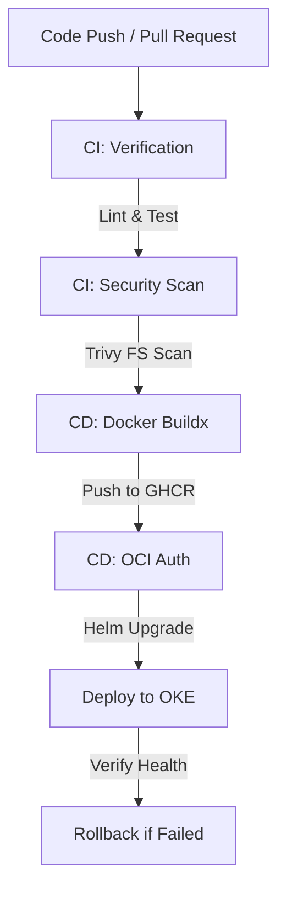

# CI/CD Report — CyberCom Automation Pipeline

**Date:** 2026-06-28  
**Author:** Chief DevOps Engineer, Principal SRE  
**Project:** CyberCom Platform  

---

## 1. Pipeline Architecture

We use a unified GitHub Actions pipeline (`.github/workflows/ci-cd.yml`) to orchestrate all build, test, scan, and deploy phases.



---

## 2. CI Verification Phase

Every code push or pull request to the `develop`, `staging`, or `main` branches initiates the CI validation job:
- **Linting:** Validates code formatting via `black` and syntax compliance via `flake8`.
- **Security Check:** Scans codebase for vulnerabilities (hardcoded secrets, insecure functions) using `bandit`.
- **Unit Testing:** Runs all 1,213 pytest cases in parallel.
- **Container Scan:** Scans the code directory for vulnerabilities using `trivy`.

---

## 3. CD Build & Push Phase

Upon successful CI completion, pushes to monitored branches execute the CD workflow:
- **Docker Buildx:** Multi-stage Docker builder constructs the production image with layer caching.
- **GHCR Registry:** Pushes the versioned tag (`ghcr.io/eng9myan/cybercom-backend:<sha>`) to the GitHub Container Registry.

---

## 4. OKE Deployment & Atomic Rollbacks

- **OCI Authentication:** Utilizes OCI API private keys stored in Github Secrets to authenticate with Oracle Cloud CLI.
- **OKE Credentials:** Generates the Kubeconfig file dynamically for the target OKE cluster.
- **Helm Upgrade:** Runs the deployment command:
  ```bash
  helm upgrade --install cybercom-platform \
    infrastructure/helm/cybercom-platform \
    --namespace <target-ns> \
    --atomic \
    --timeout 10m0s
  ```
- **Atomic Rollback:** The `--atomic` flag ensures that if the deployment health check fails or times out, Helm immediately reverts the Kubernetes resources back to the previous stable revision.
