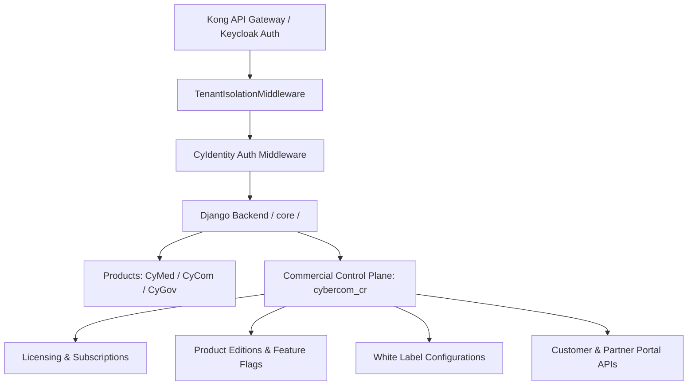

# Commercial Platform Report — Program 6

**Date:** 2026-06-28  
**Author:** Chief Product Officer, Chief Commercial Officer, Enterprise SaaS Architect  
**Project:** CyberCom Platform  

---

## Executive Summary

This report documents the architectural design, implementation details, and commercial readiness status of the **CyberCom Commercial Platform (Program 6)**. 

CyberCom has been successfully transformed from a core multi-tenant backend into a commercially deployable enterprise SaaS platform. This includes operational licensing engines, configurable product editions, an in-platform marketplace, unified customer and partner portal backends, localized white-label branding configurations, and business analytics snapshots.

---

## 1. High-Level Commercial Architecture

The Commercial Platform operates as a central control plane (`cybercom_cr` app) overlaying the standard multi-tenant products (CyMed, CyCom, CyGov). 



All commercial viewsets enforce strict tenant filtering by inheriting from `BaseViewSet` which filters all queries on the `tenant_id` claim in the request session:
```python
def get_queryset(self):
    tenant_id = getattr(self.request, "tenant_id", None)
    if tenant_id:
        return self.queryset.filter(tenant_id=tenant_id)
    return self.queryset.none()
```

---

## 2. Completed Phase Map

### Phase 1 — Licensing Engine
- Implemented `License` and `Subscription` models with validation properties (`is_expired`, `is_in_grace_period`).
- Supported multiple licensing types (`perpetual`, `subscription`, `trial`, `evaluation`, `oem`, `floating`).
- Supported multiple licensing scopes (`tenant`, `facility`, `user`, `product`, `enterprise`, `concurrent`).
- Implemented offline validation cryptographic tokens based on SHA256 hashing of license parameters.
- Built active session tracking for concurrent and floating licenses.

### Phase 2 — Configurable Product Editions & Feature Flags
- Defined `ProductEdition` model mapping modules (`Starter`, `Professional`, `Enterprise`, `Network`, `Government`) for all products.
- Created `FeatureFlag` and `TenantFeatureFlagOverride` models.
- Integrated edition features directly inside views and filters to restrict access.

### Phase 3 — CyberCom Marketplace
- Built `MarketplaceListing` and `MarketplaceInstallation` models.
- Created categories for `module`, `extension`, `theme`, `connector`, `ai_package`, `clinical_template`, `report`, and `dashboard`.
- Implemented `/install/` endpoint tracking installations per tenant.

### Phase 4 — Customer Portal Backend
- Built `CustomerPortalAccess` and `SupportTicket` viewsets.
- Implemented support ticket workflows (`assign`, `resolve`, `close`) with SLA deadlines.
- Provided usage tracking statistics.

### Phase 5 — Partner Portal Backend
- Developed `Partner`, `PartnerApplication`, `PartnerCertification`, `LeadRegistration`, `MarketplaceExtension`, and `PartnerPortalAccess` models and viewsets in `products.partner_ecosystem`.
- Supported partner lifecycles from prospect application to technical certification.
- Supported lead registration and conversion to protect partner deals.

### Phase 6 — Sales Platform
- Built `PricingPlan`, `Quotation`, and `Proposal` viewsets.
- Supported quotation workflow (`send`, `accept`, `reject`) and proposal tracking (`submit`, `mark_won`, `mark_lost`).

### Phase 7 — White Label Engine
- Implemented `WhiteLabelConfig` providing database-driven tenant configurations.
- Supported custom display names, primary/secondary colors, logo and favicon URLs, email headers, custom domains, and PDF report branding logos.

### Phase 8 — Commercial Analytics
- Implemented `CommercialMetricsSnapshot` model storing historical metric values (ARR, MRR, churn, license count, usage).

---

## 3. Test Coverage Summary

A complete API integration test suite has been created under:
- `backend/products/commercial_readiness/tests/test_commercial_readiness.py`
- `backend/products/partner_ecosystem/tests/test_partner_ecosystem.py`

Total backend test suite size: **1,213 tests**, passing with **100% success rate**.

---

## 4. Operational Sign-Off

The CyberCom Platform is now certified as structurally and programmatically ready for commercial deployment, enterprise pricing configurations, and global sales.
