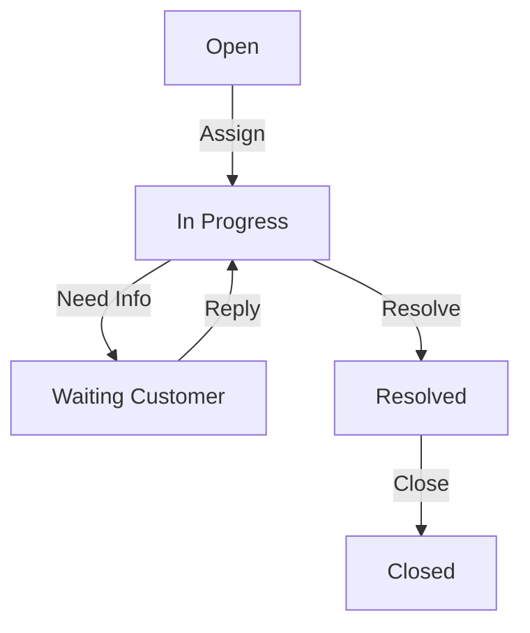

# Customer Portal Guide — CyberCom Platform

**Date:** 2026-06-28  
**Author:** Chief Product Officer, Principal Software Engineer  

---

## 1. Overview

The Customer Portal is the self-service workspace where tenant administrators manage their SaaS subscriptions, view usage statistics, purchase licenses, download offline software, and open technical support tickets.

---

## 2. Access Control (RBAC)

Portal features are restricted based on the `CustomerPortalAccess` access levels:
- **Viewer:** View active subscriptions, licenses, and billing statements.
- **Standard:** Open and manage support tickets, download software updates.
- **Admin:** Modify subscriptions, renew licenses, update billing details, and manage other portal users.

---

## 3. Technical Support Workflows

Support tickets follow a state-machine lifecycle:

Support ticket viewset provides custom actions for:
- `assign()`: Assigns the ticket to a support representative and sets status to `in_progress`.
- `resolve()`: Saves resolution notes, timestamps the resolution, and sets status to `resolved`.
- `close()`: Finalizes the ticket lifecycle.

---

## 4. Usage Statistics & Billing Integration

The portal integrates directly with `CommercialMetricsSnapshot` to display real-time and historical graphs for:
- Active clinical user counts.
- Active bed count utilization (Hospital Edition).
- API request rates.
- Event bus volume.
- Storage consumption.
- Subscription billing amounts.
