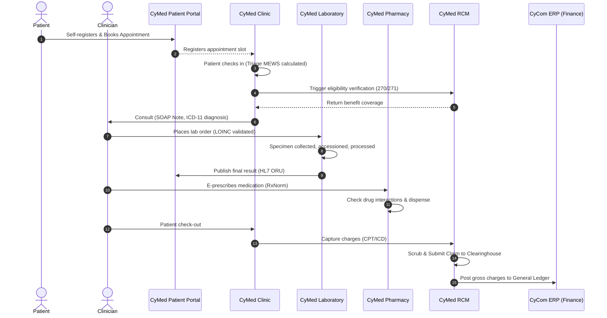

# CyMed End-to-End Workflow Report

**Date:** 2026-06-28  
**Version:** Release 1.0  
**Prepared by:** CyberCom Platform Engineering

---

## Executive Summary

This report documents the end-to-end integration workflows validated across the CyMed product line, ensuring that the 9 products operate as a unified commercial ecosystem.

---

## 1. Patient Journey: Check-In to Payment

The following diagram illustrates the complete patient lifecycle, spanning registration, clinical care, lab ordering, imaging, prescribing, and billing:

---

## 2. Key Integration Points

### Clinic & RCM Integration
- On patient check-in, Clinic queries the RCM `EligibilityService` to verify insurance coverage.
- On consultation completion, Clinic pushes captured ICD-11 diagnosis codes and procedure codes directly to RCM charge capture.

### Hospital & Laboratory/Imaging Integration
- On ICU/Emergency triage or Operating Room scheduling, orders are placed using LOINC/SNOMED CT.
- Resulting lab or radiology files are pushed directly to the patient's record, and the ordering clinician receives an alert in their results inbox.

### Pharmacy & CyAI Integration
- When prescribing medications in Pharmacy, the system calls `ClinicalAIService.score_drug_interaction_severity()` to assess potential interactions based on age, renal function (eGFR), and pregnancy status.
