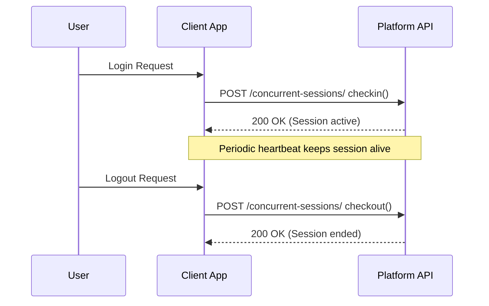

# Licensing Guide — CyberCom Platform

**Date:** 2026-06-28  
**Author:** Principal Software Engineer, Enterprise SaaS Architect  

---

## 1. Overview

The CyberCom Licensing Engine (`cybercom_cr` app) provides robust, multi-tier, multi-tenant license key generation, validation, and activation processes. It supports both cloud-connected online verification and offline air-gapped environment verification.

---

## 2. Supported Licensing Scopes

The engine supports six license scopes through the `License` model:

| Scope | DB Value | Enforcement Mechanism |
|-------|----------|-----------------------|
| **Per Tenant** | `tenant` | Tenant-level API access block on expiration. |
| **Per Facility** | `facility` | Checks active facility count against `max_facilities`. |
| **Per User** | `user` | Limits total provisioned users in tenant realm. |
| **Per Product** | `product` | Grants access to specific endpoints (e.g. `/api/v1/clinic/`). |
| **Enterprise** | `enterprise` | Unlimited users and facilities within the tenant context. |
| **Concurrent** | `concurrent` | Session tracking checks active sessions against `max_concurrent`. |

---

## 3. Cryptographic Offline Validation

For air-gapped deployments (common in governmental and military hospitals), the system provides an offline token generator. It generates a signed hash of the licensing limits using the tenant's private key configuration.

### Generation Logic
```python
def generate_offline_token(self):
    import hashlib
    import json
    payload = {
        "license_key": self.license_key,
        "product_code": self.product_code,
        "valid_until": self.valid_until.isoformat() if self.valid_until else None,
        "max_users": self.max_users,
        "licensed_features": sorted(self.licensed_features),
    }
    self.offline_token = hashlib.sha256(
        json.dumps(payload, sort_keys=True).encode()
    ).hexdigest()
    return self.offline_token
```

To activate an offline system, the administrator downloads the offline token from the Customer Portal and uploads it to the local system, which validates the signature locally without making external internet calls.

---

## 4. Concurrent User License Session Workflows

For floating licenses, the client checks out a session on login and releases it on logout:



If the active concurrent session count reaches `max_concurrent`, any subsequent login attempts are rejected with a `403 Forbidden` error.

---

## 5. Expiration & Grace Period Enforcement

The license properties `is_expired` and `is_in_grace_period` allow dynamic system behavior:
- **Expired but in grace period:** Allows clinical staff to read and write data but shows a prominent dashboard warning.
- **Beyond grace period:** Restricts the tenant's clinical staff to read-only view modes, blocking all write operations.
