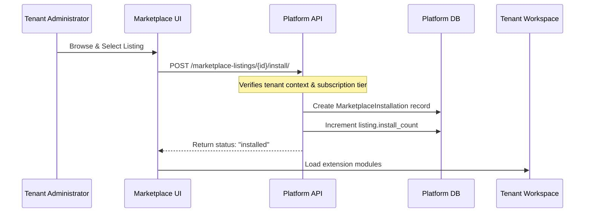

# Marketplace Guide — CyberCom Platform

**Date:** 2026-06-28  
**Author:** Chief Product Officer, Chief Commercial Officer  

---

## 1. Overview

The CyberCom Marketplace is an integrated platform service that allows third-party developers, partners, and CyberCom itself to distribute optional modules, extensions, and integrations.

---

## 2. Supported Categories

Listings in the marketplace are organized into eight distinct categories:

| Category | DB Code | Example Target |
|----------|---------|----------------|
| **Module** | `module` | Population health dashboard extensions. |
| **Extension** | `extension` | Custom SMS notification alerts. |
| **Theme** | `theme` | Regional hospital portal visual skins. |
| **Connector** | `connector` | Custom PACS server DICOM gateways. |
| **AI Package** | `ai_package` | Specialized radiology diagnosis prompts. |
| **Clinical Template** | `clinical_template` | Maternity or pediatric SOAP note forms. |
| **Report** | `report` | Financial general ledger custom spreadsheets. |
| **Dashboard** | `dashboard` | Clinical ICU live metrics views. |

---

## 3. Installation Flow

Marketplace listings are published by official publishers or certified partners. Tenants install listings through the marketplace viewset:

---

## 4. Monetization Models

The marketplace supports four price models:
- **Free:** Available to all tenants.
- **One Time:** Fixed purchase amount.
- **Subscription:** Monthly or annual recurring charge added to the tenant's base subscription invoice.
- **Usage Based:** Dynamic charging based on API calls, bytes transferred, or records processed.
