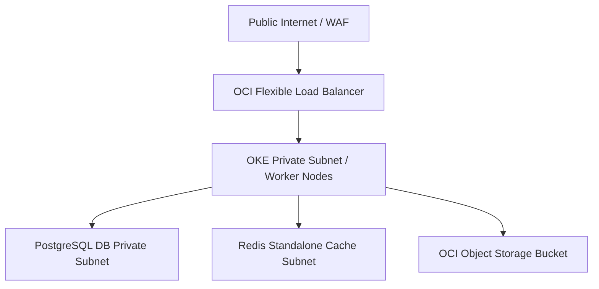

# OCI Architecture Report — CyberCom Production SaaS

**Date:** 2026-06-28  
**Author:** Chief Cloud Architect, SaaS Platform Architect  
**Project:** CyberCom Platform  

---

## 1. Cloud Infrastructure Overview

This report details the production-grade architecture of the **CyberCom SaaS Platform** running on **Oracle Cloud Infrastructure (OCI)**. The setup is designed for enterprise high availability (HA), security isolation, and rapid scalability.

---

## 2. Network Topology & VCN Configuration

The network layout uses a single virtual cloud network (VCN) divided into three subnets:

| Subnet Name | CIDR Block | Accessibility | Purpose |
|-------------|------------|---------------|---------|
| **Public LB Subnet** | `10.0.10.0/24` | Public | Public-facing OCI Flexible Load Balancers. |
| **Private OKE Subnet**| `10.0.20.0/24` | Private | Managed OKE cluster worker nodes. |
| **Private Data Subnet**| `10.0.30.0/24` | Private | OCI PostgreSQL and Redis servers. |

- **NAT Gateway:** Enables private OKE worker nodes to securely download packages and updates from the internet without exposing their IPs.
- **Service Gateway:** Connects the VCN private subnets directly to OCI Object Storage and management endpoints without traversing the public internet.

---

## 3. Compute & Kubernetes (OKE)

We employ **Oracle Kubernetes Engine (OKE)** to orchestrate containerized microservices:
- **Cluster Version:** `v1.29.1`
- **Managed Node Pool:** Standard shapes (`VM.Standard.E4.Flex`) with autoscaling set between 3 and 10 active worker nodes.
- **Resource Allocations:**
  - **Backend Pods:** Request `250m` CPU / `512Mi` memory; Limit `1` CPU / `1Gi` memory.
  - **Frontend Pods:** Request `100m` CPU / `256Mi` memory; Limit `500m` CPU / `512Mi` memory.

---

## 4. Production Data Layer HA

The database layer utilizes **OCI PostgreSQL Database System**:
- **Deployment Shape:** `PostgreSQL.VM.Standard.E4.Flex.2.32GB`
- **Instance Count:** 2 (Primary + Active Standby replica)
- **High Availability:** Automated replication stream with automatic failover configured in the subnet security list.
- **Connection Pooling:** Managed via client-side pooling settings to prevent PostgreSQL max connection saturation during peak workloads.
- **Object Storage Buckets:** Dynamic storage for database base backups and transaction logs (WAL archiving).
