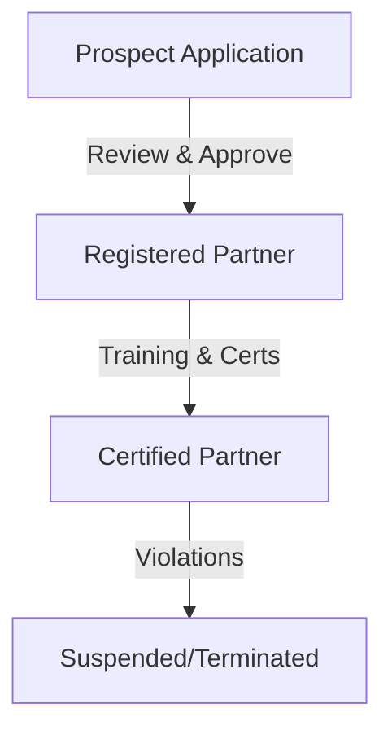

# Partner Portal Guide — CyberCom Platform

**Date:** 2026-06-28  
**Author:** Chief Commercial Officer  

---

## 1. Overview

The Partner Portal is the primary interface for CyberCom's partner ecosystem. It enables reseller, technology, and implementation partners to register sales deals, request technical certifications, submit marketplace extensions, and track revenue sharing.

---

## 2. Partner Lifecycles

The partner onboarding and maintenance flow is fully automated:

---

## 3. Key Portal Workflows

### Onboarding Applications
Prospects submit applications (`PartnerApplication` model). The administrative team reviews them and triggers either `approve()` or `reject()` actions. Approved applications auto-provision a new `Partner` record.

### Deal Registration
Partners register sales opportunities (`LeadRegistration` model) to protect their commission. Once registered:
- The lead is protected for a configurable duration (`protected_until`).
- Other partners are blocked from registering the same client name or domain.
- Approved leads can be converted to active customers (`convert()` action).

### Technical Certifications
Partners tracks consultant expertise (`PartnerCertification` model) across specific product lines (CyMed Clinic, Hospital, ERP). Certifications support five types: Technical, Sales, Implementation, Architect, and Support.

### Marketplace Extensions
Partners upload and maintain custom extensions (`MarketplaceExtension` model). Actions include:
- `publish()`: Publishes the extension to the marketplace catalog.
- `deprecate()`: Deprecates the extension to prevent new installations.
- `record_install()`: Increments usage statistics for revenue sharing.

---

## 4. Revenue Sharing Models

The portal calculates revenue sharing payouts based on the partner's tier:
- **Silver:** 10% commission on registered deals.
- **Gold:** 15% commission + 5% on marketplace installations.
- **Platinum:** 20% commission + 10% on marketplace installations.
- **Diamond:** 25% commission + 15% on marketplace installations.
