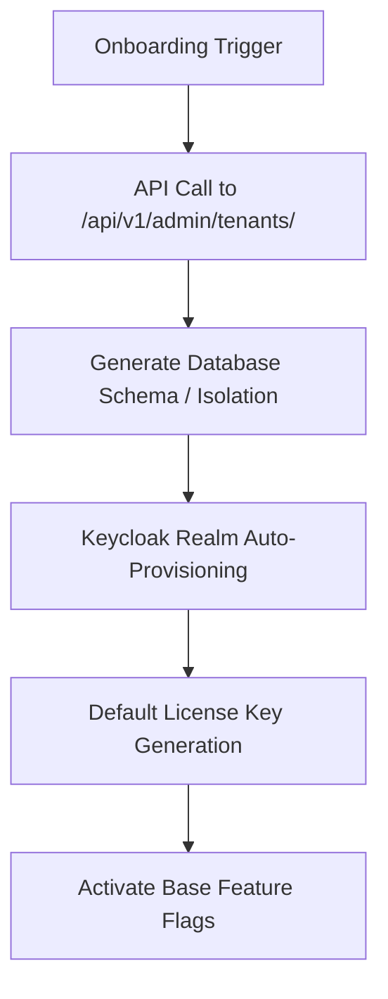

# SaaS Operations Report — CyberCom Platform

**Date:** 2026-06-28  
**Author:** Chief Product Officer, SaaS Platform Architect  
**Project:** CyberCom Platform  

---

## 1. Overview

This report describes the SaaS operational processes and tools designed to manage tenant lifecycles, upgrades, feature flags, backups, and configurations on the CyberCom Platform.

---

## 2. Tenant Provisioning Workflow

Tenant onboarding is fully automated via the `provision_tenant.py` and `tenant_operations.py` utility scripts. The flow involves:



Administrators trigger the onboarding by calling:
```bash
python scripts/provisioning/tenant_operations.py \
  --tenant-id "aaaa-bbbb-cccc" \
  --action brand \
  --display-name "Health Group" \
  --primary-color "#0055A5" \
  --secondary-color "#004B91"
```

---

## 3. Product Upgrades & Feature Gating

We employ dynamic feature flags and product editions rather than running code branches per customer.
- **Product Editions:** Starter, Professional, Enterprise, Network, and Government.
- **Feature Flags:** Restrict or enable views, menu blocks, and specific API urls.
- **Upgrade Path:** Running `tenant_operations.py --action upgrade` triggers the backend engine to transition the tenant configuration and re-evaluate feature assignments.

---

## 4. Tenant-Level Backup & Recovery

For data sovereignty and protection, the platform supports isolated tenant backups.
- **Tenant schema dump:** Leverages PostgreSQL namespace partitioning (`tenant_<id>`).
- **Backup script:** Generates a compressed SQL dump containing only the target tenant's rows.
- **Object Storage archiving:** Uploads the dump to `oci_objectstorage_bucket.backups`.
- **Restore process:** Overwrites the tenant's namespace table rows with historical dump values.
