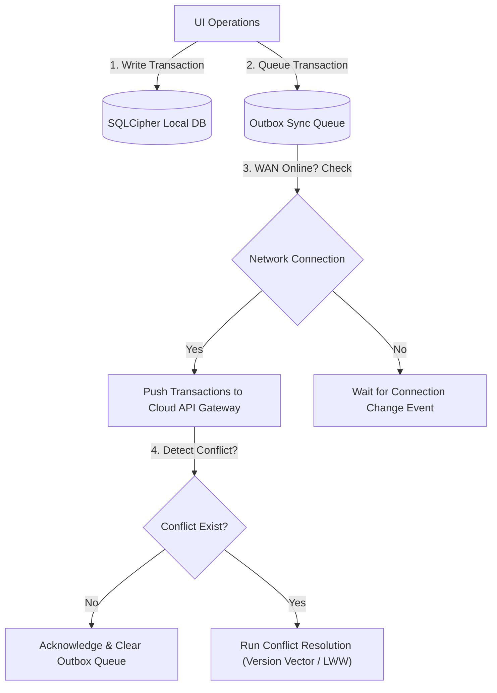

# ADR-0033: Mobile & Offline Architecture Strategy

| Field | Value |
|---|---|
| **Status** | Accepted |
| **Date** | 2026-06-21 |
| **Deciders** | Chief Domain Architect, Platform Architect, Mobile Architect |
| **Affects** | All Mobile Applications, Offline Edge Systems |
| **Tags** | governance, mobile, offline, sync, react-native |
| **Related** | [ADR-0008](ADR-0008-saas-deployment-strategy.md), [ADR-0012](ADR-0012-environment-management-strategy.md) |

---

## 1. Context

CyberCom’s mobile applications (e.g., patient portals, home-care clinician apps, citizen wallets) are frequently deployed in areas with unstable cellular networks (e.g., remote clinics, rural emergency calls, or baseline concrete buildings). If mobile designs depend on a continuous, active internet connection:
-   Home care nurses cannot log medication administrations in rural fields.
-   Emergency workers cannot check citizen profiles offline.
-   App UI lockups occur, causing data loss during cellular dropouts.

---

## 2. Decision Drivers

-   **Uninterrupted Clinical Access:** Home nurses and clinicians must be able to perform essential charting offline.
-   **Security and Cryptographic Protection:** Cached PHI/PII data on mobile devices must be encrypted to comply with local privacy regulations.
-   **Conflict Resolution:** Deterministic reconciliation rules when merging offline changes back to the cloud database.
-   **Battery & Data Efficiency:** Background sync must be throttled to prevent rapid device battery drainage.

---

## 3. Decision

We mandate an **Offline-First Mobile Architecture Strategy** built on the following pillars:

### 3.1 Mobile Technology Stack
*   **Framework:** **React Native** (using TypeScript) for cross-platform iOS and Android deployments, combining high rendering performance with shared codebase efficiency.
*   **Local Storage:** **SQLCipher** (using WatermelonDB or RxDB) for encrypted, high-performance relational local database queries.

### 3.2 Synchronous Queue & Conflict Resolution
Mobile apps use a local queue pattern to sync data changes:

1.  **Version Vector Verification:** Every entity record has a `version` integer metadata column.
2.  **Conflict Policies:**
    *   *Last-Write-Wins (LWW):* The standard for demographic updates.
    *   *Logical Merging:* Used for clinical records (e.g., compounding clinical notes instead of overwriting).
    *   *Manual Review Queue:* If concurrent changes modify identical fields on separate devices, the cloud creates an admin reconciliation ticket.

### 3.3 Security & Cryptographic Access Controls
*   **At-Rest Encryption:** Local SQLCipher databases are encrypted using AES-256 with keys generated dynamically within the device secure enclave (Keychain/Keystore).
*   **Authentication:** Local biometric locks (FaceID, TouchID) are required to unlock the application session.
*   **Time-Bound Cache Limits:** In clinical apps, offline cached patient records are cleared from local memory if the device has not synced for over 24 hours.

---

## 4. Rationale

*   SQLCipher handles local database queries natively at the OS layer, avoiding thread locking in JavaScript.
*   Enclave-backed key generation prevents data extraction even if the mobile device is rooted or stolen.

---

## 5. Consequences

### 5.1 Positive
*   Zero data loss during unexpected network cuts.
*   Sub-50ms local UI response times since reads target SQLCipher directly.
*   Compliant caching of sensitive health information.

### 5.2 Negative / Trade-offs
*   Significant development complexity in designing conflict resolution testing matrices.
*   Large initial sync load when clinical staff download their roster at the start of their shift.

---

## Revision History

| Date | Author | Change |
|---|---|---|
| 2026-06-21 | Enterprise Architect | Proposed & Approved |
