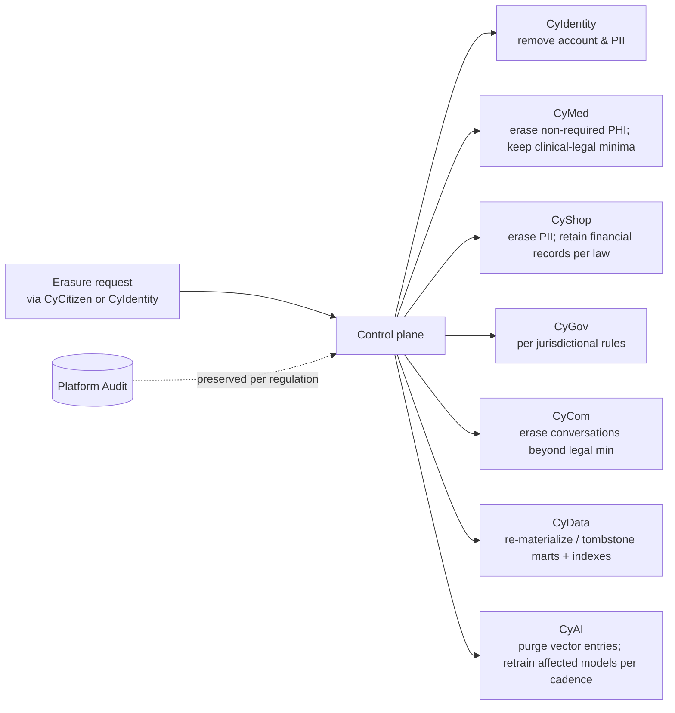

# Data Ownership Matrix

> **Status:** Approved — Program 1, Phase 1.1
> **Owner:** Chief Enterprise Architect + Principal Engineer (Data)
> **Purpose:** Name, for every important data set, **which product owns the source of truth**, who replicates it, the data class, residency, and retention defaults.

Legend:

- **SoR** — System of Record (the only product allowed to write the canonical copy).
- **Replicas** — products that hold projections / read-only copies (typically via events into CyData; never via cross-product DB access).
- **Class** — per `database_standards.md` §13: Public / Internal / Confidential / Restricted (PII) / Restricted (PHI) / Restricted (PCI) / Secret.
- **Residency** — region pinning rules.
- **Retention** — default; legal hold and per-tenant overrides may extend.

---

## 1. Identity & Access Data

| Data set | SoR | Replicas | Class | Residency | Retention |
|---|---|---|---|---|---|
| User accounts (workforce / customer / citizen / partner) | **CyIdentity** | — | Restricted (PII) | Per-realm region | Lifetime of relationship + per-regulation grace |
| Credentials, MFA enrollments, recovery factors | **CyIdentity** | — | Secret | Same region as account | Until removed; rotation logged |
| Sessions & refresh tokens | **CyIdentity** | — | Confidential | Same region | Token TTL; revocation list 30 d |
| Federation configurations / metadata | **CyIdentity** | — | Confidential | Per-tenant | Lifetime of federation + 1 y |
| Consents (identity-level) | **CyIdentity** | CyData (analytics, redacted) | Restricted (PII) | Per-realm region | Per regulation; minimum 6 y where audit-relevant |
| Workload identities (SPIFFE IDs) | **CyIdentity + SPIRE** | — | Internal | Per-cluster | Lifecycle of workload |
| Signing keys & JWKS | **CyIdentity + Vault/KMS** | — | Secret | Per-region | Rotated every 30 d; old versions retained for verify |

---

## 2. Healthcare Data (CyMed)

| Data set | SoR | Replicas | Class | Residency | Retention |
|---|---|---|---|---|---|
| Local MPI (patient master at the hospital) | **CyMed** | CyData (de-identified Bronze→Silver) | Restricted (PHI) | Per-tenant region (BYOK common) | Per national health regulation (commonly 7–30 y) |
| Encounters & ADT | **CyMed** | CyData (de-identified) | Restricted (PHI) | Same | Same |
| EHR (problems, allergies, vitals, observations) | **CyMed** | CyData (de-identified) | Restricted (PHI) | Same | Same |
| Orders (CPOE), administrations (eMAR) | **CyMed** | CyData (de-identified) | Restricted (PHI) | Same | Same |
| Lab results, microbiology, blood bank | **CyMed** | CyData | Restricted (PHI) | Same | Same |
| Imaging metadata; pixel data | **CyMed** (metadata) + DICOM archive via CyIntegration Hub (pixels) | CyData (study refs only) | Restricted (PHI) | Same | Same |
| Scheduling & bed state | **CyMed** | CyData | Restricted (PII/PHI) | Same | Per regulation |
| Charge capture & coding output | **CyMed** | **CyShop** (invoice generation), CyData | Restricted (PHI; billing-derived PII) | Same | Per financial-reg + healthcare retention |
| Clinical consents & break-the-glass events | **CyMed** | Platform audit (BTG events) | Restricted (PHI) | Same | Per regulation (audit ≥ 6 y) |

PHI **never** leaves the regulated boundary unless under a BAA and an approved data-flow ADR (esp. toward CyAI vendors).

---

## 3. Communications Data (CyCom)

| Data set | SoR | Replicas | Class | Residency | Retention |
|---|---|---|---|---|---|
| Channel preferences & opt-in/out | **CyCom** | CyIdentity (identity-level overlay) | Restricted (PII) | Per-recipient region | Lifetime of recipient + per-regulation |
| Conversation threads & message bodies | **CyCom** | CyData (metadata only; bodies opt-in by tenant policy) | Confidential (default) or Restricted (PHI/PII when contextual) | Per-tenant region | Per use case (clinical longer; marketing shorter) |
| Delivery attempts, receipts, DLR | **CyCom** | CyData | Confidential | Same | 1 y default |
| Voice call metadata | **CyCom** | CyData | Confidential | Per recording-jurisdiction | 1 y default (varies) |
| Voice / video recordings | **CyCom** | — | Restricted (depending on context) | Per recording-jurisdiction | Per consent + jurisdiction; defaults short |
| Contact-center state (queues, agent assignments) | **CyCom** | CyData (operational analytics) | Confidential | Per-tenant region | Short hot; long cold for KPI |

---

## 4. Commerce Data (CyShop)

| Data set | SoR | Replicas | Class | Residency | Retention |
|---|---|---|---|---|---|
| Catalog, prices, promotions | **CyShop** | CyData | Internal / Public | Per-tenant region | Lifecycle |
| Carts & sessions | **CyShop** | CyData (abandoned-cart analytics) | Confidential | Same | Short (30–90 d) |
| Orders, fulfillments, returns | **CyShop** | CyData | Confidential (with PII) | Same | Per financial-reg (commonly 7 y) |
| Payment **tokens** (no PANs) | **CyShop** (PCI enclave) | — | Restricted (PCI) | Same | Per PCI DSS |
| Payment transactions, refunds, chargebacks | **CyShop** | CyData (aggregated) | Restricted (PCI / Confidential) | Same | Per financial-reg |
| Subscriptions, invoices, billing schedules | **CyShop** | CyData (financial reporting) | Confidential | Same | Per tax/financial-reg |
| Marketplace sellers, listings, payouts | **CyShop** | CyData | Confidential (PII for sellers) | Same | Per regulation |
| Fraud signals & risk decisions | **CyShop** | CyData (de-identified), CyAI (features) | Confidential | Same | 1–2 y |

---

## 5. Government Data (CyGov)

| Data set | SoR | Replicas | Class | Residency | Retention |
|---|---|---|---|---|---|
| Service catalog (government services) | **CyGov** | CyCitizen (cache), CyData | Public / Internal | Per-jurisdiction | Lifecycle |
| Cases / applications & documents | **CyGov** | CyData (KPI metrics, redacted) | Restricted (PII; sometimes PHI when health-services) | Per-jurisdiction (sovereign common) | Per jurisdictional retention |
| Permits & licensing registers | **CyGov** | CyCitizen (lookups), CyData | Restricted (PII) | Per-jurisdiction | Per regulation (often very long) |
| e-Procurement: RFx, bids, evaluations, contracts | **CyGov** | CyData (procurement analytics) | Confidential / Restricted (PII) | Per-jurisdiction | Long retention per anti-fraud rules |
| Civic registers (vital / business / property where SoR) | **CyGov** | CyCitizen (public projections where applicable), CyData | Restricted (PII) | Per-jurisdiction | Often permanent (append-only) |
| Fee & fine **assessments** | **CyGov** | **CyShop** (capture), CyData | Confidential | Per-jurisdiction | Per financial / public-finance reg |
| Regulatory submissions in/out | **CyGov** | CyData | Confidential / Restricted (varies) | Per-jurisdiction | Per sector reg |
| Inter-agency exchange envelopes | **CyGov** | Platform audit | Confidential | Per-jurisdiction | Per gov retention |
| Open-data publications | **CyGov** (curated) | CyData (publication) | Public | Per-jurisdiction | Lifecycle (versions retained) |

---

## 6. Citizen-Facing Data (CyCitizen)

| Data set | SoR | Replicas | Class | Residency | Retention |
|---|---|---|---|---|---|
| Citizen portal UI state, preferences, layout choices | **CyCitizen** | — | Internal | Per-citizen region | Lifetime of relationship |
| Civic engagement (feedback, polls) | **CyCitizen** | CyGov (when becomes a case), CyData | Confidential | Per-jurisdiction | Per engagement policy |
| **Citizen identity, civic records, cases** | **NOT CyCitizen** | — | — | — | Lives in CyIdentity / CyGov |

---

## 7. Integration & Platform Data

| Data set | SoR | Replicas | Class | Residency | Retention |
|---|---|---|---|---|---|
| Partner registrations, API keys (hashed) | **CyIntegration Hub** | Platform audit | Confidential | Per-region | Lifetime of partner |
| Schemas (Avro / JSON-Schema) | **CyIntegration Hub (Schema Registry)** | — | Internal | Per-region | Permanent |
| Connector configurations | **CyIntegration Hub** (secrets in Vault) | — | Confidential | Per-region | Lifecycle |
| Outbox events (transient) | Producing product | **CyIntegration Hub** publishes; CyData consumes | Mirrors source class | Per source | Topic-policy retention |
| Schemas: webhook deliveries | **CyIntegration Hub** | CyData | Confidential | Per-tenant | 90 d default |
| Audit events | **Platform audit sink** | — | Restricted | Per region with replicated cold copy | 90 d hot / 1 y warm / 6+ y cold (regulated) |
| Operational logs | **Platform observability** | — | Confidential | Per region | 30 d hot / 1 y cold |
| Traces & metrics | **Platform observability** | — | Internal | Per region | 30–90 d default |
| Secrets | **Vault / KMS** | — | Secret | Per region | Lifecycle + 90 d versions |

---

## 8. AI Data (CyAI)

| Data set | SoR | Replicas | Class | Residency | Retention |
|---|---|---|---|---|---|
| Model registry metadata | **CyAI** | — | Internal | Per-region | Permanent |
| Vector indexes (per feature, per tenant) | **CyAI** | — | Mirrors source class (often Restricted) | Per-tenant region | Lifecycle of feature |
| Prompts / system prompts / RAG templates | **CyAI** (in git) | — | Internal | Per-region | Permanent |
| Inference logs (redacted) | **CyAI** | CyData (de-identified, aggregate) | Confidential / Restricted | Per-tenant | 30 d hot / 1 y cold (regulated overrides) |
| Eval datasets & results | **CyAI** | — | Confidential | Per-region | Permanent |
| Training run metadata + artifacts | **CyAI** | — | Internal / Confidential | Per-region | Per model lifecycle |
| Guardrail outcomes | **CyAI** | Platform audit (security-relevant), CyData | Confidential | Per-region | Per audit policy |

---

## 9. Cross-Cutting Rules

1. **No cross-product DB reads.** Replicas exist only via events into CyData (or explicit, audited API reads).
2. **PHI** has exactly one SoR (CyMed). Any other product that needs PHI signals does it via FHIR APIs with audit.
3. **PCI** has exactly one SoR (CyShop). No PANs anywhere else.
4. **Citizen identity attributes** live in CyIdentity; civic data lives in CyGov; CyCitizen renders, never stores SoR.
5. **Audit events** live in the immutable platform sink — never duplicated in product DBs.
6. **Residency** flows from tenant configuration; storage and compute are region-pinned accordingly.
7. **Erasure** propagates from CyIdentity → SoR → replicas; audit events are exempt (legal hold).
8. **Replicas** in CyData are governed by data contracts; breaking the contract is a CI failure.
9. **Classification** flows with data: a copy never has a *lower* class than its source.
10. **Encryption**: at-rest CMK per environment; per-tenant CMK for regulated tenants; field-level for Restricted classes.

---

## 10. Erasure & Consent Propagation

Each product publishes an **erasure runbook** as part of its `RECOVERY.md` and operates against the central erasure-procedure document (planned in `docs/security/erasure-procedure.md`).

---

## 11. Change Process

Same as the other matrices: a data ownership change requires an ADR plus a coordinated PR updating this matrix, the [domain ownership matrix](domain_ownership_matrix.md), the [product boundary matrix](product_boundary_matrix.md), and the affected product architecture docs.
