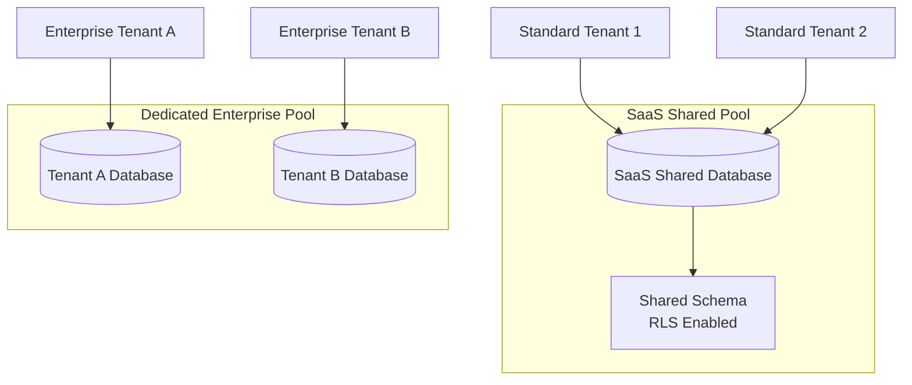
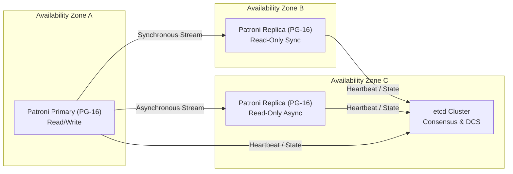

# Database Reference Architecture

## 1. PostgreSQL Strategy

CyberCom leverages **PostgreSQL (v16+)** as its primary transactional database engine. It provides the relational robustness, JSONB flexibility, and enterprise features (such as Row-Level Security and Declarative Partitioning) required to support clinical, ERP, and civic workloads.

### 1.1 Key Database Extensions
*   **`pgAudit`:** Detailed session and/or object audit logging.
*   **`timescaledb` / Partitioning engine:** For high-volume telemetry and audit trail indexing.
*   **`pgcrypto` / `uuid-ossp`:** Cryptographic operations and ID generation.
*   **`pg_partman`:** Automated partition lifecycle management.

---

## 2. Primary Key Strategy: UUIDv7

To avoid index fragmentation and enable secure, non-predictable, time-sortable identifiers, CyberCom mandates **UUIDv7** for all primary keys across all services.

### 2.1 Why UUIDv7?
1.  **B-Tree Index Friendliness:** Traditional UUIDv4 values are randomly distributed, causing frequent page splits and cache evictions in PostgreSQL B-Tree indexes. UUIDv7 contains a millisecond-precision Unix timestamp in its most significant 48 bits, ensuring sequential inserts and high cache hit ratios.
2.  **Decoupled Creation:** API clients and microservices can generate unique IDs locally without round-tripping to a database sequence, supporting offline transaction creation (e.g., disconnected clinical clinics).

```
 0                   1                   2                   3
 0 1 2 3 4 5 6 7 8 9 0 1 2 3 4 5 6 7 8 9 0 1 2 3 4 5 6 7 8 9 0 1
+-+-+-+-+-+-+-+-+-+-+-+-+-+-+-+-+-+-+-+-+-+-+-+-+-+-+-+-+-+-+-+-+
|                           unix_ts_ms                          |
+-+-+-+-+-+-+-+-+-+-+-+-+-+-+-+-+-+-+-+-+-+-+-+-+-+-+-+-+-+-+-+-+
|          unix_ts_ms           |  ver  |       rand_a          |
+-+-+-+-+-+-+-+-+-+-+-+-+-+-+-+-+-+-+-+-+-+-+-+-+-+-+-+-+-+-+-+-+
|var|                           rand_b                          |
+-+-+-+-+-+-+-+-+-+-+-+-+-+-+-+-+-+-+-+-+-+-+-+-+-+-+-+-+-+-+-+-+
|                           rand_b                              |
+-+-+-+-+-+-+-+-+-+-+-+-+-+-+-+-+-+-+-+-+-+-+-+-+-+-+-+-+-+-+-+-+
```

---

## 3. Multi-Tenant Database Strategy

Following [ADR-0002](../adr/ADR-0002-multi-tenancy-strategy.md), CyberCom supports a hybrid multi-tenancy model to accommodate varying tenant sizes and compliance requirements:



### 3.1 Row-Level Security (RLS) in Shared Pool
For shared databases, RLS is configured to prevent cross-tenant data leaks at the engine level:
1.  Every table contains a `tenant_id UUIDv7` column.
2.  Connection pools set a session variable (`app.current_tenant_id`) upon acquiring a connection.
3.  PostgreSQL filters queries using the following policy:

```sql
CREATE POLICY tenant_isolation_policy ON patient_record
    FOR ALL
    USING (tenant_id = NULLIF(current_setting('app.current_tenant_id', true), '')::uuid);
```

---

## 4. Partitioning Strategy

Declarative partitioning is applied to high-growth tables to keep active indexes small and facilitate efficient data purging/archiving.

### 4.1 Partitioning Dimensions
*   **Time-Based (Audit Logs & Telemetry):** Partitioned monthly. High-volume write tables like `audit_event` use `pg_partman` to create partitions ahead of time.
*   **Tenant-Based (SaaS Shared):** Hash partitioning by `tenant_id` across a predefined number of physical shards (e.g., 64 shards) for scale-out storage optimization.

---

## 5. High Availability (HA) and Replication

High Availability is managed via **Patroni**, etcd/Consul, and streaming replication:



*   **Synchronous Replication:** Configured between Primary and at least one local standby in an adjacent Availability Zone to guarantee zero data loss failover (`syncrep`).
*   **Asynchronous Replication:** Configured for cross-region read standbys and disaster recovery nodes.

---

## 6. Backup, Recovery, and Disaster Recovery (DR)

*   **Tooling:** **pgBackRest** is mandated for all backups due to its multi-threaded compression, block-level delta restore, and encryption support.
*   **Backup Schedule:**
    *   **Continuous:** Write-Ahead Logs (WAL) are archived to secure, append-only object storage immediately upon generation.
    *   **Daily:** Full physical backup.
*   **Disaster Recovery Metrics:**
    *   **Recovery Point Objective (RPO):** < 5 seconds (using continuous WAL streaming).
    *   **Recovery Time Objective (RTO):** < 10 minutes (using Patroni automated failover).

---

## 7. Data Residency and Compliance

*   **Sovereign Pinning:** Database instances are physically located in regional cloud data centers corresponding to the legal jurisdiction of the tenant (e.g., UAE Ministry of Health data remains on local UAE Cloud resources; KSA PDPL compliance pins databases to Oracle/Google Cloud regions in Saudi Arabia).
*   **No Global Cross-Region Joins:** Data warehouse extraction (`CyData`) anonymizes or pseudonymizes all PII before replicating cross-border for central analytics.

---

## 8. Database Audit Strategy

*   **pgAudit configuration:** Enable auditing on all DML and DDL commands relating to PHI and Financial schemas.
*   **Execution:** Database logs are output directly to local journald/syslog processes, which immediately stream to the immutable centralized WORM audit sink as defined in [ADR-0028](../adr/ADR-0028-audit-legal-record-strategy.md).

---

## 9. Revision History

| Date | Version | Description | Author |
|---|---|---|---|
| 2026-06-21 | 1.0 | Initial Database Reference Architecture | Enterprise Architect |
