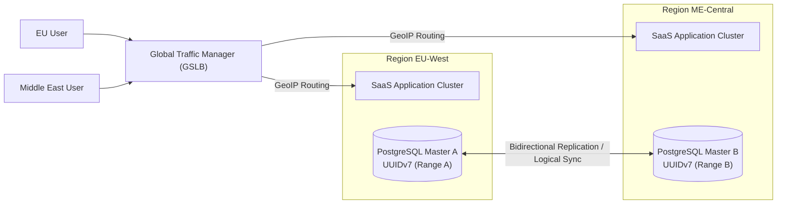

# Deployment Reference Architecture

## 1. Deployment Profiles

The CyberCom Platform supports multiple deployment profiles to accommodate varying security levels, regulatory compliance standards, and infrastructure constraints:

```mermaid
graph TD
    subgraph National Sovereign Cloud
        Core_App["Core ERP (CyCom) & Analytics (CyData)"]
        Central_DB[("Central State DB")]
    end

    subgraph Local Hospital Edge (On-Premise / Hybrid)
        Edge_Proxy["Edge Gateway (Kong)"]
        Clinical_Cache["CyMed Local Cache (Admissions & CPOE)"]
        Local_DB[("Local SQLite / Postgres Cache")]
    end

    Client_App["Clinical Workstation"] --> Edge_Proxy
    Edge_Proxy --> Clinical_Cache
    Clinical_Cache --> Local_DB
    Clinical_Cache -- "Async Outbox Sync (VPN)" --> Core_App
    Core_App --> Central_DB
```

| Deployment Profile | Target Environment | Tenancy Model | Internet Connectivity | Core Features |
|---|---|---|---|---|
| **SaaS** | Public Cloud (AWS, GCP, Azure) | Shared Multi-Tenant | Mandatory | Standard commerce (`CyShop`), general ERP, and outpatient records. |
| **Private Cloud** | Dedicated Cloud Subscription (VPC) | Single Tenant (Dedicated) | Optional (VPN Only) | Large private hospital networks, national banks. |
| **Government Cloud** | Sovereign Cloud (AWS GovCloud, local data centers) | Single Tenant / Shared Government | Restricted / Private WAN | Citizen registry (`CyGov`), public national health platforms. |
| **Hybrid** | Local Clinic Edge + Central Sovereign Cloud | Decoupled hybrid | Periodic | Clinical functions operate locally on the edge; financial reconciliation occurs centrally. |
| **On-Premise** | Local Bare Metal / VMs | Single Tenant | None required | Small standalone community hospitals with poor local WAN stability. |
| **Air-Gapped** | Secure military or research facilities | Single Tenant | Completely Blocked | Uses offline license files, local Docker mirrors, and local DNS. |

---

## 2. Multi-Region Active-Active Strategy

For the high-performance SaaS profile, CyberCom implements a multi-region Active-Active architecture to ensure zero downtime:



### 2.1 Key Mechanics
1.  **Global Load Balancing (GSLB):** Directs users to the nearest regional data center using GeoIP routing and health status probes.
2.  **No ID Conflicts:** UUIDv7 keys prevent primary key collisions during multi-region writes.
3.  **Data Replication:** Bidirectional database replication (using PostgreSQL logical replication or CockroachDB multi-region tables) synchronizes state asynchronously across regions, maintaining local sub-100ms write latency.

---

## 3. Air-Gapped Deployment Requirements

To run in completely offline environments:
*   **Artifact Mirrors:** All Docker containers are packaged into tarballs and imported to a local registry (e.g., Harbor).
*   **Local Repositories:** Code packages (npm, pip) are mirrored locally.
*   **Offline Activation:** Licensing uses hardware-bound, public-key-signed license files that do not require online verification.

---

## 4. Disaster Recovery (DR) and Business Continuity

For Single-Region and Hybrid deployments:
*   **Failover Automation:** Active-Passive warm standby setups managed via GitOps.
*   **Data Protection:** Cross-region log shipping (WAL) ensuring that in the event of a total primary data center loss, recovery has an RPO < 5 seconds and RTO < 30 minutes.

---

## 5. Revision History

| Date | Version | Description | Author |
|---|---|---|---|
| 2026-06-21 | 1.0 | Initial Deployment Reference Architecture | Enterprise Architect |
