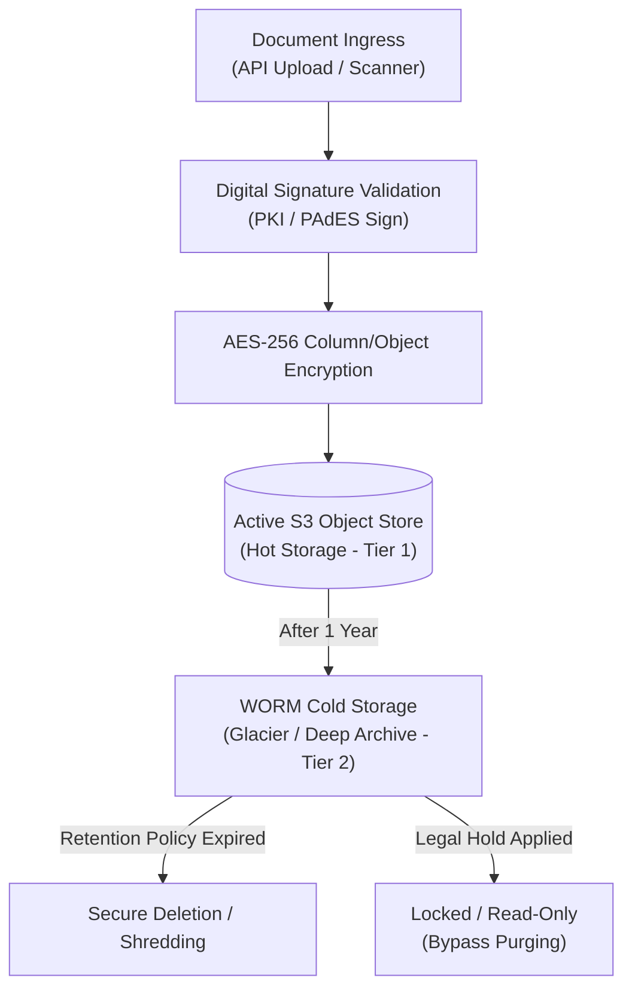

# Document Management Reference Architecture

## 1. Document Lifecycle Management

The Document Management Reference Architecture outlines the standards for storing, securing, and archiving clinical, financial, and governmental files within the CyberCom Platform, in compliance with [ADR-0029](../adr/ADR-0029-enterprise-document-management-strategy.md).

---

## 2. Document Segregation & Security Zones

Files are divided into separate, isolated object storage buckets to prevent cross-domain data leakage:

*   **Clinical Zone (`CyMed` Documents):** Houses PHI, lab reports, imaging files, and discharge summaries. Encryption utilizes KMS keys managed under HIPAA guidelines. Access requires explicit clinical roles.
*   **ERP Zone (`CyCom` Documents):** Houses purchase orders, supplier contracts, tax invoices, and payroll registers. Access is gated by financial ABAC rules.
*   **Government Zone (`CyGov` Documents):** Houses civic registries, land records, and tax declarations. Access is governed by national security credentials.

---

## 3. Cryptographic and Digital Signatures

*   **Digital Signatures:** Documents (e.g., patient consents, lab approvals, e-invoices, and employment contracts) are signed using cryptographic PKI keys.
*   **Standards:** Supported signature formats include **PAdES** (PDF Advanced Electronic Signatures) and **XAdES** (XML Advanced Electronic Signatures).
*   **Integrations:** Supports national identity signature systems (such as UAE PASS or Jordan Sanad e-ID) to verify citizen identities during official applications.

---

## 4. Retention & Archiving Policies

To control storage costs and remain legally compliant, all documents follow automated retention schedules:

| Document Type | Retention Period | Target Storage Class | Regulatory Compliance |
|---|---|---|---|
| **Clinical Records** | Lifetime of patient (min. 21 years) | Hot S3 (1 year) ➔ WORM Cold Archive (20 years) | Joint Commission (JCI) / HIPAA |
| **Financial / Tax Invoices** | 7–10 Years | Hot S3 (6 months) ➔ Cold Object Storage (6.5 years) | ZATCA (KSA) / GAAP / IFRS |
| **HR / Employee Files** | 10 Years post-termination | Hot S3 (6 months) ➔ Cold Object Storage (9.5 years) | Local Labor Laws |
| **Government Civic Records**| Permanent (Indefinite) | Hot S3 (2 years) ➔ High-Availability Cold Store | National Archives Regulations |

---

## 5. Legal Hold & Immutable Locking

When litigation or audits occur, documents are flagged with a **Legal Hold**:
*   **WORM Protection:** Object storage buckets are configured with Object Lock in Compliance Mode.
*   **Override:** When a Legal Hold is active on a document ID, all automated purge scripts are bypassed. Only authorized Legal Officers can release the hold.
*   **Watermarking:** Downloaded PDFs from active Legal Hold folders are dynamically watermarked with the name of the requesting user, time, and IP address to prevent data leakage.

---

## 6. Revision History

| Date | Version | Description | Author |
|---|---|---|---|
| 2026-06-21 | 1.0 | Initial Document Reference Architecture | Enterprise Architect |
