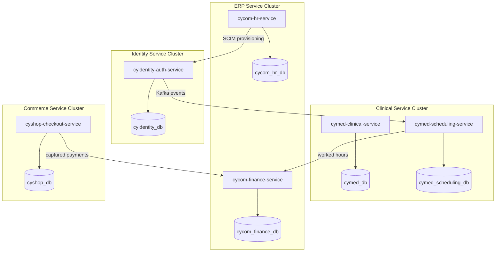

# Enterprise Domain Architecture

> **Status:** Approved — Program 1, Phase 1.3
> **Owner:** Chief Domain Architect + Enterprise Architect
> **Related Documents:** [enterprise_product_architecture.md](enterprise_product_architecture.md), [product_boundary_matrix.md](product_boundary_matrix.md)

---

## 1. Enterprise Bounded Context Map

The CyberCom Platform is modeled as a set of bounded contexts operating across the Platform Plane (Infrastructure/Shared Services) and the Product Plane (Vertical/Horizontal business applications).

```mermaid
flowchart TB
    subgraph Platform Plane [Platform Bounded Contexts]
        ID_Ctx[CyIdentity Context<br/>AuthN · Consents · SVIDs]
        HUB_Ctx[CyIntegration Hub Context<br/>Schema Registry · Event Bus]
        DATA_Ctx[CyData Context<br/>Lakehouse · Lineage · Feature Store]
        AI_Ctx[CyAI Context<br/>Model Gateway · RAG · Agents]
    end

    subgraph Product Plane [Product Bounded Contexts]
        MED_Ctx[CyMed Healthcare Context<br/>Clinical EHR · CPOE · Scheduling]
        COM_Ctx[CyCom ERP Context<br/>Finance · HR · Procurement]
        SHOP_Ctx[CyShop Commerce Context<br/>POS · Storefronts · PCI Payments]
        GOV_Ctx[CyGov Government Context<br/>Licensing · Permits · Case Workflows]
        CONN_Ctx[CyConnect Comms Context<br/>Omnichannel Threads · CC State]
        CIT_Ctx[CyCitizen Engagement Context<br/>Portal UI State · Discovery Caches]
    end

    %% Relationships
    MED_Ctx -->|OIDC / Claims| ID_Ctx
    COM_Ctx -->|SCIM Sync / OIDC| ID_Ctx
    SHOP_Ctx -->|Payment Tokens| ID_Ctx
    GOV_Ctx -->|eID Federation| ID_Ctx
    
    MED_Ctx -->|outbox events| HUB_Ctx
    COM_Ctx -->|outbox events| HUB_Ctx
    SHOP_Ctx -->|outbox events| HUB_Ctx
    GOV_Ctx -->|outbox events| HUB_Ctx

    HUB_Ctx -->|conform| DATA_Ctx
    CONN_Ctx -->|delivery receipts| DATA_Ctx

    MED_Ctx -->|query suggestions| AI_Ctx
    COM_Ctx -->|invoice extraction| AI_Ctx
    AI_Ctx -.->|reads features| DATA_Ctx

    MED_Ctx -->|send alert| CONN_Ctx
    COM_Ctx -->|send payslip| CONN_Ctx
    SHOP_Ctx -->|send receipt| CONN_Ctx
    GOV_Ctx -->|send civic notice| CONN_Ctx

    CIT_Ctx -->|display state| GOV_Ctx
    CIT_Ctx -->|SSO| ID_Ctx

    COM_Ctx <--|payment postings| SHOP_Ctx
    COM_Ctx <--|billing records| MED_Ctx
    COM_Ctx <--|fee assessments| GOV_Ctx
```

### Context Mappings & Relationship Types:
1.  **Shared Kernel (SK):** `CyIdentity` shares its identity attribute schema with all product contexts. All products must conform to the token format.
2.  **Customer-Supplier (C-S):** `CyConnect` acts as the Supplier to all other products. Products (Customers) specify notification contents; CyConnect guarantees delivery.
3.  **Conformist (CF):** `CyData` acts as a Conformist to all product events. It ingests events exactly in the schemas validated by the `CyIntegration Hub` Schema Registry.
4.  **Anti-Corruption Layer (ACL):** `CyIntegration Hub` runs translation pipelines (e.g., HL7 v2 to FHIR R4, ISO 20022 to internal ledger events) to prevent legacy formats from polluting core product domain models.

---

## 2. Entity Ownership Map

To ensure **no duplicate ownership** and **one source of truth per dataset**, the system enforces strict entity boundaries:

| Entity Name | System of Record (SoR) | Key Reference Attributes Exposed | Allowed Mutators |
|---|---|---|---|
| **UserAccount** | `CyIdentity` | `user_id`, `realm`, `email`, `role_claims` | SCIM sync, Admin Console |
| **EmployeeProfile** | `CyCom HR` | `employee_id`, `job_title`, `department_id` | HR Specialist |
| **PatientProfile** | `CyMed` | `patient_id`, `mrn_number`, `current_ward_id` | Admitting Clerk |
| **ClinicalOrder** | `CyMed` | `order_id`, `order_type`, `prescribing_physician` | Attending Doctor |
| **LedgerJournal** | `CyCom Accounting` | `journal_id`, `account_code`, `amount`, `fiscal_period` | Automated Postings, CFO |
| **PurchaseOrder** | `CyCom Procurement` | `po_id`, `supplier_id`, `approved_by` | Purchasing Agent |
| **Transaction** | `CyShop` | `transaction_id`, `payment_token`, `amount` | Customer Checkout |
| **LicenseRecord** | `CyGov` | `license_id`, `license_type`, `expiration_date` | Government Officer |
| **ConversationThread**| `CyConnect` | `thread_id`, `recipient_id`, `channel` | Automated triggers, Agents |

---

## 3. Platform-Wide Event Catalog & Integration Map

All cross-context communication is asynchronous, mediated by the Kafka event backbone.

```
       [Producer Context]
               │ (Emits Outbox Event)
               ▼
     [CyIntegration Hub (Kafka)]
               │ (Schema Validation check)
               ├─────────────────────────┬─────────────────────────┐
               ▼                         ▼                         ▼
      [Consumer Context 1]      [Consumer Context 2]      [CyData Lakehouse]
```

### Key Integration Events:

1.  `cybercom.cyidentity.consent.updated`
    *   *Producer:* `CyIdentity`
    *   *Consumers:* `CyData` (redaction engine), `CyMed` (break-the-glass policy validator).
2.  `cybercom.cymed.encounter.admitted`
    *   *Producer:* `CyMed`
    *   *Consumers:* `CyConnect` (in-patient welcome notifications), Platform Policy Engine (updates OPA/Redis active location cache).
3.  `cybercom.cycom.payroll.completed`
    *   *Producer:* `CyCom Payroll`
    *   *Consumers:* `CyConnect` (payslip notification), `CyCom Finance` (journal debit posting).
4.  `cybercom.cyshop.payment.captured`
    *   *Producer:* `CyShop`
    *   *Consumers:* `CyCom Finance` (AR sub-ledger journal creation), `CyConnect` (receipt delivery).
5.  `cybercom.cygov.permit.issued`
    *   *Producer:* `CyGov`
    *   *Consumers:* `CyCitizen` (adds permit to citizen profile view), `CyData` (adds record to registries mart).

---

## 4. Future Service Boundary Map

To ensure the platform scales cleanly, product plane components must be packaged into microservices with isolated persistence databases:



This database isolation prevents direct SQL joins across domains. All cross-service data aggregation must be executed downstream in `CyData` or via asynchronous event projections.
