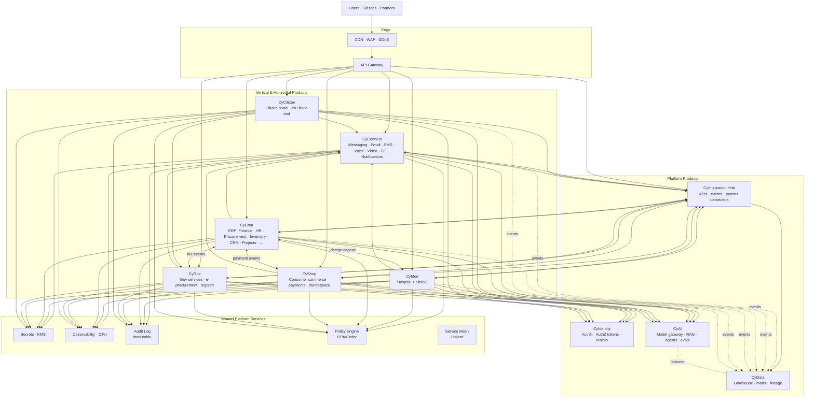
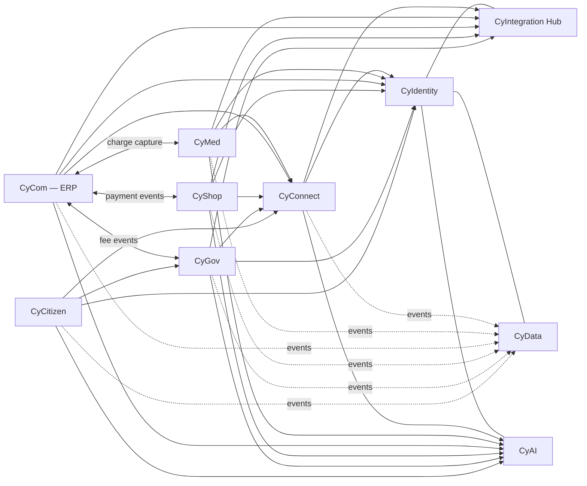

# Enterprise Product Architecture

> **Status:** Approved — Program 1, Phase 1.1, updated 2026-06-21 per [ADR-0018](../adr/ADR-0018-cycom-product-repositioning.md) and [ADR-0019](../adr/ADR-0019-cyconnect-communications-platform.md)
> **Owner:** Chief Enterprise Architect
> **Scope:** All CyberCom products and the platform that hosts them

This document defines the **shape of CyberCom as a single platform of ten products**. It establishes what each product is, what it owns, what it shares, and how the pieces fit together — so teams build into a coherent whole instead of ten adjacent islands.

> **Change note (2026-06-21):** Architecture Board repositioned the product roster.
> - **CyCom** is now CyberCom's **enterprise back-office / ERP** (Finance · Accounting · HR · Payroll · Procurement · Inventory · Manufacturing · CRM · Projects · Assets · Quality · Documents · Approvals · Budgeting · Contracts).
> - **CyConnect** is the new **omnichannel communications platform** (Messaging · Email · SMS · WhatsApp · Voice · Video · Contact Center · Notifications) — it inherits the comms scope previously documented under CyCom.
> See [ADR-0018](../adr/ADR-0018-cycom-product-repositioning.md) and [ADR-0019](../adr/ADR-0019-cyconnect-communications-platform.md).

---

## 1. Architectural Principles

1. **One platform, many products.** Products are composable. Anything used by more than one product is a **shared service**.
2. **Single responsibility per product.** No product owns a domain that belongs to another. Overlap is a design bug.
3. **Own your data; expose APIs and events.** No cross-product database access. Period.
4. **Identity, audit, observability, secrets are platform services** — not product features.
5. **Standards-based contracts.** REST + OpenAPI 3.1 default ([ADR-0003](../adr/ADR-0003-api-strategy.md)); FHIR R4 in healthcare ([ADR-0007](../adr/ADR-0007-healthcare-interoperability-strategy.md)); events via outbox to Kafka ([ADR-0004](../adr/ADR-0004-event-driven-architecture-strategy.md)).
6. **Paved roads everywhere.** Every product runs on the same K8s + Helm + GitOps + observability stack ([ADR-0008](../adr/ADR-0008-saas-deployment-strategy.md), [ADR-0011](../adr/ADR-0011-platform-engineering-strategy.md)).
7. **Compliance is shared.** HIPAA/GDPR controls flow from platform services down — products don't reinvent them.
8. **Deployable independently, governed centrally.** Products can ship on their own cadence; release governance is platform-wide ([release_management](../governance/release_management.md)).

---

## 2. The Ten Products at a Glance

| # | Product | One-line | Layer |
|---|---|---|---|
| 1 | **CyIdentity** | The single identity provider for humans, services, and citizens | Platform |
| 2 | **CyIntegration Hub** | The integration backbone: APIs, events, ESB, partner connectors | Platform |
| 3 | **CyData** | The data plane: lakehouse, contracts, lineage, BI marts | Platform |
| 4 | **CyAI** | The AI/ML platform: gateway, registry, RAG, agents, evals, guardrails | Platform |
| 5 | **CyConnect** | Omnichannel communications: messaging, email, SMS, WhatsApp, voice, video, contact center, notifications | Horizontal: Comms |
| 6 | **CyMed** | Hospital management and clinical care | Vertical: Healthcare |
| 7 | **CyCom** | Enterprise back-office / ERP: Finance, HR, Payroll, Procurement, Inventory, Manufacturing, CRM, Projects, Assets, Quality, Documents, Approvals, Budgeting, Contracts | Horizontal: Back-office |
| 8 | **CyShop** | Consumer commerce: catalog, cart, checkout, payments (PCI), marketplace, storefronts, logistics | Horizontal: Commerce |
| 9 | **CyGov** | Digital government services, e-procurement (public sector), regulatory tech | Vertical: Government |
| 10 | **CyCitizen** | Citizen-facing portal and digital services for CyGov | Vertical: Government (citizen face) |

> **Layer = how the product participates.** *Platform* products are infrastructure for the others; *Vertical* products solve a specific industry; *Horizontal* products solve a cross-industry capability.

---

## 3. Logical Architecture (C4 Container view)

- All products authenticate through **CyIdentity** and authorize through the **policy engine**.
- All inter-product calls and external integrations flow through **CyIntegration Hub** (synchronous APIs) or **Kafka via the outbox** (events).
- All product events land in **CyData** (medallion lakehouse) for analytics and ML feature production.
- **CyAI** is invoked by products through the model gateway; it reads features from CyData; it writes prompts/responses to audit.

---

## 4. Two-Plane Model

CyberCom is best understood as two interlocking planes:

| Plane | Members | Job |
|---|---|---|
| **Platform plane** | CyIdentity · CyIntegration Hub · CyData · CyAI · Shared services (audit, secrets, policy, mesh, observability) | Provide reusable, compliant capabilities. **No business logic.** |
| **Product plane** | CyConnect · CyMed · CyCom (ERP) · CyShop · CyGov · CyCitizen | Solve customer/citizen problems. **Reuse the platform.** |

The **rule**: a Product asks the Platform "give me this capability"; a Platform never embeds Product logic.

---

## 5. Shared Services (provided by Platform plane)

| Service | Provider | What products consume |
|---|---|---|
| **Authentication** | CyIdentity | OIDC sign-in, MFA, sessions, JWTs |
| **Authorization (policy)** | Platform policy engine + CyIdentity attributes | Allow/deny decisions per request |
| **Workload identity** | CyIdentity + SPIRE in mesh | Service-to-service mTLS |
| **API gateway / ingress** | Platform (Gateway API) | TLS termination, WAF, rate-limit |
| **Service mesh** | Platform (Linkerd primary, Istio fallback — [ADR-0013](../adr/ADR-0013-service-mesh-strategy.md)) | mTLS, retries, circuit breakers, telemetry |
| **Integration & API management** | CyIntegration Hub | Partner connectors, API publishing, B2B |
| **Event backbone** | CyIntegration Hub (Kafka + RabbitMQ — [ADR-0004](../adr/ADR-0004-event-driven-architecture-strategy.md)) | Cross-product events, outbox publishing |
| **Data plane / analytics** | CyData | Lakehouse, contracts, lineage, marts |
| **AI / ML** | CyAI | LLM gateway, embeddings, RAG, agents, evals, guardrails |
| **Secrets & KMS** | Platform (Vault + ESO + cloud KMS) | Secret materialization, signing, encryption |
| **Audit log** | Platform (immutable sink — [audit_logging_strategy](../security/audit_logging_strategy.md)) | Append-only, tamper-evident audit events |
| **Observability** | Platform (OTel + Prometheus + Grafana + Loki/Tempo — [ADR-0009](../adr/ADR-0009-observability-strategy.md)) | Metrics, logs, traces, SLOs |
| **CI/CD & GitOps** | Platform Engineering | Reusable workflows, Argo CD, progressive delivery |
| **Healthcare terminology** | Platform terminology service (per [ADR-0006](../adr/ADR-0006-icd-11-strategy.md)) | ICD-11, SNOMED CT, LOINC lookups |
| **Communications (delivery)** | CyConnect | All messaging, email, SMS, WhatsApp, voice, video, contact center, notifications |
| **Approvals (ERP workflows)** | CyCom Approvals | Workflow engine for PO / expense / journal / contract approvals (CyConnect delivers the notification, CyCom runs the workflow) |
| **Enterprise documents** | CyCom Documents | Versioned, signed, retention-aware enterprise records (invoices, POs, contracts, employee files, quality records) — **not** clinical or civic documents |

If a capability is on this list, products **must not** re-implement it.

---

## 6. Product Relationship Map (high level)

Key directed dependencies:

- **Every product depends on CyIdentity** for authN.
- **Vertical/horizontal products depend on CyIntegration Hub** for external integration; **never on each other directly**.
- **Every product emits events into CyData**; products **do not read another product's DB**.
- **CyCitizen** is the citizen-facing front for **CyGov** services; it does not duplicate CyGov logic.
- **CyConnect is the delivery surface for every other product** — CyMed messages a patient, CyCom (ERP) notifies an approver, CyShop sends an order update, CyGov delivers a civic notice; the producing product authors content, CyConnect delivers it.
- **CyCom (ERP) is the back-office system** that recognizes commerce (CyShop payments), hospital billing (CyMed charge capture), and public-sector AR (CyGov fees) into the General Ledger; it does not run consumer storefronts (CyShop) or public tendering (CyGov).

---

## 7. Domain Ownership (one-line summaries)

The full matrix lives in [`docs/architecture/domain_ownership_matrix.md`](domain_ownership_matrix.md). Quick reference:

| Domain | Owner |
|---|---|
| Identity, sessions, tokens, MFA, federation | CyIdentity |
| External APIs, partner connectors, ESB, event bus | CyIntegration Hub |
| Data lakehouse, marts, lineage, BI, ML features | CyData |
| Models, RAG, agents, evals, guardrails | CyAI |
| Messaging (chat / SMS / WhatsApp / push), email, voice / SIP, contact center, video, notifications | CyConnect |
| Hospital ops, clinical care, EHR, eMAR, pharmacy, lab, imaging | CyMed |
| Finance, Accounting, HR, Payroll, Procurement (enterprise), Inventory, Manufacturing, CRM, Projects, Assets, Quality, Documents, Approvals, Budgeting, Contracts | CyCom (ERP) |
| Catalog, cart, checkout, orders, payments (PCI scope), shipping, marketplace, consumer storefronts | CyShop |
| Government services, e-procurement (public sector), regulatory submissions, licensing, civic registers | CyGov |
| Citizen portal, eID front-end, citizen profile, civic engagement | CyCitizen |

---

## 8. Data Ownership (one-line summaries)

The full matrix lives in [`docs/architecture/data_ownership_matrix.md`](data_ownership_matrix.md). Headlines:

- **PHI** is owned exclusively by **CyMed** (and replicated read-only into CyData under de-identification rules).
- **Citizen identity attributes** are owned by **CyIdentity** (`citizen-<jurisdiction>` realm); civic data is owned by **CyGov**; the **public profile** view is presented by **CyCitizen**.
- **Payment instruments / PCI scope** sit in **CyShop** (with tokenization at the payment gateway); **General Ledger and AR/AP** are owned by **CyCom (ERP) Finance**.
- **Employee master, payroll, ERP documents (invoices/POs/contracts/employee files), approval workflows, budgets** are owned by **CyCom (ERP)**.
- **Conversations, voice/video recordings, delivery receipts** are owned by **CyConnect** with metadata indexed in CyData.
- **Cross-product events** are owned by the producer; CyData is a downstream replica only.

---

## 9. Anti-Overlap Rules (settle the obvious arguments now)

These rules pre-empt the most likely product-boundary fights:

1. **Patient/customer/citizen communication → CyConnect.** CyMed/CyShop/CyGov/CyCom produce the *event*; **CyConnect** owns the *delivery* (SMS/push/email/voice/video). No product runs its own SMS gateway or SIP trunk.
2. **Citizen profile → CyIdentity.** Identity attributes (name, contact, eID claims) are in CyIdentity. CyCitizen *renders* them. CyGov *uses* them. Neither stores duplicates beyond cached display.
3. **E-procurement → CyGov vs Procurement → CyCom.** **Government / public-sector tendering** (statutory RFx, public registers, contract awards for citizens / public works) is **CyGov**. **Enterprise procurement** (the tenant buying for itself: supplier master, POs, GRNs, supplier payments) is **CyCom Procurement**. CyShop is **consumer commerce**, not procurement at all.
4. **Marketplace → CyShop.** Multi-seller marketplaces, including B2B and B2C consumer storefronts, are CyShop. CyGov MAY publish public-facing storefronts through CyShop. **Enterprise back-office purchasing remains in CyCom Procurement.**
5. **Payments → CyShop captures; CyCom recognizes.** CyShop owns the **PCI scope and payment capture**. CyMed billing, CyGov fee collection, and CyCom-billed CyConnect traffic invoke CyShop for capture; **CyCom Finance** then posts the AR/revenue into the General Ledger.
6. **Audit log → Platform, not products.** Every product writes to the platform audit sink; no product owns an audit table.
7. **Reporting → CyData.** Cross-product or executive reports come from CyData marts. In-product operational dashboards stay in the product on its read replica.
8. **AI features → CyAI.** Products call CyAI for inference. They do **not** call external LLMs directly. (See [ADR-0016](../adr/ADR-0016-ai-platform-strategy.md).)
9. **Clinical decision logic → CyMed.** CyAI provides models and inference; **clinical interpretation and decisions** are CyMed's responsibility, with appropriate SaMD governance.
10. **External integrations → CyIntegration Hub.** B2B/partner APIs ingress and egress flow through the Hub. Direct partner connections from a product are forbidden without an ADR.
11. **ERP approval workflows → CyCom Approvals.** Workflows for PO / expense / journal / contract approvals are CyCom. **CyConnect MAY deliver the approval notification; the workflow lives in CyCom.** Case workflows for citizens stay in CyGov; clinical order workflows stay in CyMed.
12. **Enterprise documents → CyCom Documents.** Invoices, POs, contracts, employee files, quality records. **Not** clinical documents (CyMed) or civic case documents (CyGov).
13. **Employee master → CyCom HR; workforce identity → CyIdentity.** CyIdentity owns authN, MFA, sessions, role claims. CyCom HR owns compensation, leave, performance, benefits. No duplication.

---

## 10. Deployment Model (recap)

Per [ADR-0008](../adr/ADR-0008-saas-deployment-strategy.md): all products deploy on K8s + Helm + GitOps in SaaS, private cloud, and sovereign on-prem profiles. Per-product deployment notes live in each product's architecture doc.

---

## 11. Compliance Footprint Per Product

| Product | Highest data class | Primary regulations |
|---|---|---|
| CyIdentity | Restricted (credentials) | HIPAA, GDPR, eIDAS, NIST 800-63, ISO 27001 |
| CyIntegration Hub | Pass-through (carries all classes) | HIPAA, GDPR, ISO 27001 |
| CyData | Restricted (PHI/PII derivatives) | HIPAA, GDPR, ISO 27001, SOC 2 |
| CyAI | Restricted (prompts may carry PHI/PII) | HIPAA, GDPR, EU AI Act, FDA SaMD (clinical features) |
| CyConnect | Confidential (message content; Restricted when carrying clinical / financial / civic content) | GDPR, ePrivacy, telecom regs, TCPA / CASL (per jurisdiction), HIPAA-aware relays |
| CyMed | **PHI** | HIPAA, GDPR, MOH (national), FDA SaMD, IEC 62304 |
| CyCom (ERP) | Confidential (financial); Restricted (PII for HR/payroll); pass-through (charge-capture references) | GDPR, SOX-style SoD, statutory payroll & tax filings (per jurisdiction), ISO 27001 |
| CyShop | **PCI / PII** | PCI DSS, GDPR, consumer protection (per jurisdiction) |
| CyGov | Restricted (civic data) | GDPR, national gov frameworks, accessibility (WCAG) |
| CyCitizen | PII | GDPR, accessibility (WCAG), national eID schemes |

---

## 12. What This Document Does **Not** Decide

- Specific frameworks or libraries inside a product (handled by [`docs/standards/`](../standards/) and per-product ADRs).
- Detailed bounded contexts within a product (Phase 1.2 — domain models).
- Roadmap and sequencing for product builds (Phase 1.2 / 1.3).
- Vendor selections (e.g. specific BI tool, SIP carrier) — per-deployment addenda.

See [`Phase1_1_Enterprise_Product_Architecture_Report.md`](../Phase1_1_Enterprise_Product_Architecture_Report.md) for what comes next.
