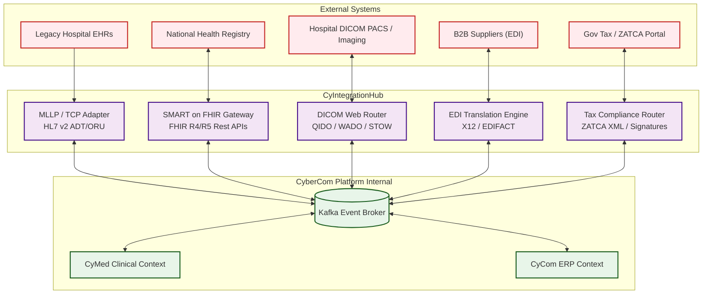

# Integration Reference Architecture

## 1. Enterprise Integration Hub Overview

The Integration Reference Architecture details how the CyberCom Platform connects with external medical hardware, national registries, corporate supply chains, tax authorities, and client systems. The core router for all external interactions is **CyIntegrationHub**.

---

## 2. Healthcare Interoperability

CyberCom is fully compliant with modern and legacy healthcare integration standards:

### 2.1 HL7 v2 / v3 Integration
*   **Transport:** TCP/IP socket connection using the Minimal Lower Layer Protocol (MLLP).
*   **Use Cases:** Stream admission, transfer, and discharge events (ADT), lab orders (ORM), and lab results (ORU).
*   **Adapter:** `CyIntegrationHub` ingests MLLP messages, parses the segments, maps them into JSON payloads, and publishes them to Kafka.

### 2.2 FHIR R4 & R5 Strategy
*   **SMART on FHIR:** Supported to allow external application launches within the clinical EHR layout using OAuth 2.1 token validation.
*   **Data Models:** Patient, Encounter, Observation, DiagnosticReport, and MedicationRequest mapped natively to the `CyMed` domain.

### 2.3 DICOM (Medical Imaging)
*   **Web Interfaces:** Supports DICOMweb APIs:
    *   `QIDO-RS` (Query based on RESTful Web Services).
    *   `WADO-RS` (Retrieve based on RESTful Web Services).
    *   `STOW-RS` (Store based on RESTful Web Services).
*   **Router:** CyIntegrationHub routes metadata to `CyMed` while forwarding heavy binary pixel data directly to tenant-specific S3-compatible cold stores.

---

## 3. Financial and Government Integrations

### 3.1 ZATCA & Tax E-Invoicing
*   **Jurisdiction Compliance:** Complies with Saudi Arabia (ZATCA Phase 2), UAE, and Jordan e-invoicing laws.
*   **Requirements:**
    *   XML invoice generation with embedded cryptographic signatures.
    *   Universally Unique Invoice Identifiers (UUID) and cryptographic hash chaining from the preceding invoice.
    *   Integration with ZATCA APIs for real-time clearance (for B2B) and reporting (for B2C).

### 3.2 B2B EDI Supply Chain
*   **Standards:** ANSI X12 and UN/EDIFACT.
*   **Transactions:**
    *   EDI 850 (Purchase Order).
    *   EDI 856 (Advance Ship Notice).
    *   EDI 810 (Invoice).

---

## 4. Platform API Gateway Specifications

All synchronous external APIs are published using standard formats:
*   **REST/OpenAPI:** The standard for internal and external developer APIs. Configured with strict OpenAPI 3.1 definitions.
*   **GraphQL:** Used at the Web Client/Presentation edge to aggregate multiple backend queries into a single HTTP request (preventing over-fetching).
*   **Webhooks:** Outbound events are signed with tenant-specific secret keys (HMAC-SHA256) inside the `X-CyberCom-Signature` header to allow safe external consumer consumption.

---

## 5. Revision History

| Date | Version | Description | Author |
|---|---|---|---|
| 2026-06-21 | 1.0 | Initial Integration Reference Architecture | Enterprise Architect |
