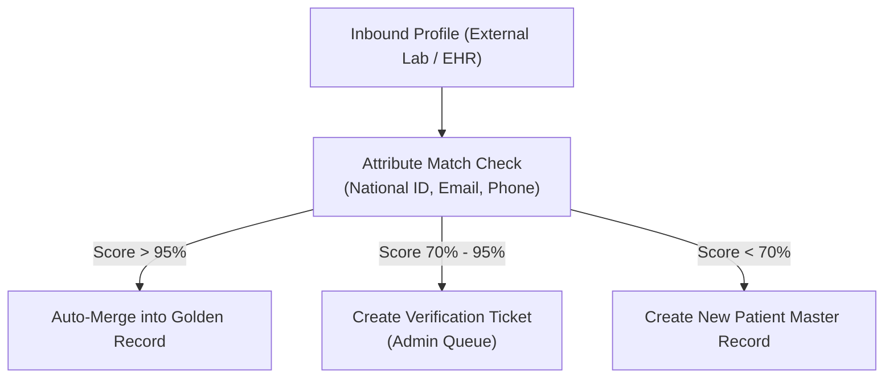

# Master Data Reference Architecture

## 1. Master Data Strategy & Governance

The Master Data Reference Architecture defines the single sources of truth (Systems of Record - SoR) and synchronization patterns for core entities shared across CyberCom's modular services. It enforces consistency while maintaining operational independence across platforms, aligned with [ADR-0027](../adr/ADR-0027-master-data-management-strategy.md).

```mermaid
graph TD
    subgraph System of Record (SoR)
        HR["CyCom HR<br/>(Employee SoR)"]
        Patient_Svc["CyMed Patient Context<br/>(Patient SoR)"]
    end

    subgraph Messaging Hub
        Kafka[("Kafka Event Broker")]
    end

    subgraph Local Cached Projections
        CyMed_Local_Emp[("CyMed Local Cache<br/>(Employee Records)")]
        CyShop_Local_Pat[("CyShop Local Cache<br/>(Patient Billing Detail)")]
    end

    HR -- "Outbox: employee.updated" --> Kafka
    Patient_Svc -- "Outbox: patient.admitted" --> Kafka
    Kafka --> CyMed_Local_Emp
    Kafka --> CyShop_Local_Pat
```

---

## 2. Systems of Record (SoR) Registry

To prevent circular updates and conflicting data states, every master record is allocated exactly one writing owner:

| Entity Master | System of Record (SoR) | Primary Identifier | Domain Rules |
|---|---|---|---|
| **Patient Master** | `CyMed Patient Context` | `patient_id` (UUIDv7) | Retains demographic details, MRN, emergency contacts, and blood types. |
| **Citizen Master** | `CyGov Registry Context` | `citizen_id` (UUIDv7) | Stores national identity numbers, residency status, and civic details. |
| **Employee Master** | `CyCom HR` | `employee_id` (UUIDv7) | Primary database for active employee profiles, departments, and titles. |
| **Provider Master** | `CyMed Scheduling` | `provider_id` (UUIDv7) | Holds clinical license registrations, medical specialties, and rosters. |
| **Supplier Master** | `CyCom Procurement` | `supplier_id` (UUIDv7) | Registry for supplier accounts, tax references, and payment terms. |
| **Product Master** | `CyShop Catalog` | `sku` (String) | Retail inventory item registry (SKU, weight, barcodes). |
| **Medical Product Master** | `CyMed Pharmacy` | `ndc_code` (String) | Pharmaceutical registry (NDC codes, chemical formulas, dosages). |
| **Organization / Facility** | `CyCom HR` | `org_id` / `facility_id` | General structure maps (Headquarters, physical wards, clinics). |

---

## 3. Synchronization Pipeline

Master data updates propagate asynchronously across domains using the **Transactional Outbox** pattern:
1.  **Local Write:** An administrative action writes to the SoR database.
2.  **Outbox Capture:** A Change Data Capture (CDC) connector (Debezium) reads the database transaction logs.
3.  **Kafka Event Broker:** The CDC connector publishes the change event (e.g., `cybercom.hr.employee.updated`) to Kafka.
4.  **Local Projection Cache:** Consuming services ingest the event and update their local read-only tables. For example, `CyMed` updates its local cached employee table to verify doctor privileges without making a blocking API call to the HR service.

---

## 4. Golden Record and Reconciliation

When importing patient or citizen data from external healthcare systems or legacy records via `CyIntegrationHub`, a **Matching & Survivorship** workflow resolves duplicates:



### 4.1 Survivorship Rules
1.  **Registry Hierarchy:** Government National Registry data overrides clinic-entered citizen attributes.
2.  **Recency Rule:** In the absence of a registry overrides, the newest timestamped update from a trusted system (e.g., hospital registrar) overrides older records.
3.  **Immutability:** Merging records is an append-only operation. A history log containing cryptographic hashes of previous record states is preserved for legal audit verification.

---

## 5. Revision History

| Date | Version | Description | Author |
|---|---|---|---|
| 2026-06-21 | 1.0 | Initial Master Data Reference Architecture | Enterprise Architect |
