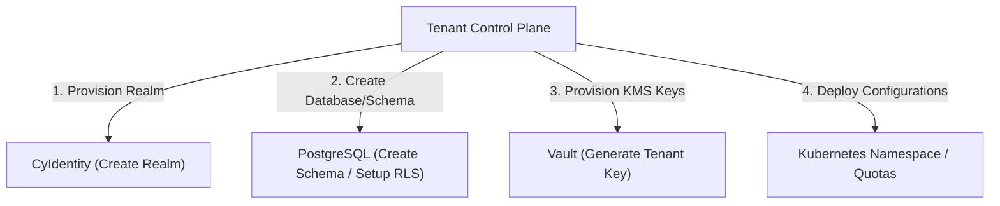

# Multi-Tenant Reference Architecture

## 1. Multi-Tenant Strategy

CyberCom supports a flexible, secure multi-tenant strategy to host multiple client organizations (hospitals, companies, government bodies) on a shared or dedicated physical infrastructure.



---

## 2. Resource Isolation Models

Tenants are categorized into tiers, dictating their isolation level at the Compute, Storage, and Cryptographic layers:

| Isolation Layer | Standard Tier (SaaS Shared) | Premium Tier (VPC Isolated) | Sovereign Tier (Government/On-Prem) |
|---|---|---|---|
| **Compute** | Shared Kubernetes Node Pools; Isolated namespaces and pod resource limits. | Dedicated Kubernetes Node Pools; Dedicated Virtual Machines. | Physical hardware isolation (Bare-Metal). |
| **Storage** | Shared Database; Logical Row-Level Security (RLS) filtering on `tenant_id`. | Dedicated PostgreSQL Database Instance per tenant. | Dedicated physical server with isolated storage arrays. |
| **Cryptographic** | Shared KMS; Tenant-specific Key rings inside the vault. | Dedicated Cloud HSM partition. | Physical HSM appliance with client-owned keys. |

---

## 3. Storage Layer Isolation & Row-Level Security (RLS)

In standard shared database deployments, tenant data leak prevention is enforced through PostgreSQL RLS:
1.  **Strict Schema Isolation:** Microservices do not perform cross-tenant queries.
2.  **RLS Policies:** Policies are applied to all relational tables.
3.  **Connection Management:** Database connection pools (e.g., PgBouncer) intercept sessions to run:
    ```sql
    SET LOCAL app.current_tenant_id = 'tenant-uuid-here';
    ```
4.  **Automatic Filters:** Any `SELECT`, `UPDATE`, or `DELETE` statement is implicitly appended with `WHERE tenant_id = current_tenant_id` by the engine.

---

## 4. Tenant Onboarding & Lifecycle

The onboarding of a new tenant is managed by the central **Control Plane** and follows an automated GitOps flow:

1.  **Registration:** The client registers via `CyShop` or administrative order.
2.  **Identity Provisioning:** `CyIdentity` creates a new dedicated client realm (`customer-<tenant-id>`), sets up standard login layouts, and configures default RBAC groups.
3.  **Database Provisioning:**
    *   *Shared model:* Database migrations run against the shared database pool, creating metadata rows for the tenant.
    *   *Dedicated model:* A new PostgreSQL database is spun up, migrations are executed, and connection strings are securely saved to Vault.
4.  **Cryptographic Configuration:** Vault generates a tenant-specific data encryption key (DEK) for column-level encryption.
5.  **Ingress Setup:** Kong API Gateway dynamically registers the tenant’s custom domain or subdomain (e.g., `tenant-a.cybercom.cloud`).

---

## 5. Quotas and Rate Limiting

To prevent a single tenant from starving resources of others (the "noisy neighbor" problem):
*   **API Limits:** Kong Gateway enforces rate limits based on the `tenant_id` claim in the incoming JWT (e.g., Standard Tier: 500 requests/minute; Premium Tier: 5,000 requests/minute).
*   **Database Limits:** Shared database pools limit maximum concurrent active connections per `tenant_id`.
*   **Compute Limits:** Kubernetes namespaces have CPU and Memory limits configured via `ResourceQuotas`.

---

## 6. Revision History

| Date | Version | Description | Author |
|---|---|---|---|
| 2026-06-21 | 1.0 | Initial Multi-Tenant Reference Architecture | Enterprise Architect |
