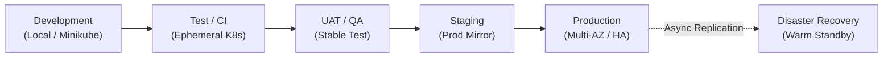

# Reference Environment Architecture

## 1. Environment Topology

The CyberCom Platform defines a standardized progression of environments to ensure safe code deployment, performance validation, and operations training:

---

## 2. Environment Specifications Matrix

| Environment | Purpose | Node Sizing (App Pools) | Database Model | Data Strategy | KMS / Security |
|---|---|---|---|---|---|
| **Development** | Local coding & developer testing. | Local Docker / Minikube (1 node). | Shared PostgreSQL Container. | Mock data generators. | Mock Vault (transit mode). |
| **Test** | CI/CD build validation & automated regression tests. | Ephemeral K8s namespaces (2–3 nodes). | Ephemeral schema instance. | Small, anonymized integration datasets. | Soft KMS keys. |
| **UAT** | Client acceptance testing & QA sign-off. | Low-cost cloud VM cluster (3 nodes). | Multi-tenant shared PostgreSQL. | Anonymized production-like data (no real PHI). | Cloud KMS (soft keys). |
| **Training** | Medical and admin staff onboarding. | Medium-cost cloud VM cluster (3 nodes). | Shared database. Automated nightly reset script. | Simulated hospital clinical datasets. | Cloud KMS. |
| **Staging** | Production mirror; load testing & release validation. | Full scale (mirroring Prod). | Multi-region PostgreSQL Active-Active (HA). | Anonymized production database clone. | HSM-backed Cloud KMS. |
| **Production** | Live transactions & critical operations. | High-performance multi-AZ (minimum 9 nodes). | Dedicated/Shared PostgreSQL (Patroni, pgBackRest). | Real PII/PHI. | Dedicated FIPS 140-3 HSM. |
| **Disaster Recovery** | Warm backup for Business Continuity. | Minimum 3 nodes (scalable during failover). | Warm standbys (WAL replication). | Real-time mirrored data (replication lag < 5s). | Mirrored HSM partitions. |

---

## 3. Environment Synchronization & Promotions (GitOps)

Following [ADR-0010](../adr/ADR-0010-gitops-deployment-strategy.md), environment states are fully declared in Git (Infrastructure as Code - IaC) using **ArgoCD**:
1.  **Deployment Repositories:** Separate folders exist for `/dev`, `/test`, `/uat`, `/staging`, and `/prod`.
2.  **Promotion Flow:** Merging pull requests from `develop` ➔ `release` ➔ `main` triggers ArgoCD reconciliation, aligning the physical Kubernetes cluster state with the Git repository declarations.
3.  **Data Isolation:** Under no circumstances are dev/test systems permitted to query production databases or access production Vault secrets.

---

## 4. Revision History

| Date | Version | Description | Author |
|---|---|---|---|
| 2026-06-21 | 1.0 | Initial Reference Environment Architecture | Enterprise Architect |
