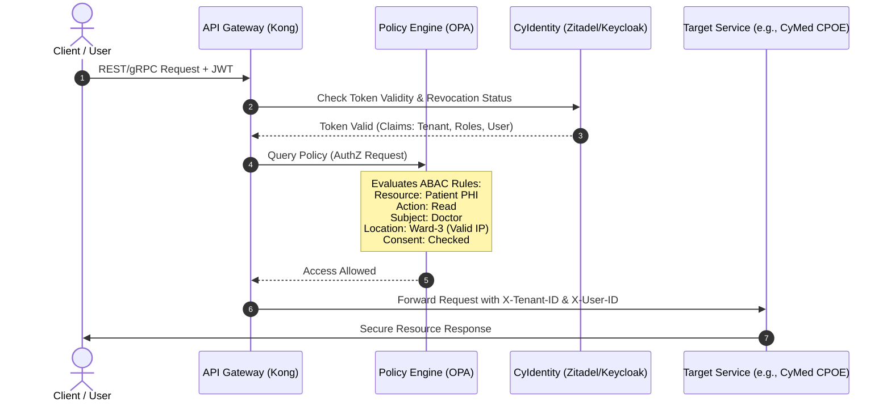
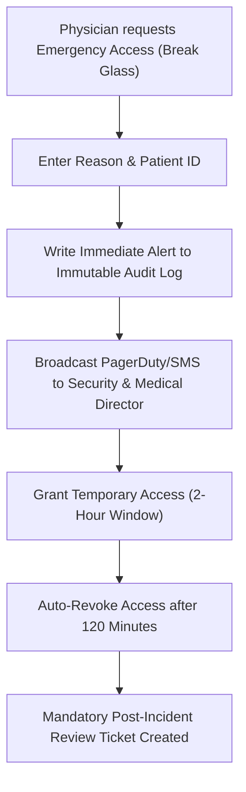

# Security Reference Architecture

## 1. Zero Trust Architecture

CyberCom operates on a **Zero Trust** security model. No entity—whether a user, a service, or an administrator—is trusted by default, regardless of their location on the network (internal or external).

### 1.1 Core Principles
1.  **Continuous Verification:** Authenticate and authorize every request at the Gateway and at the receiving service boundary using short-lived tokens.
2.  **Least Privilege Access:** Grant the absolute minimum access required to perform a business function.
3.  **Microsegmentation:** Workload pods communicate only through defined Service Mesh (Envoy/Istio) channels with mutual TLS (mTLS) enforced.

---

## 2. Authentication & Authorization (RBAC / ABAC)

Authorization combines Role-Based Access Control (RBAC) for coarse-grained routing and Attribute-Based Access Control (ABAC) for fine-grained clinical and financial operations.

### 2.1 Fine-Grained ABAC Policy Controls
Using Open Policy Agent (OPA) sidecars, access policies evaluate dynamic environment and resource attributes:
*   **Location Constraints:** A nurse can only view patient EHRs if their client IP or device GPS proves they are physically located inside the clinic/ward.
*   **Time-Bound Rules:** Administrative staff cannot access payroll schemas outside of working hours (08:00 - 18:00).
*   **Relationship Checks:** A doctor can only write prescriptions if they have an active care relationship with the patient (represented in the `CyMed` Scheduling and Encounter schemas).

### 2.2 MFA and WebAuthn Standard
*   **Mandatory Enforcement:** Multi-factor authentication is mandatory for all access.
*   **Passwordless (WebAuthn):** FIDO2/WebAuthn (passkeys or hardware tokens) is enforced for system administrators, financial officers, and clinical providers performing high-risk actions (e.g., prescribing controlled substances).

---

## 3. Break Glass (Emergency Access) Workflow

In critical clinical scenarios (e.g., a patient enters the Emergency Room unconscious and their primary physician is unavailable), emergency overrides must bypass typical ABAC checks:

### 3.1 Break Glass Controls
*   **Scope:** Time-bound (typically 2 hours).
*   **Auditing:** Emits high-priority alerts to the SIEM.
*   **Post-Audit:** Requires the physician to enter a diagnostic reason, which is linked to the session token and logged in the immutable audit sink.

---

## 4. Encryption Standards

*   **In-Transit:** TLS 1.3 enforced for all external and internal service-to-service calls. Cryptographic cipher suites are restricted to PFS (Perfect Forward Secrecy) algorithms (e.g., ECDHE-RSA-AES256-GCM).
*   **At-Rest:** AES-256-GCM at the storage layer. Databases use Transparent Data Encryption (TDE).
*   **Column-Level Encryption (Envelope Encryption):** Highly sensitive patient data (National ID, birthdate, medical notes) is encrypted before hitting PostgreSQL using data encryption keys (DEKs) managed by Vault.

---

## 5. Secrets Management

*   **Technology:** **HashiCorp Vault**.
*   **Dynamic Credentials:** Database credentials are not hardcoded. Services authenticate to Vault using their Kubernetes ServiceAccount token to receive dynamic, short-lived database user logins (valid for 1 hour).
*   **Key Rotation:** KMS signing keys are rotated automatically every 30 days.

---

## 6. Revision History

| Date | Version | Description | Author |
|---|---|---|---|
| 2026-06-21 | 1.0 | Initial Security Reference Architecture | Enterprise Architect |
