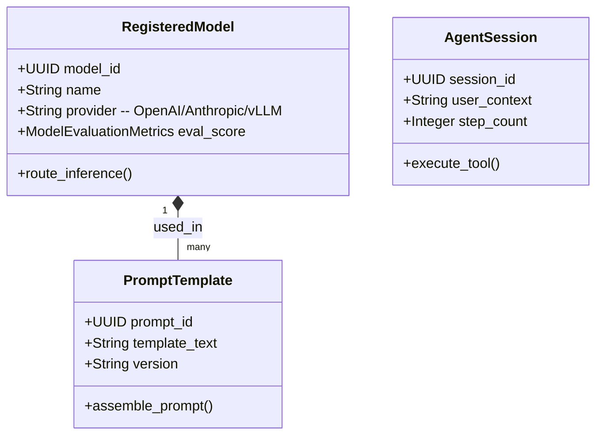

# CyAI Domain Model

> **Product:** CyAI (Platform Plane)  
> **Status:** Approved — Phase 1.3  
> **Owner:** Chief Software Architect  

This document specifies the domain boundaries, aggregates, and domain events for the CyAI context.

---

## 1. Domain Classifications

*   **Core Domains:**
    *   *Model Gateway:* Routing inference requests across LLM providers and classical models.
    *   *Prompt Registry:* Versioning, testing, and retrieving system prompt templates.
    *   *Guardrails:* Enforcing PII/PHI detection filters and prompt-injection mitigations.
*   **Supporting Domains:**
    *   *Vector Store Indexing:* Embedding and indexing data for RAG.
    *   *Agent Framework:* Executing step-bounded agents with secure tool-calling capabilities.
*   **Generic Domains:**
    *   *AI Observability:* Logging token counts, prompts, completions, and costs.

---

## 2. Bounded Contexts & Tactical DDD Mappings

### 2.1 Aggregates, Entities & Value Objects

#### 1. RegisteredModel Aggregate (Root: `RegisteredModel`)
*   *Entities:* `ModelVersion`, `ModelDeployment`.
*   *Value Objects:* `ModelEvaluationMetrics` (accuracy, latency), `LicenseType` (OSS, commercial).
*   *Job:* Governs available LLM and classical model profiles, versions, and deployment states.

#### 2. PromptTemplate Aggregate (Root: `PromptTemplate`)
*   *Entities:* `PromptVersion`.
*   *Value Objects:* `RequiredParameters` (variables list), `SafeFilterConfig`.
*   *Job:* Manages versioned prompt layouts, system instructions, and variables mapping.

#### 3. AgentSession Aggregate (Root: `AgentSession`)
*   *Entities:* `AgentTool` (validated APIs), `AgentTraceNode`.
*   *Value Objects:* `GuardrailPolicy` (toxicity filters, PHI blockers), `BudgetLimit` (max steps, max tokens).
*   *Job:* Manages multi-step agent executions, tracing tools, and enforcing safety limits.

---

## 3. Domain Logic (Services, Policies & Events)

### 3.1 Domain Services
*   `InferenceRoutingService`: Directs requests dynamically based on cost, model availability, and provider status.
*   `PromptAssemblyService`: Merges prompt templates with patient features fetched from the CyData Feature Store.

### 3.2 Policies
*   `SafetyFilterPolicy`: Forces input redaction if an unauthorized prompt contains PHI.
*   `TokenQuotaPolicy`: Restricts API usage based on per-tenant budgets.

### 3.3 Domain & Integration Events

*   **Domain Events:**
    *   `ModelVersionRegistered` (Fires on deployment).
    *   `InferenceCompleted` (Triggered on response receipt).
    *   `AgentToolExecuted` (Fires on tool callback).
*   **Integration Events (Kafka):**
    *   `cybercom.cyai.inference.guardrail.blocked` (Fires when a security filter blocks a request).
    *   `cybercom.cyai.cost.budget.exceeded` (Alerts downstream finance modules of cost budget violations).
