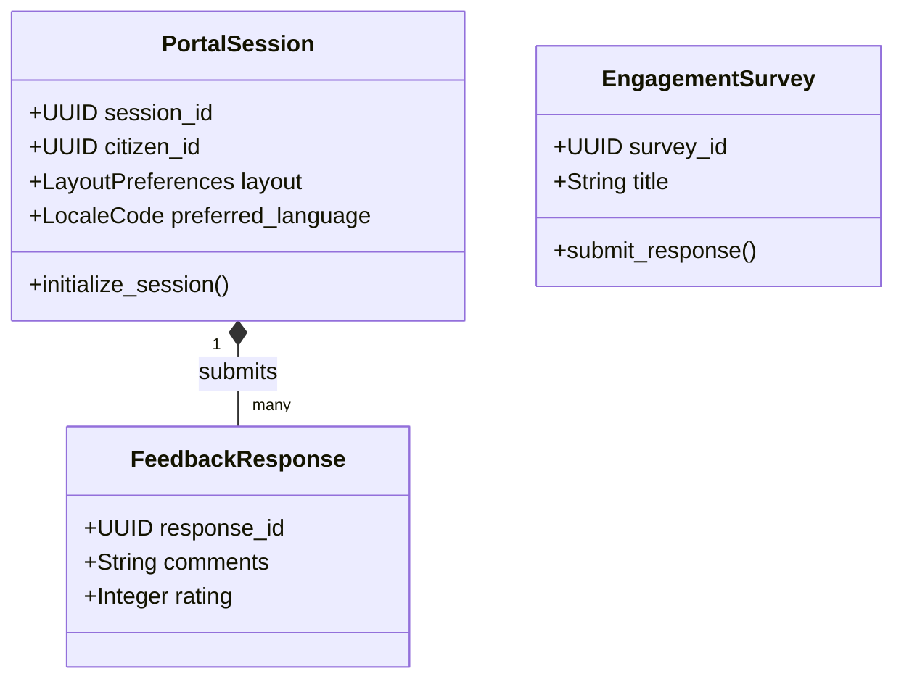

# CyCitizen Domain Model

> **Product:** CyCitizen (Vertical Government Plane - Front-End)  
> **Status:** Approved — Phase 1.3  
> **Owner:** Platform Architect (Government)  

This document specifies the domain boundaries, aggregates, and domain events for the CyCitizen context.

---

## 1. Domain Classifications

*   **Core Domains:**
    *   *Citizen Portal Experience (Z1):* Coordinating layout choices, language preferences, and device configurations.
    *   *Civic Engagement (Z2):* Gathering public surveys, feedback loops, and grievances reports.
    *   *Service Discovery (Z4):* Indexing and rendering the CyGov service catalog.
*   **Supporting Domains:**
    *   *eID Enrollment Flows (Z3):* Orchestrating front-end registration steps. Identity records are saved in CyIdentity.

---

## 2. Bounded Contexts & Tactical DDD Mappings

### 2.1 Aggregates, Entities & Value Objects

#### 1. PortalSession Aggregate (Root: `PortalSession`)
*   *Entities:* `ServiceDiscoveryCache`.
*   *Value Objects:* `LayoutPreferences` (accessibility themes, contrast profiles), `LocaleCode` (en, ar).
*   *Job:* Governs the active citizen front-end session, caching route mappings and localization resources.

#### 2. EngagementSurvey Aggregate (Root: `EngagementSurvey`)
*   *Entities:* `FeedbackResponse`.
*   *Value Objects:* `SurveyQuestion`, `ResponseRating`.
*   *Job:* Manages citizen satisfaction surveys, feedback logs, and complaints submission.

---

## 3. Domain Logic (Services, Policies & Events)

### 3.1 Domain Services
*   `ServiceSearchIndexingService`: Creates fast search indexes of the public service catalog.

### 3.2 Policies
*   `AccessibilityCompliancePolicy`: Enforces WCAG 2.2 AA guidelines on color selections, screen reader tags, and keyboard focus states.

### 3.3 Domain & Integration Events

*   **Domain Events:**
    *   `PortalSessionCreated` (Fires on login).
    *   `FeedbackSubmitted` (Gathers survey data).
*   **Integration Events (Kafka):**
    *   `cybercom.cycitizen.feedback.submitted` (Publishes survey outcome to CyGov Case management and CyData analytics).
