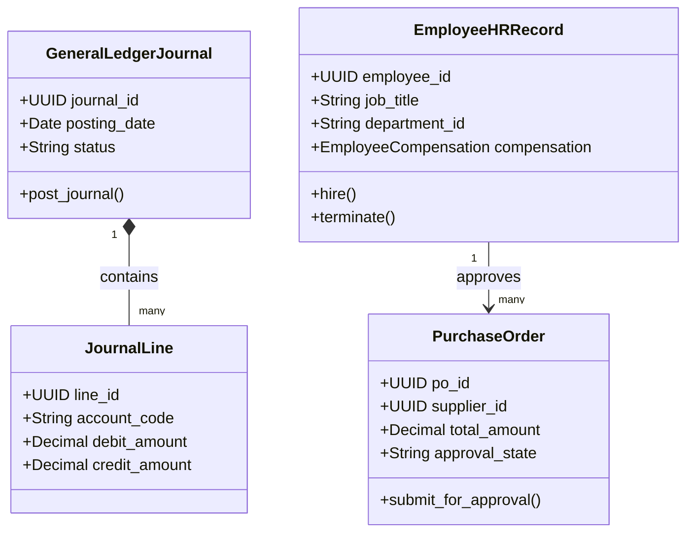

# CyCom Domain Model (Enterprise Back-Office / ERP)

> **Product:** CyCom (Horizontal Back-Office Plane)  
> **Status:** Approved — Phase 1.3  
> **Owner:** ERP Domain Architect  

This document specifies the domain boundaries, aggregates, and domain events for the CyCom ERP context.

---

## 1. Domain Classifications

*   **Core Domains:**
    *   *Finance & Accounting (E1/E2):* General Ledger (GL), Accounts Payable (AP), Accounts Receivable (AR), chart of accounts, journals.
    *   *HR & Payroll (E3/E4):* Employee master, positions, payroll calculations, deductions, payslips.
    *   *Procurement (E5):* Supplier master, RFx, purchase orders, three-way match.
    *   *Inventory (E6):* Warehouse management, stock moves, valuation.
*   **Supporting Domains:**
    *   *Manufacturing (E7):* BoMs, routings, work orders, costing.
    *   *CRM (E8):* B2B leads, opportunities, sales orders.
    *   *Projects (E9) & Assets (E10):* Timesheets, expenses, fixed assets, depreciation.
    *   *Quality (E11), Budgeting (E14), Contracts (E15):* Inspections, CAPA, budgets, contract lifecycle.
*   **Generic Domains:**
    *   *Documents (E12) & Approvals (E13):* Secure enterprise documents, approval workflows.

---

## 2. Bounded Contexts & Tactical DDD Mappings

### 2.1 Aggregates, Entities & Value Objects

#### 1. GeneralLedgerJournal Aggregate (Root: `GeneralLedgerJournal`)
*   *Entities:* `JournalLine`, `PeriodLockStatus`.
*   *Value Objects:* `ChartOfAccountsCode` (assets, liabilities, revenue, expenses), `CurrencyCode`, `FxRate`.
*   *Job:* Governs the financial ledger. Enforces ledger balance (Debits == Credits) and period lock states.

#### 2. EmployeeHRRecord Aggregate (Root: `EmployeeHRRecord`)
*   *Entities:* `LeaveBalance`, `PerformanceRating`, `PositionAssignment`.
*   *Value Objects:* `EmployeeCompensation` (base salary, benefits), `TaxDeclaration`.
*   *Job:* Represents the employee master file. Manages position allocation and contract parameters.

#### 3. PurchaseOrder Aggregate (Root: `PurchaseOrder`)
*   *Entities:* `PurchaseOrderLine`, `ThreeWayMatchStatus` (PO vs. GRN vs. Invoice).
*   *Value Objects:* `SupplierTaxId`, `PaymentTerms`.
*   *Job:* Manages corporate procurement. Enforces spending limits and three-way matching before releasing supplier payments.

#### 4. EnterpriseDocument Aggregate (Root: `EnterpriseDocument`)
*   *Entities:* `DocumentVersion`, `DigitalSignatureRecord`.
*   *Value Objects:* `DocumentClassification` (Confidential, Public), `RetentionSchedule`.
*   *Job:* Stores versioned, digitally signed contracts, POs, invoices, and employee records.

---

## 3. Domain Logic (Services, Policies & Events)

### 3.1 Domain Services
*   `ThreeWayMatchService`: Compares Purchase Orders, Good Received Notes (GRN), and Supplier Invoices. Flags mismatches.
*   `PayrollCalculationService`: Computes gross-to-net pay, applying tax deductions and leave encumbrances.
*   `IntercompanyAllocationService`: Allocates revenues and expenses across multi-entity corporate structures.

### 3.2 Policies
*   `SeparationOfDutiesPolicy` (SoD): Enforces that the PO creator, PO approver, and payment releaser must be distinct users.
*   `PeriodLockPolicy`: Blocks journal postings to closed or locked fiscal periods.

### 3.3 Domain & Integration Events

*   **Domain Events:**
    *   `JournalLineAdded` (Fires on ledger edit).
    *   `ThreeWayMatchPassed` (Releases invoice for payment).
    *   `ApprovalGranted` (Fires when a workflow step completes).
*   **Integration Events (Kafka):**
    *   `cybercom.cycom.employee.hired` (Triggers SCIM account creation in CyIdentity).
    *   `cybercom.cycom.gl.journal.posted` (Alerts CyData to update financial ledger projections).
    *   `cybercom.cycom.po.created` (Initiates approval notification requests in CyConnect).
