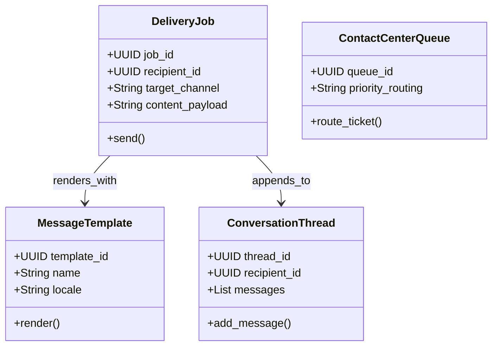

# CyConnect Domain Model

> **Product:** CyConnect (Omnichannel Communications)  
> **Status:** Approved — Phase 1.3  
> **Owner:** Platform Architect (Communications)  

This document specifies the domain boundaries, aggregates, and domain events for the CyConnect context.

---

## 1. Domain Classifications

*   **Core Domains:**
    *   *Channel Routing (C1):* Delivering notifications over SMS, email, push, WhatsApp, voice, and video.
    *   *Template Service (C4):* Managing locale-aware, versioned message templates.
    *   *Consent & Suppression (C5/C10):* Enforcing quiet hours, opt-outs, and jurisdictional regulations (TCPA, GDPR, CASL).
    *   *Conversation Store (C7):* Archiving and threading message logs per recipient.
*   **Supporting Domains:**
    *   *Voice & Video Stacks (C2/C3):* Controlling SIP trunks, IVR routing, and video call sessions.
    *   *Contact Center (C8):* Managing queues, agent presence, and supervisors.
*   **Generic Domains:**
    *   *Agent Assist Embedding:* Displaying AI-generated response suggestions.

---

## 2. Bounded Contexts & Tactical DDD Mappings

### 2.1 Aggregates, Entities & Value Objects

#### 1. DeliveryJob Aggregate (Root: `DeliveryJob`)
*   *Entities:* `DeliveryReceipt`, `ChannelAdapter`.
*   *Value Objects:* `RetryRules`, `CostWeight`.
*   *Job:* Manages individual send workflows, handling retries, adapter failures, and routing logs.

#### 2. MessageTemplate Aggregate (Root: `MessageTemplate`)
*   *Entities:* `TemplateVersion`.
*   *Value Objects:* `LocaleCode` (en-US, ar-SA), `SanitizationHeader`.
*   *Job:* Resolves template placeholders and matches translations per recipient localization.

#### 3. ConversationThread Aggregate (Root: `ConversationThread`)
*   *Entities:* `MessageLogEntry`, `CallRecordingReference`.
*   *Value Objects:* `RecipientPreference` (opt-in status), `ConversationClassification` (Confidential, Restricted).
*   *Job:* Maintains transactional communications histories per contact.

#### 4. ContactCenterQueue Aggregate (Root: `ContactCenterQueue`)
*   *Entities:* `AgentPresence`, `IVRNode`.
*   *Value Objects:* `SkillsVector`, `QueueSla`.
*   *Job:* Manages agent availability, skill routing tags, and supervisor stats.

---

## 3. Domain Logic (Services, Policies & Events)

### 3.1 Domain Services
*   `RouteOptimizationService`: Selects delivery pathways based on current provider latency, availability, and cost.
*   `TemplateRenderService`: Safe-renders variables, preventing HTML/script injections.

### 3.2 Policies
*   `QuietHoursSuppressionPolicy`: Blocks non-urgent notifications during night-time windows (e.g., 22:00 to 07:00 local time).
*   `TCPACompliancePolicy`: Restricts automated outbound voice and SMS calls unless explicit recipient consent is verified.

### 3.3 Domain & Integration Events

*   **Domain Events:**
    *   `MessageSent` (Fires on adapter success).
    *   `MessageFailed` (Triggered on provider errors).
    *   `CallSessionRecorded` (Fires on recording file storage).
*   **Integration Events (Kafka):**
    *   `cybercom.cyconnect.message.delivered` (Updates delivery status in sender contexts).
    *   `cybercom.cyconnect.cc.handoff` (Alerts CRM systems to customer escalation events).
