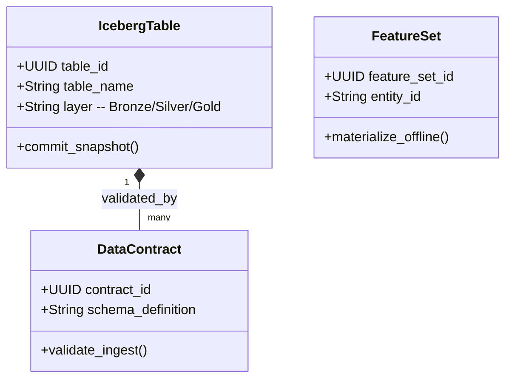

# CyData Domain Model

> **Product:** CyData (Platform Plane)  
> **Status:** Approved — Phase 1.3  
> **Owner:** Principal Engineer (Data)  

This document specifies the domain boundaries, aggregates, and domain events for the CyData context.

---

## 1. Domain Classifications

*   **Core Domains:**
    *   *Lakehouse Storage:* Managing transactional tables (Apache Iceberg) in Bronze, Silver, and Gold zones.
    *   *Transformation Orchestration:* Running dbt models and Airflow DAGs.
    *   *Data Contracts:* Defining structural expectations between source systems and the lakehouse.
*   **Supporting Domains:**
    *   *Feature Store (Feast):* Registering and serving online/offline ML features.
    *   *Data Catalog:* Tracking data classifications and lineage.
*   **Generic Domains:**
    *   *Retention & Erasure:* Enforcing compliance rules and propagating erasure requests.

---

## 2. Bounded Contexts & Tactical DDD Mappings

### 2.1 Aggregates, Entities & Value Objects

#### 1. IcebergTable Aggregate (Root: `IcebergTable`)
*   *Entities:* `TableSnapshot`, `TablePartition`.
*   *Value Objects:* `ColumnSchema` (field names, types), `DataClassification` (Public, Confidential, Restricted).
*   *Job:* Manages storage schema formats, partition parameters, and data state histories.

#### 2. DataContract Aggregate (Root: `DataContract`)
*   *Entities:* `ContractRule`.
*   *Value Objects:* `SlaParameters` (freshness, volume), `ComplianceMapping` (HIPAA tag, GDPR tag).
*   *Job:* Validates incoming event streams against data requirements.

#### 3. FeatureSet Aggregate (Root: `FeatureSet`)
*   *Entities:* `FeatureDefinition`.
*   *Value Objects:* `FeatureVector`, `ServingTtl`.
*   *Job:* Governs the schema and serving metrics for ML features.

---

## 3. Domain Logic (Services, Policies & Events)

### 3.1 Domain Services
*   `DeIdentificationService`: Removes or masks patient identifiers (Safe Harbor rules) before copying data from Silver to Gold.
*   `ErasurePropagationService`: Scans Bronze/Silver tables and applies tombstones to rows requested for deletion.

### 3.2 Policies
*   `DataQualityPolicy`: Quarantines payloads that fail contract validation, logging discrepancies to the audit sink.
*   `RetentionPolicy`: Automatically deletes tables or partitions that exceed regional archiving limits.

### 3.3 Domain & Integration Events

*   **Domain Events:**
    *   `TableSnapshotCommitted` (Fires on data write).
    *   `DataContractViolated` (Triggered on schema mismatches).
    *   `FeatureMaterialized` (Fires when features update).
*   **Integration Events (Kafka):**
    *   `cybercom.cydata.dataset.contract.published` (Broadcasts contract expectations to upstream services).
    *   `cybercom.cydata.erasure.applied` (Confirms compliance deletion task completion).
