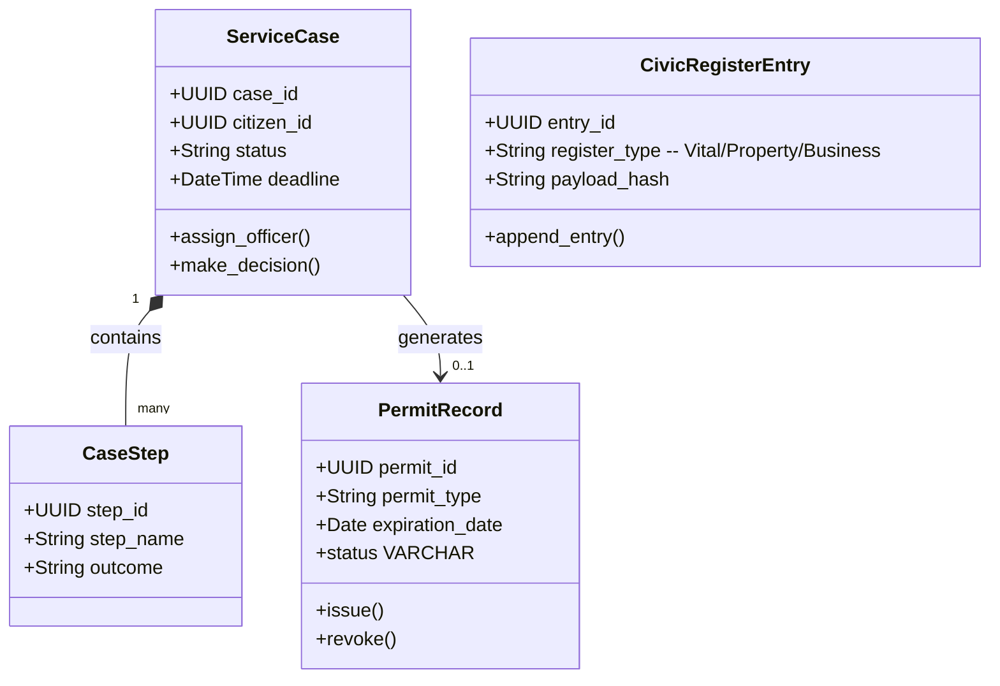

# CyGov Domain Model (Government & Registries)

> **Product:** CyGov (Vertical Government Plane)  
> **Status:** Approved — Phase 1.3  
> **Owner:** Platform Architect (Government)  

This document specifies the domain boundaries, aggregates, and domain events for the CyGov context.

---

## 1. Domain Classifications

*   **Core Domains:**
    *   *Case Management & Workflow (G2):* Tracking application statuses, officer assignments, and SLAs.
    *   *Permits & Licensing (G4):* Managing business licensing, building permits, and clinical practitioner registries.
    *   *Civic Registers (G7):* Append-only ledger registers for births, deaths, marriages, and property/business listings.
*   **Supporting Domains:**
    *   *Service Catalog (G1):* Defining available services, eligibility requirements, and fees.
    *   *e-Procurement (G3):* Public-sector tendering, RFx, sealed bids, and contract awards.
    *   *Regulatory Submissions (G5):* Processing hospital clinical reports, tax returns, and bank statements.
    *   *Inspections:* Scheduling and logging field audits and safety inspections.
*   **Generic Domains:**
    *   *Revenue Collection (G6):* Fee and fine assessments. Payment capture is delegated to CyShop.
    *   *Public Records & Open Data (G9):* Redacting and publishing datasets.

---

## 2. Bounded Contexts & Tactical DDD Mappings

### 2.1 Aggregates, Entities & Value Objects

#### 1. ServiceCase Aggregate (Root: `ServiceCase`)
*   *Entities:* `CaseStep`, `CaseDocument`.
*   *Value Objects:* `EligibilityStatus`, `OfficerAssignment`.
*   *Job:* Governs the workflow of citizen applications, enforcing SLAs and statutory step completions.

#### 2. PermitRecord Aggregate (Root: `PermitRecord`)
*   *Entities:* `InspectionRecord`.
*   *Value Objects:* `LicensingScope`, `JurisdictionCode`.
*   *Job:* Reps issued permissions (business licenses, medical practice permits). Tracks inspection logs.

#### 3. CivicRegisterEntry Aggregate (Root: `CivicRegisterEntry`)
*   *Entities:* `RegisterAuditSignature`.
*   *Value Objects:* `VitalStatistic` (birth/death attributes), `CryptographicAttestation`.
*   *Job:* Implements immutable, append-only records of civic events, ensuring cryptographic integrity.

#### 4. GovernmentTender Aggregate (Root: `GovernmentTender`)
*   *Entities:* `BidSubmission`, `TenderAward`.
*   *Value Objects:* `SealedBidTimer`, `TenderScope`.
*   *Job:* Manages public e-procurement bids, locking submissions until the tender deadline.

---

## 3. Domain Logic (Services, Policies & Events)

### 3.1 Domain Services
*   `TenderSealingService`: Enforces cryptographic sealing of bids, preventing pre-deadline visibility.
*   `OpenDataRedactionService`: Anonymizes PII from civic records using redactors before public releases.
*   `CaseSlaMonitoringService`: Continuously monitors case timelines and escalates cases approaching breach windows.

### 3.2 Policies
*   `TenderConflictPolicy`: Evaluates bid details to identify conflict-of-interest indicators between officers and bidders.
*   `AccessControlPolicy`: Limits visibility of vital registries to authenticated and authorized officers only.

### 3.3 Domain & Integration Events

*   **Domain Events:**
    *   `CaseAssigned` (Fires on queue allocation).
    *   `BidReceived` (Adds to sealed vault).
    *   `InspectionFailed` (Triggers violation alerts).
*   **Integration Events (Kafka):**
    *   `cybercom.cygov.fee.assessed` (Alerts CyShop for checkout capture and CyCom for AR entry).
    *   `cybercom.cygov.case.updated` (Triggers status notifications in CyCitizen and CyConnect).
