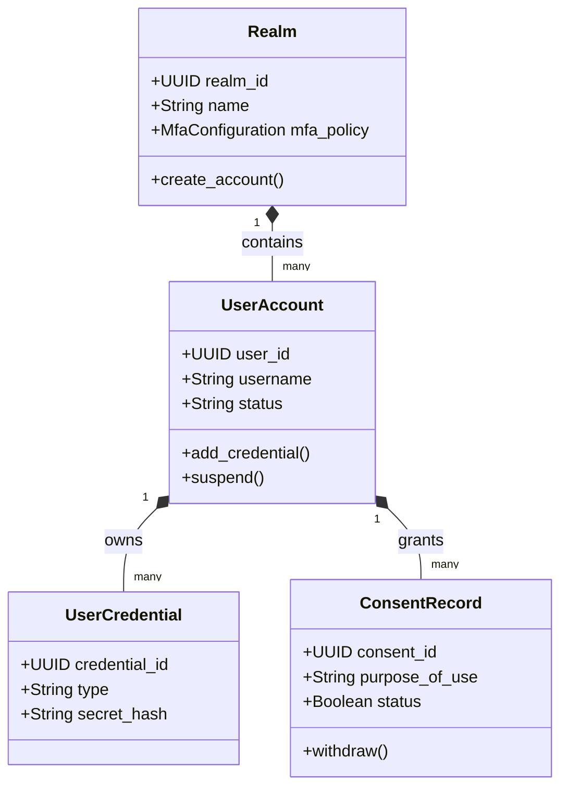

# CyIdentity Domain Model

> **Product:** CyIdentity (Platform Plane)  
> **Status:** Approved — Phase 1.3  
> **Owner:** Chief Security Architect  

This document specifies the domain boundaries, aggregates, and domain events for the CyIdentity product context.

---

## 1. Domain Classifications

*   **Core Domains:**
    *   *Authentication (AuthN):* Verifying principal identities (OAuth 2.1, OIDC, WebAuthn, passkeys).
    *   *Realms & Tenants:* Isolating user spaces (Workforce, Customer, Citizen, Partner, Workload).
    *   *Consent Management:* Capturing identity-level user privacy consents and purpose-of-use definitions.
*   **Supporting Domains:**
    *   *Workforce Provisioning:* SCIM 2.0 adapters for upstream HRIS mappings.
    *   *Workload Identity Bridge:* Issuing SPIFFE SVIDs and exchanging tokens.
*   **Generic Domains:**
    *   *Audit Emission:* Sending identity-access records to the platform audit sink.

---

## 2. Bounded Contexts & Tactical DDD Mappings

### 2.1 Aggregates, Entities & Value Objects

#### 1. Realm Aggregate (Root: `Realm`)
*   *Entities:* `ClientApplication`, `IdentityProviderFederation`.
*   *Value Objects:* `MfaConfiguration` (password complexity, WebAuthn requirements), `RealmTheme` (white-label metadata).
*   *Job:* Manages isolation boundaries for tenants and enforces password/MFA parameters.

#### 2. UserAccount Aggregate (Root: `UserAccount`)
*   *Entities:* `UserCredential` (passwords, WebAuthn credentials), `UserSession`.
*   *Value Objects:* `UserAttribute` (roles, emails, department codes), `DevicePostureInfo` (OS version, MDM compliance signals).
*   *Job:* Represents the active identity entity. Enforces authentication attempts, lockouts, and session lifecycles.

#### 3. ConsentRecord Aggregate (Root: `ConsentRecord`)
*   *Entities:* `ConsentPurpose`.
*   *Value Objects:* `ConsentScope` (PII access, billing access), `ConsentTimestamp`.
*   *Job:* Tracks explicit user agreements for data sharing.

---

## 3. Domain Logic (Services, Policies & Events)

### 3.1 Domain Services
*   `PasswordHashingService`: Implements Argon2id hashing algorithms for local credentials.
*   `TokenSigningService`: Signs JWT tokens using RSA/ECDSA key pairs stored in Vault/HSM.

### 3.2 Policies
*   `MfaStepUpPolicy`: Forces WebAuthn step-up authentication when the clinician requests access to a high-alert ward (e.g., ICU) or attempts a clinical override.
*   `SessionTimeoutPolicy`: Limits session lifecycles to 15 minutes for active clinical clients.

### 3.3 Domain & Integration Events

*   **Domain Events:**
    *   `UserCredentialEnrolled` (Fires when WebAuthn is configured).
    *   `SessionExpired` (Triggered on inactivity).
    *   `ConsentWithdrawn` (Fires when a citizen revokes permissions).
*   **Integration Events (Kafka):**
    *   `cybercom.cyidentity.account.suspended` (Triggers immediate session termination in downstream products).
    *   `cybercom.cyidentity.consent.updated` (Alerts CyData to update anonymization rules).
