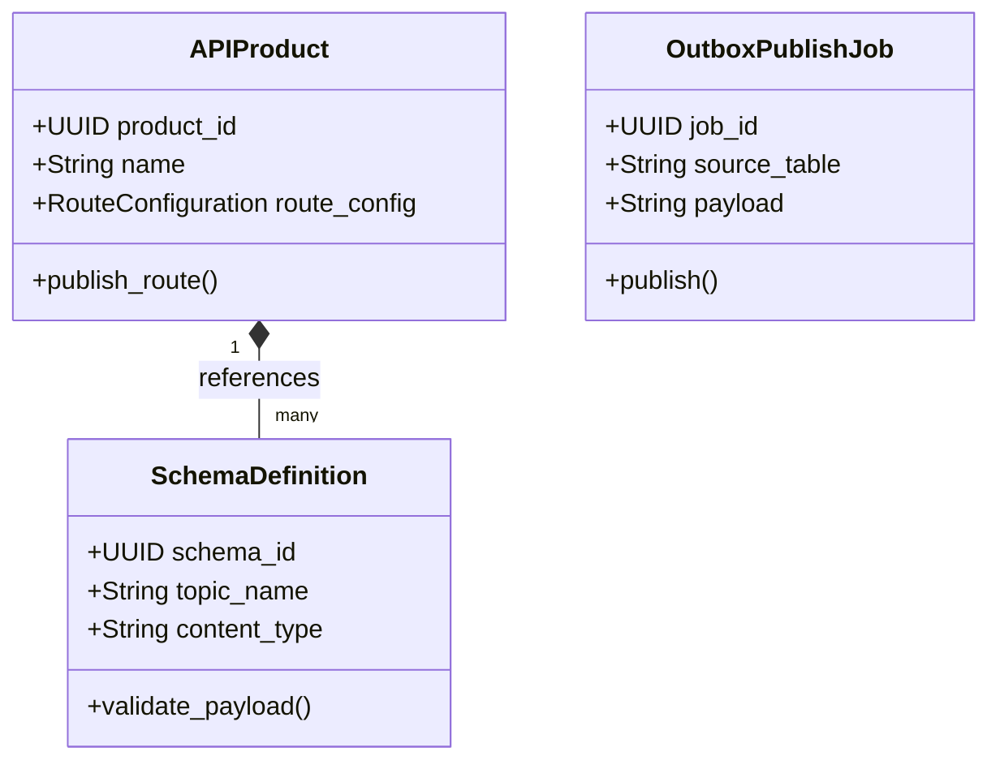

# CyIntegration Hub Domain Model

> **Product:** CyIntegration Hub (Platform Plane)  
> **Status:** Approved — Phase 1.3  
> **Owner:** Platform Architect  

This document specifies the domain boundaries, aggregates, and domain events for the CyIntegration Hub context.

---

## 1. Domain Classifications

*   **Core Domains:**
    *   *API Management:* Governing external endpoint publication, routing, and rate limits.
    *   *Schema Registry:* Enforcing data contract compatibility for Kafka event topics.
    *   *Outbox Publisher:* Transactional message delivery from product datastores.
*   **Supporting Domains:**
    *   *Protocol Translation (iPaaS):* Translating HL7 v2, DICOM, and ISO 20022 payloads into standard JSON/FHIR formats.
*   **Generic Domains:**
    *   *Webhook Dispatch:* Handling signed outbound delivery attempts to external partners.

---

## 2. Bounded Contexts & Tactical DDD Mappings

### 2.1 Aggregates, Entities & Value Objects

#### 1. APIProduct Aggregate (Root: `APIProduct`)
*   *Entities:* `ProxyRoute`, `PartnerRegistration`.
*   *Value Objects:* `RouteConfiguration` (paths, CORS rules), `RateLimitingPolicy` (burst limits, quota limits).
*   *Job:* Manages the public API gateway surface, routing configs, and partner permissions.

#### 2. SchemaDefinition Aggregate (Root: `SchemaDefinition`)
*   *Entities:* `SchemaVersion`.
*   *Value Objects:* `CompatibilityLevel` (Backward, Forward, Full), `SchemaPayload` (Avro/JSON-Schema text).
*   *Job:* Validates outbound and inbound payloads against registered topic contracts.

#### 3. OutboxPublishJob Aggregate (Root: `OutboxPublishJob`)
*   *Entities:* `OutboxAttemptLog`.
*   *Value Objects:* `JobStatus` (Pending, Succeeded, Failed), `RetryMetadata`.
*   *Job:* Guarantees at-least-once transactional delivery from database outbox tables to Kafka.

---

## 3. Domain Logic (Services, Policies & Events)

### 3.1 Domain Services
*   `HL7ToFHIRConverter`: Standardizes legacy healthcare messages into FHIR R4 JSON structures.
*   `PayloadSignatureGenerator`: Computes HMAC-SHA-256 signatures for outgoing webhooks.

### 3.2 Policies
*   `SchemaEvolutionPolicy`: Prevents schemas with breaking changes from registering in the catalog without a major version bump.
*   `RateLimitingPolicy`: Dynamic throttling of partner requests based on active tier attributes.

### 3.3 Domain & Integration Events

*   **Domain Events:**
    *   `SchemaRegistered` (Triggered on contract deployment).
    *   `APIProductUpdated` (Fires on route changes).
    *   `OutboxJobFailed` (Triggered on publisher retries exhaustion).
*   **Integration Events (Kafka):**
    *   `cybercom.hub.route.published` (Informs gateway edge pods of routing updates).
    *   `cybercom.hub.webhook.dlq` (Fires when a partner webhook fails delivery).
