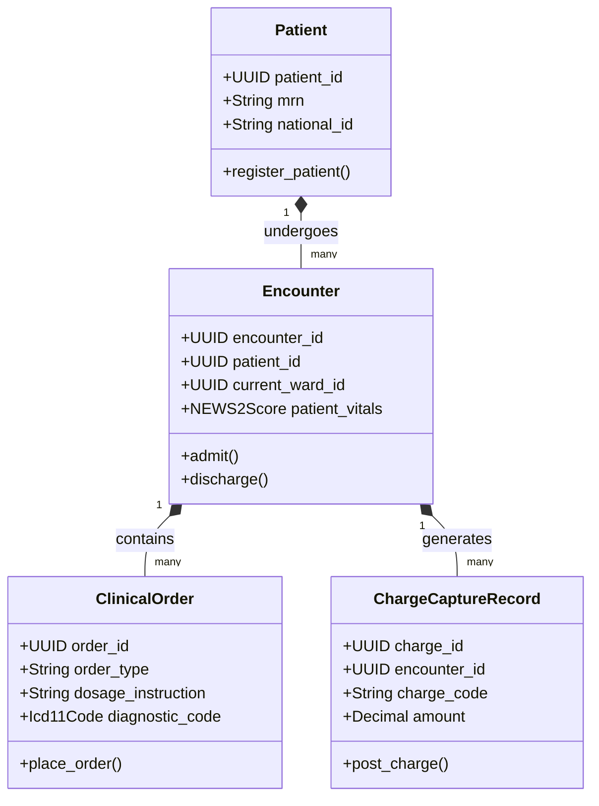

# CyMed Domain Model

> **Product:** CyMed (Vertical Plane)  
> **Status:** Approved — Phase 1.3  
> **Owner:** Healthcare Domain Architect  

This document specifies the domain boundaries, aggregates, and domain events for the CyMed healthcare context.

---

## 1. Domain Classifications

*   **Core Domains:**
    *   *Patient Registry (H1):* Managing the local Master Patient Index (MPI).
    *   *Clinical Records (H3):* Storing Electronic Health Records (problems, allergies, observations).
    *   *Orders (CPOE - H4):* Managing doctor orders (medications, labs, procedures).
    *   *Scheduling (H9):* Coordinating clinic, operating theater, and clinician shift rosters.
    *   *Inpatient / Outpatient / Emergency / Operating Theatre:* Operational workflows per clinical unit.
    *   *Nursing & Bed Management (H10):* Charting, care plans, bed state tracking, infection controls.
*   **Supporting Domains:**
    *   *Clinical Support:* Laboratory (specimens/worklists), Pharmacy (formulary/dispensation), Imaging (DICOM references).
    *   *Billing & Revenue Cycle (H12):* Capturing clinical charges and exporting ICD-11 coding files.
    *   *Clinical Decision Support (CDS):* Hooking OPA rules and AI-suggested alerts into workflows.
*   **Generic Domains:**
    *   *Research:* De-identifying cohorts for research export.
    *   *Credentialing check:* Validating active license claims before CPOE entry.

---

## 2. Bounded Contexts & Tactical DDD Mappings

### 2.1 Aggregates, Entities & Value Objects

#### 1. Patient Aggregate (Root: `Patient`)
*   *Entities:* `PatientContact`, `PatientConsent`.
*   *Value Objects:* `MedicalRecordNumber`, `NationalIdentityNumber`.
*   *Job:* Represents the master patient index. Enforces identity integrity and clinical consent limits.

#### 2. Encounter Aggregate (Root: `Encounter`)
*   *Entities:* `BedAssignment`, `VitalsObservation`, `ShiftAssignment`.
*   *Value Objects:* `NEWS2Score` (respiratory rate, oxygen saturation, temperature), `AcuityLevel` (Stable, Moderate, Intensive).
*   *Job:* Represents the active inpatient admission, outpatient visit, or emergency trauma encounter.

#### 3. ClinicalOrder Aggregate (Root: `ClinicalOrder`)
*   *Entities:* `MedicationAdministration` (eMAR record), `LabSpecimen`.
*   *Value Objects:* `Icd11Code` (WHO diagnosis standard), `DoseInstruction`.
*   *Job:* Governs CPOE entries, clinical verification cycles, and eMAR administration checks.

#### 4. ChargeCaptureRecord Aggregate (Root: `ChargeCaptureRecord`)
*   *Entities:* `ChargeCodeDetails`.
*   *Value Objects:* `PayerCode`, `BillingAmount`.
*   *Job:* Generates billing data based on clinical actions. Sends charge outputs to CyShop (capture) and CyCom (AR posting).

---

## 3. Domain Logic (Services, Policies & Events)

### 3.1 Domain Services
*   `AcuityCalculationService`: Analyzes patient vitals and automatically determines shift staffing requirements (HPPD targets).
*   `DoseRangeCheckService`: Evaluates physician orders against age, weight, and allergy histories, flagging dosage warnings.
*   `ClinicalAccessValidationService`: Validates active duty rosters against OPA policies to check chart read permissions.

### 3.2 Policies
*   `ClinicalConsentPolicy`: Restricts EHR access if a patient has withdrawn consent, enforcing "Break-the-Glass" logging for emergency overrides.
*   `SafetyRatioPolicy`: Generates shortage warnings when nurse-to-patient counts drop below safe limits.

### 3.3 Domain & Integration Events

*   **Domain Events:**
    *   `EncounterAdmitted` (Fires on patient check-in).
    *   `OrderPlaced` (Triggered on CPOE execution).
    *   `MedicationAdministered` (eMAR sign-off).
    *   `BreakTheGlassInvoked` (Emergency record override).
*   **Integration Events (Kafka):**
    *   `cybercom.cymed.encounter.admitted` (Updates identity OPA/Redis active location cache).
    *   `cybercom.cymed.chargecapture.posted` (Triggers billing reconciliation in CyShop and ledger entry in CyCom).
    *   `cybercom.cymed.roster.hours_worked` (Synchronizes clinician timesheets with CyCom Payroll).
