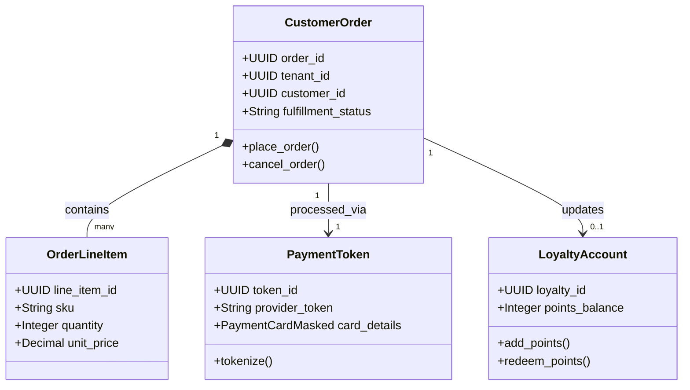

# CyShop Domain Model (Consumer Commerce)

> **Product:** CyShop (Horizontal Commerce Plane)  
> **Status:** Approved — Phase 1.3  
> **Owner:** Chief Commerce Architect  

This document specifies the domain boundaries, aggregates, and domain events for the CyShop commerce context.

---

## 1. Domain Classifications

*   **Core Domains:**
    *   *E-Commerce & Retail (S1/S2):* Catalog management, cart pricing, storefront checkout.
    *   *Payments & PCI Enclave (S3):* Card tokenization, capture, refunds, and PCI DSS isolation.
    *   *Order Management (OMS - S4):* Order fulfillment, carrier routing, returns.
*   **Supporting Domains:**
    *   *POS (Point of Sale):* Physical register transactions and hardware sync.
    *   *Marketplace (S5):* Multi-seller listings, commissions, vendor payouts.
    *   *Subscriptions (S6):* Recurring billing plans and consumer subscription accounts.
*   **Generic Domains:**
    *   *Loyalty & Customer Engagement:* Points balances, promotional rewards, campaign triggers.
    *   *Tax Engine Integration (S7):* Consumer-facing sales tax and invoice generation.

---

## 2. Bounded Contexts & Tactical DDD Mappings

### 2.1 Aggregates, Entities & Value Objects

#### 1. CustomerOrder Aggregate (Root: `CustomerOrder`)
*   *Entities:* `OrderLineItem`, `FulfillmentLog`.
*   *Value Objects:* `ShippingAddress`, `PromoCode`, `OrderStatus` (Pending, Paid, Shipped, Returned).
*   *Job:* Governs consumer storefront purchases, matching transactions with logistics events.

#### 2. PaymentToken Aggregate (Root: `PaymentToken`)
*   *Entities:* `TransactionAttempt`.
*   *Value Objects:* `PaymentCardMasked` (last 4 digits, brand, expiry), `PaymentReference`.
*   *Job:* Securely represents payment instruments within the PCI enclave. Stores zero PANs (Primary Account Numbers) in the main database.

#### 3. SubscriptionPlan Aggregate (Root: `SubscriptionPlan`)
*   *Entities:* `ActiveSubscription`.
*   *Value Objects:* `BillingSchedule` (Monthly, Annual), `GracePeriod`.
*   *Job:* Coordinates recurring consumer billing intervals and access privileges.

#### 4. LoyaltyAccount Aggregate (Root: `LoyaltyAccount`)
*   *Entities:* `LoyaltyLedgerEntry`.
*   *Value Objects:* `PointsValue`, `RewardTier`.
*   *Job:* Tracks promotional rewards balances and redemption eligibility.

---

## 3. Domain Logic (Services, Policies & Events)

### 3.1 Domain Services
*   `PaymentProcessingService`: Mediates between the internal PCI enclave and external payment gateways (Stripe, Adyen, local networks).
*   `FraudSignalScoringService`: Packages transaction signals (device fingerprint, geolocation, IP velocity) to send to CyAI for risk scoring.
*   `TaxCalculationService`: Computes regional sales taxes/VAT (integrating with ZATCA in KSA, local rules in UAE/USA).

### 3.2 Policies
*   `RefundPolicy`: Enforces limits on refunds (e.g., maximum 30 days post-fulfillment) based on order status and item type.
*   `SubscriptionBillingPolicy`: Governs dunning cycles, specifying retry intervals and automatic account suspension upon payment failure.

### 3.3 Domain & Integration Events

*   **Domain Events:**
    *   `CartAbandoned` (Triggers marketing follow-ups).
    *   `PaymentTokenized` (Confirms PCI token creation).
    *   `LoyaltyPointsRedeemed` (Fires on ledger update).
*   **Integration Events (Kafka):**
    *   `cybercom.cyshop.payment.captured` (Triggers invoice/AR postings in CyCom Finance and fee releases in CyGov/CyMed).
    *   `cybercom.cyshop.order.shipped` (Triggers shipping notice delivery in CyConnect).
