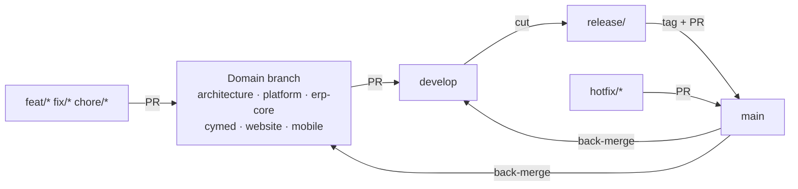
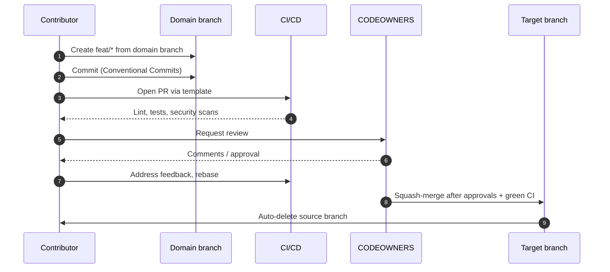
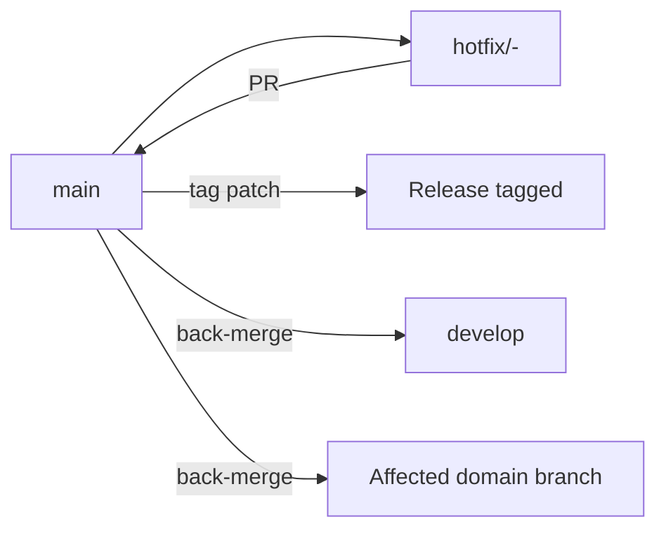
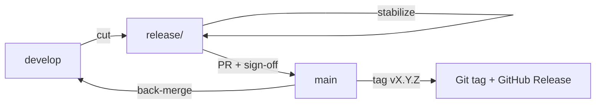

# Git Strategy

> **Status:** Approved — Program 0, Phase 0.2
> **Owner:** Chief Enterprise Architect
> **Applies to:** https://github.com/eng9myan/CyberCom-Platform

This document defines how branches, commits, merges, and history are managed across the CyberCom Platform monorepo.

---

## 1. Principles

1. **Trunk-stable, branch-fast.** `main` is always releasable; experiments happen on short-lived branches.
2. **Linear, signed history.** Squash-merge into protected branches; signed commits required where supported.
3. **Smallest reasonable PR.** A PR does one thing and is reviewable in under 30 minutes.
4. **Documentation is code.** Docs, ADRs, and IaC follow the same branch and review rules as application code.
5. **No long-lived feature branches.** Anything older than 14 days must be rebased or closed.

---

## 2. Branch Model

CyberCom uses a **layered, domain-aligned branching model** — a hybrid of GitFlow (for release discipline) and trunk-based (for fast iteration inside each domain branch).

### 2.1 Permanent branches

| Branch | Purpose | Protection | Lifetime |
|---|---|---|---|
| `main` | Production-equivalent. Tagged for every release. | 🔒 Highest | Permanent |
| `develop` | Integration of cross-domain work before promotion to `main`. | 🔒 High | Permanent |
| `architecture` | ADRs, reference architectures, diagrams, governance docs. | 🔒 High | Permanent |
| `platform` | Cross-cutting platform services (CyIdentity, CyIntegration Hub, CyData, CyAI). | 🔒 High | Permanent |
| `erp-core` | ERP modules (Finance, HR, SCM, CRM, Accounting). | 🔒 High | Permanent |
| `cymed` | CyMed healthcare product (HMRS). | 🔒 High | Permanent |
| `website` | Public marketing/web surface. | 🔒 Medium | Permanent |
| `mobile` | iOS / Android applications. | 🔒 High | Permanent |
| `release` | Active release stabilization line. | 🔒 Highest | Permanent (rotated per release train) |

### 2.2 Transient branches

| Prefix | Pattern | Source | Target | Example |
|---|---|---|---|---|
| Feature | `feat/<scope>-<short-desc>` | domain branch | domain branch | `feat/cymed-fhir-patient` |
| Fix | `fix/<scope>-<short-desc>` | domain branch | domain branch | `fix/erp-core-gl-rounding` |
| Hotfix | `hotfix/<scope>-<short-desc>` | `main` | `main` + back-merge | `hotfix/cymed-auth-bypass` |
| Docs | `docs/<scope>-<short-desc>` | `architecture` | `architecture` | `docs/adr-0007-eid` |
| Chore | `chore/<scope>-<short-desc>` | domain branch | domain branch | `chore/platform-deps-bump` |
| Release | `release/<version>` | `develop` | `release` → `main` | `release/0.2.0` |

### 2.3 Flow diagram



### 2.4 Branch ownership (CODEOWNERS-aligned)

| Branch | Owning role(s) |
|---|---|
| `main` | Chief Enterprise Architect + Release Manager |
| `develop` | Technical Program Manager + Domain Leads |
| `architecture` | Chief Enterprise Architect + Security Architect |
| `platform` | Platform Architect |
| `erp-core` | ERP Domain Architect |
| `cymed` | Healthcare Domain Architect |
| `website` | Web Lead |
| `mobile` | Mobile Lead |
| `release` | Release Manager |

---

## 3. Commit Standard — Conventional Commits

All commits **must** follow [Conventional Commits 1.0.0](https://www.conventionalcommits.org/).

### 3.1 Format

```
<type>(<scope>)<!>: <short summary>

<body — what & why, not how>

<footer — BREAKING CHANGE / Refs / Co-authored-by>
```

### 3.2 Allowed types

| Type | Purpose | Triggers release? |
|---|---|---|
| `feat` | New feature | minor |
| `fix` | Bug fix | patch |
| `docs` | Documentation only | no |
| `style` | Formatting, no logic change | no |
| `refactor` | Code change, no behavior change | no |
| `perf` | Performance improvement | patch |
| `test` | Tests only | no |
| `build` | Build system, dependencies | no |
| `ci` | CI/CD configuration | no |
| `chore` | Maintenance | no |
| `revert` | Revert a previous commit | varies |
| `security` | Security fix | patch (or higher) |

### 3.3 Allowed scopes (initial)

`identity`, `citizen`, `integration`, `data`, `ai`, `med`, `com`, `shop`, `gov`, `platform`, `erp`, `infra`, `docs`, `ci`, `web`, `mobile`, `desktop`, `repo`.

### 3.4 Breaking changes

Mark with `!` after the scope **and** a `BREAKING CHANGE:` footer. Breaking changes trigger a **major** version bump.

### 3.5 Examples

```
feat(cymed): add HL7 FHIR Patient resource adapter

Implements R4 Patient profile aligned to MOH baseline.
Refs: ADR-0011
```

```
fix(identity)!: rotate JWT signing key format

BREAKING CHANGE: existing tokens issued before v0.4.0 are invalidated.
```

---

## 4. Merge Process

| Target | Strategy | Required |
|---|---|---|
| Domain branches | Squash | 1 CODEOWNER approval, CI green |
| `develop` | Squash | 2 approvals (1 domain owner + 1 architect), CI green |
| `release/*` | Merge commit | Release Manager + 1 architect |
| `main` | Merge commit (from `release/*` or `hotfix/*` only) | Release Manager + Chief Architect |
| `architecture` | Squash | Chief Architect or Security Architect |

**Rules:**
- No direct pushes to any protected branch.
- All PRs must be linked to an issue or ADR.
- "Update branch" via **rebase**, not merge, before squash.
- Stale approvals dismissed on new commits.

---

## 5. Pull Request Workflow



**Required PR checks (target state):**
- Conventional Commits lint
- Secret scan + push protection
- Dependency vulnerability scan
- Unit / integration tests
- Static analysis / linters
- License scan
- Documentation/ADR check (for architecture-affecting changes)

---

## 6. Hotfix Workflow

For Sev-1/Sev-2 production defects only.



1. Branch from `main`: `hotfix/<scope>-<desc>`.
2. Minimal, surgical change. Add regression test.
3. PR to `main` — Release Manager + Chief Architect approval, expedited.
4. Tag patch release on merge.
5. **Back-merge** `main` → `develop` and `main` → affected domain branch within 24 hours.

---

## 7. Release Workflow

See [`release_management.md`](release_management.md) for full detail. Summary:



---

## 8. Feature Branch Workflow

1. Sync the domain branch: `git fetch && git switch <domain> && git pull --ff-only`.
2. Create: `git switch -c feat/<scope>-<short-desc>`.
3. Commit using Conventional Commits.
4. Push and open PR against the **domain branch** (not `main`).
5. Keep PR < 400 lines diff where possible.
6. Resolve review comments, rebase on domain branch.
7. Squash-merge on approval; delete the branch.

---

## 9. Tagging & Versioning

Versioning is defined in [`release_management.md`](release_management.md). All tags use `vMAJOR.MINOR.PATCH[-prerelease]` (e.g. `v0.2.0`, `v1.0.0-rc.1`). Tags are signed and immutable.

---

## 10. Repository Hygiene

- Stale branches (no commits in 14 days) are auto-flagged.
- Merged branches are auto-deleted.
- Force-push to any protected branch is forbidden.
- Large files (>5 MB) require Git LFS or an external artifact store.
- Generated files are `.gitignore`d, never committed.
