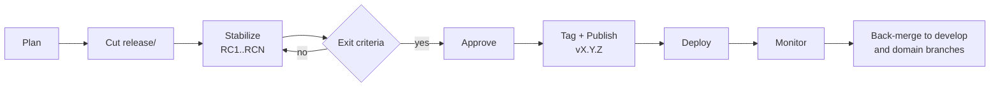

# Release Management

> **Status:** Approved — Program 0, Phase 0.2
> **Owner:** Release Manager + Technical Program Manager

This document defines how CyberCom Platform versions, stabilizes, ships, and rolls back releases.

---

## 1. Versioning Strategy — Semantic Versioning 2.0.0

Format: `MAJOR.MINOR.PATCH[-prerelease][+build]`

| Segment | Bump when… |
|---|---|
| **MAJOR** | A backwards-incompatible change is merged (commit footer `BREAKING CHANGE:` or `<type>!:`). |
| **MINOR** | A backwards-compatible feature is merged (`feat:`). |
| **PATCH** | A backwards-compatible bug fix or security fix is merged (`fix:`, `security:`, `perf:`). |
| **Prerelease** | Stabilization builds: `-alpha.N`, `-beta.N`, `-rc.N`. |
| **Build** | Build metadata (CI run id, commit sha). Not part of precedence. |

### 1.1 Platform vs product versions
- The **platform** carries a top-level umbrella version (e.g. `v0.2.0`).
- Each **product** (CyIdentity, CyMed, …) MAY carry its own SemVer once it ships, namespaced as `cymed/v1.0.0`. Platform version dominates for monorepo tags.

### 1.2 Pre-1.0 rules
- Until `v1.0.0`, MINOR bumps MAY break compatibility. Breaking changes are still announced in the changelog.
- `v1.0.0` is declared when the platform achieves a defined GA scope (tracked in `docs/governance/`).

---

## 2. Release Trains

CyberCom ships on a **time-boxed monthly train** with patch releases on demand.

| Cadence | Type | Source | Tag |
|---|---|---|---|
| Monthly (1st Tuesday) | Minor | `release/<version>` → `main` | `vX.Y.0` |
| On-demand | Patch | `hotfix/*` → `main` | `vX.Y.Z` |
| Quarterly (planned) | Major | `release/<version>` → `main` | `vX.0.0` |

A release train ships if and only if **all release exit criteria pass**.

---

## 3. Release Phases

### 3.1 Plan (T-7)
- Release scope frozen from `develop`.
- Release notes draft started.
- Risk and rollback plan reviewed.

### 3.2 Cut (T-5)
- `release/<version>` branched from `develop`.
- `develop` reopens for the next train.

### 3.3 Stabilize (T-5 → T-1)
- Only `fix:`, `docs:`, `chore:`, `test:`, `security:` commits accepted on `release/*`.
- RC builds tagged: `vX.Y.0-rc.1`, `-rc.2`, …
- QA executes the release test plan.

### 3.4 Approve (T-1)
- Release approval ceremony (see §6).
- Sign-offs recorded in the release PR.

### 3.5 Tag & Publish (T-0)
- `release/<version>` → `main` (merge commit).
- Signed annotated tag `vX.Y.Z` created on `main`.
- GitHub Release published with changelog and SBOM artifact.

### 3.6 Deploy
- Per-product deployment runbooks executed (in `docs/implementation/`).
- Progressive rollout: canary → staged → full.

### 3.7 Monitor
- 72-hour heightened-watch window with on-call.
- Defined SLOs monitored; rollback triggered if breached.

### 3.8 Back-merge
- `main` → `develop` and `main` → each affected domain branch within 24 hours of tag.

---

## 4. Release Exit Criteria

A release ships only when **all** are green:

- [ ] All required CI checks pass on the release commit.
- [ ] Zero open Sev-1/Sev-2 bugs in scope.
- [ ] Security scans clean (no Critical/High unresolved).
- [ ] SBOM generated and attached.
- [ ] Release notes published and reviewed.
- [ ] Rollback plan documented and rehearsed.
- [ ] Required approvals recorded (see §6).
- [ ] Compliance review complete for healthcare/government scope (where applicable).

---

## 5. Changelogs

- `CHANGELOG.md` at repo root, generated from Conventional Commits via release tooling.
- Per-product changelogs MAY live under `<product>/CHANGELOG.md`.
- Format: [Keep a Changelog](https://keepachangelog.com/en/1.1.0/).
- Sections: `Added`, `Changed`, `Deprecated`, `Removed`, `Fixed`, `Security`.

---

## 6. Release Approval

| Release type | Required approvers |
|---|---|
| Patch (`vX.Y.Z`) | Release Manager + Chief Architect (or Security Architect for security patches) |
| Minor (`vX.Y.0`) | Release Manager + Chief Architect + QA Architect + affected Domain Lead(s) |
| Major (`vX.0.0`) | All architects + Technical Program Manager + Executive Sponsor |
| Hotfix | Release Manager + Chief Architect (expedited) |
| Healthcare/Government releases | Add: Compliance Officer |

Approvals are recorded as GitHub PR reviews on the release PR; ceremony minutes filed in `docs/implementation/releases/`.

---

## 7. Rollback

- **Always reversible.** Every release MUST have a documented rollback path: redeploy `v(X.Y.Z-1)`, run down-migrations, restore from snapshot, etc.
- A rollback is a normal release (tag `vX.Y.Z+1` with `revert:` commits) — never a force-push.
- Post-rollback, an incident review is required within 5 business days.

---

## 8. Artifacts

For every published release:

- Signed git tag
- GitHub Release with changelog
- SBOM (CycloneDX or SPDX)
- Build provenance (SLSA target: Level 3)
- Container images / packages signed (Sigstore/cosign target)
- Release manifest pinning all submodule / dependency versions

---

## 9. Pre-1.0 Cadence (current state)

While the platform is in foundation, releases tag **documentation and governance milestones** only (e.g. `v0.1.0-foundation`, `v0.2.0-governance`). Application releases begin once Programs 1–3 produce shippable code.
