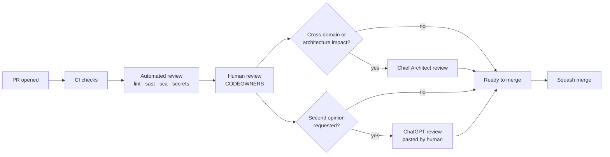
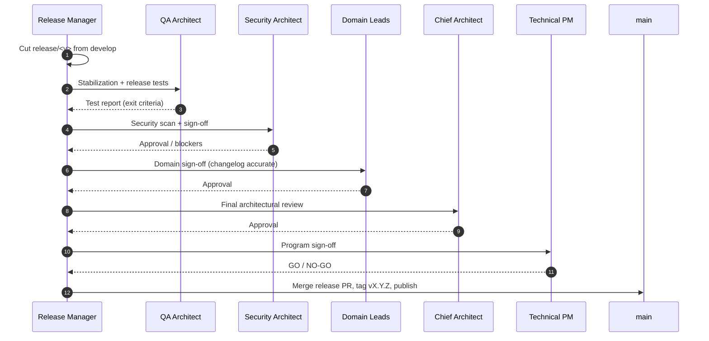

# Repository Operating Model

> **Status:** Approved — Program 0, Phase 0.2
> **Owner:** Technical Program Manager

This document defines **how humans, AI assistants, and automation collaborate** in the CyberCom Platform repository.

---

## 1. Roles

| Role | Responsibility | Tooling |
|---|---|---|
| **Chief Enterprise Architect** | Owns architecture, approves ADRs, owns `main` & `architecture` branches | GitHub, ADR tooling |
| **Security Architect** | Threat models, controls, security reviews, owns `SECURITY.md` | GitHub, scanners |
| **DevOps Architect** | CI/CD, IaC, observability, release tooling | GitHub Actions, Terraform |
| **QA Architect** | Test strategy, automation, release exit criteria | Test platforms |
| **Documentation Architect** | Doc structure, ADR quality, terminology | Markdown, Mermaid |
| **Technical Program Manager** | Cadence, governance, sign-offs | GitHub Projects |
| **Domain Architects / Leads** | Own a domain branch (platform/erp-core/cymed/website/mobile) | GitHub |
| **Contributors (human)** | Author PRs, address review | IDE + GitHub |
| **AI Assistants** | Draft code, docs, reviews under human direction | Claude Code, Antigravity, ChatGPT |
| **Release Manager** | Cuts, stabilizes, tags, and publishes releases | GitHub, release tooling |

---

## 2. Repository Model

CyberCom is a **monorepo** with **domain branches** for parallel work and a **single tagged history on `main`**. Rationale:

- Cross-cutting refactors (e.g. CyIdentity contracts) are atomic.
- Shared standards, ADRs, and tooling live in one place.
- Domain branches let independent teams ship without a flat trunk bottleneck.
- A single release line keeps the platform coherent for enterprise customers.

---

## 3. How AI Assistants Work in This Repository

CyberCom uses multiple AI assistants. Each has a **defined surface, permission scope, and review obligation**. No AI assistant may push directly to a protected branch.

### 3.1 Claude Code (Anthropic CLI)

| Aspect | Policy |
|---|---|
| **Primary use** | Authoring code, docs, IaC, ADRs; running shell/Git locally |
| **Permission** | Read/write on contributor's working tree; PRs only |
| **Identity** | Commits authored as the contributor; co-authorship trailer when AI generated substantive content |
| **Allowed branches** | Any **transient** branch (`feat/*`, `fix/*`, `docs/*`, `chore/*`, `hotfix/*`) |
| **Forbidden** | Direct push to `main`, `develop`, `architecture`, `release/*`, or any protected branch |
| **Required** | Conventional Commits; PR template; link to issue or ADR |
| **Secrets** | MUST NOT read, write, or commit secrets. Use `.env.example` only |
| **Review** | Same CODEOWNERS rules as human contributors |

### 3.2 Antigravity (workspace agent)

| Aspect | Policy |
|---|---|
| **Primary use** | Multi-file refactors, repo-wide audits, scaffolding, IaC generation, long-running agent tasks |
| **Permission** | Read/write on a sandboxed workspace; PRs only |
| **Identity** | Commit author = operator; trailer `Co-authored-by: Antigravity <noreply@antigravity.local>` for substantive AI work |
| **Allowed branches** | Transient branches only; MAY create domain-scoped feature branches |
| **Forbidden** | Touching `SECURITY.md`, `CODEOWNERS`, branch-protection settings, or any `release/*` without explicit human approval |
| **Required** | Each agent run produces a **change summary** in the PR body listing files touched and rationale |
| **Review** | CODEOWNERS + at least one human architect for cross-domain changes |

### 3.3 ChatGPT (code & doc review)

| Aspect | Policy |
|---|---|
| **Primary use** | Second-opinion review on PRs (architecture, security, clarity), doc editing, ADR critique |
| **Permission** | **Read-only** on diffs/files shared by the human reviewer; never authors commits directly |
| **Identity** | Review feedback pasted into PR conversations by the human reviewer, attributed: `via ChatGPT review` |
| **Allowed branches** | N/A — review-only |
| **Forbidden** | Committing, merging, or modifying branch settings |
| **Required** | Human reviewer must validate and own any ChatGPT-sourced suggestion before applying |
| **Use cases** | Threat-model sanity check, ADR quality review, naming/clarity, alternative designs |

### 3.4 General AI guardrails

1. **Human accountable.** Every PR has a human author and approver, even if AI-drafted.
2. **No data exfiltration.** AI tools must not transmit production data, PII, PHI, or secrets.
3. **Provenance.** Substantive AI-generated content disclosed via `Co-authored-by` trailer.
4. **Licensing.** Generated code must respect dependency licenses; license scanner enforced in CI.
5. **Determinism where it counts.** Generated migrations, IaC, and crypto code require **two human reviewers**, regardless of source.

---

## 4. PR Review Process

### 4.1 Review rubric (every PR)
- **Correctness** — does it do what the description says?
- **Security** — new attack surface, data flows, secrets?
- **Architecture fit** — aligned with ADRs?
- **Testability** — covered by tests proportionate to risk?
- **Docs** — README/ADR updated where required?
- **Reversibility** — can this be rolled back safely?

### 4.2 Approval matrix

| Change type | Min approvals | Required reviewers |
|---|---|---|
| Docs only | 1 | Documentation Architect or domain owner |
| Domain code (single domain) | 1 | Domain CODEOWNER |
| Cross-domain code | 2 | Affected CODEOWNERS + Chief Architect |
| Security-sensitive (auth, crypto, IAM, PHI) | 2 | Security Architect + Domain Owner |
| Infrastructure / CI | 2 | DevOps Architect + Security Architect |
| ADR | 2 | Chief Architect + relevant Domain Architect |
| Release PR | per release_management.md §6 | Release Manager + others |

---

## 5. Release Approval Process

See [`release_management.md`](release_management.md) for full criteria.

---

## 6. Automation & Bots

| Bot | Scope | Auto-merge? |
|---|---|---|
| Dependabot | Dependency PRs | Patch/minor for non-critical deps after CI green + CODEOWNER approval |
| CodeQL / SAST | Security scanning | No — opens issues / PR annotations |
| Stale bot | Flags branches >14 days idle | No — notifies only |
| Release-please (or equivalent) | Generates release PRs from Conventional Commits | No — Release Manager merges |

---

## 7. Issue & Project Workflow

- All work tracked via GitHub Issues using the templates in `.github/ISSUE_TEMPLATE/`.
- Programs (P0, P1, …) tracked as GitHub Projects.
- Epics labeled `epic`; broken down into issues per PR-sized unit.
- Labels: `area:*` (product/domain), `type:*` (bug/feature/etc.), `priority:P0..P3`, `risk:*`, `compliance:*`.

---

## 8. Confidentiality & Data Handling

- Public repository today; treat as public-internet visible.
- No production data, PII, PHI, or customer data in commits, issues, PRs, screenshots, or AI prompts.
- Threat models and exploit details kept in a **private** security repo or restricted folder once it exists; redact in public discussions.

---

## 9. Escalation

| Trigger | Escalate to |
|---|---|
| Stuck PR (>5 business days, no movement) | Technical PM |
| Disagreement on architecture | Chief Architect → ADR |
| Suspected security incident | Security Architect (private channel per `SECURITY.md`) |
| Release blocker | Release Manager |
| AI-tool misbehavior | Technical PM + Security Architect |

---

## 10. Continuous Improvement

- This operating model is reviewed every quarter.
- Changes require an ADR.
- Metrics tracked: PR cycle time, review latency, escape defects per release, rollback rate, AI co-authorship ratio.
