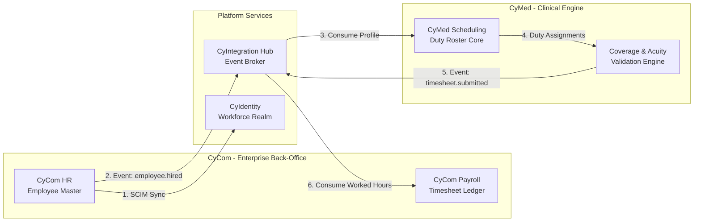

# CyMed Healthcare Workforce Architecture

> **Status:** Approved — Phase 1.2
> **Owner:** Chief Healthcare Architect + Chief Nursing Informatics Architect
> **Related Documents:** [ADR-0005](../adr/ADR-0005-identity-access-management-strategy.md), [ADR-0017](../adr/ADR-0017-cyidentity-product-strategy.md), [ADR-0018](../adr/ADR-0018-cycom-product-repositioning.md)

---

## 1. System Mission & Strategy

The clinical operations of a hospital are highly dynamic and safety-critical. The **CyMed Healthcare Workforce Architecture** defines how CyberCom structures, schedules, and validates clinical personnel across diverse hospital networks. 

By separating **clinical operational constraints** (acuity, clinical safety, duty hours) from **back-office enterprise records** (contracts, pay rates, basic HR files), CyMed guarantees:
1.  **Clinical Safety:** Enforcing nurse-to-patient ratios, skill mixes, and fatigue rules before shifts begin.
2.  **Regulatory Compliance:** Configurable rule sets for multi-country deployments (USA, Saudi Arabia, UAE, Jordan) without hardcoding labor laws.
3.  **HIPAA-Grade Security:** Dynamic access mapping based on active duty roster status.

---

## 2. Abstraction Hierarchy (Configurable Country Support)

To avoid hardcoded national laws, CyMed implements a hierarchical configuration structure. Rules and constraints flow from the country down to the individual department unit.

```
 [Country]  -- (e.g., USA, Saudi Arabia, UAE, Jordan)
    │
    ▼
 [Region]  -- (e.g., California, Riyadh Province, Dubai Emirates)
    │
    ▼
 [Hospital Group]  -- (e.g., National Guard Health Affairs, private group)
    │
    ▼
 [Hospital]  -- (e.g., King Abdulaziz Medical City)
    │
    ▼
 [Facility]  -- (e.g., West Wing Campus, Ambulatory Center)
    │
    ▼
 [Department]  -- (e.g., Pediatrics, Emergency Department)
    │
    ▼
 [Unit]  -- (e.g., Pediatric ICU - Ward 3)
    │
    ▼
 [Role]  -- (e.g., Charge Nurse, Senior Registrar)
    │
    ▼
 [Contract Type]  -- (e.g., Full-Time, Resident, Travel, Agency)
```

Each tier in the hierarchy can inherit or override constraints (such as maximum consecutive working hours, mandatory rest periods, or overtime thresholds).

---

## 3. CyMed vs CyCom Boundary & Integrations

Per ADR-0018, **CyCom** owns the back-office ERP records, and **CyMed** owns clinical scheduling operations. Under no circumstances should databases be cross-read or shared synchronously.



### Integration Points:
1.  **Employee Sync (HR to Scheduling):** When a clinician is hired, modified, or terminated, `CyCom HR` writes to the platform outbox, publishing `cybercom.cycom.employee.hired` or `cybercom.cycom.employee.updated`. CyMed consumes these events to maintain a local projection of active, verified clinical profiles (specialty, licenses, contract constraints).
2.  **Attendance & Timesheet Sync (Scheduling to Payroll):** At the completion of a shift or pay cycle, `CyMed` publishes `cybercom.cymed.roster.hours_worked`. `CyCom Payroll` consumes this event to calculate payment deductions, overtime, and shift-differential payouts.
3.  **Workforce Identity Bind (Identity to Scheduling):** Clinicians log in via `CyIdentity` (Workforce Realm), which issues short-lived JWTs containing the user's globally unique employee ID matching `CyCom HR` and `CyMed`.

---

## 4. System Interaction Model (C4 Container View)

The workforce planning components consume platform resources and interact with adjacent systems as shown:

```mermaid
flowchart TB
    actor User[Clinicians · Nurses · Admins]
    
    subgraph EDGE[Edge]
        GW[API Gateway]
    end

    subgraph CYMED[CyMed - Healthcare Core]
        SCH[Scheduling Module]
        ACU[Acuity Engine]
        VAL[Coverage Validator]
    end

    subgraph CYCOM[CyCom - ERP]
        HR[HR & Org Master]
        PAY[Payroll Engine]
    end

    subgraph PLATFORM[Platform Plane]
        ID[CyIdentity]
        CONN[CyConnect]
        HUB[CyIntegration Hub]
        POL[Policy Engine]
        AUD[Audit Sink]
    end

    User -->|OIDC Login| ID
    User -->|API Access| GW
    GW --> SCH
    SCH -->|Validate Roster| VAL
    VAL -->|Read Live Acuity| ACU
    VAL -->|Publish Events| HUB
    HUB -.-> PAY
    SCH -->|Authorize Action| POL
    SCH -->|Audit Action| AUD
    VAL -->|Trigger Alert| CONN
    CONN -->|SMS / Push / Voice| User
```

All interactions between `CyMed` and `CyConnect` for shift changes, notifications, and alert routing flow through asynchronous event bindings, maintaining decoupled system reliability.

---

## 5. Hospital Types & Organizational Configurations

To ensure applicability across various healthcare business models, CyMed supports 7 distinct **Hospital Types** with specialized scheduling, financial, and compliance parameters:

### 5.1 Government Hospitals
*   **Operational Focus:** Civil service rosters, rigid public sector contracts, fixed statutory allowances, and direct integration with government procurement.
*   **System Configuration:**
    *   *Allowances:* Integrates with `CyCom Payroll` to apply fixed public-sector shift allowances without performance-related premiums.
    *   *Contracts:* Enforces fixed weekly hour limits with strict limitations on paid overtime.
    *   *Vendor Bidding:* Integrates with `CyGov e-Procurement` (G3) to handle bids and compliance checks for external medical staffing contractors.

### 5.2 Private Hospitals
*   **Operational Focus:** Commercial efficiency, revenue cycle management (RCM) optimization, and flexible contractor usage (agencies, travel nurses).
*   **System Configuration:**
    *   *Billing Integration:* Direct linkage between `CyMed Charge Capture` (H12) and `CyShop` (S3) to post clinical billing records dynamically based on rostered procedure completions.
    *   *Staffing Mix:* High reliance on `Float Pools` and `Agency Staff` to dynamically align nurse counts with active inpatient census.

### 5.3 Academic Hospitals
*   **Operational Focus:** Dual-role scheduling for clinical professors and medical researchers who divide their time between academic lectures, clinical trials, and clinical rounds.
*   **System Configuration:**
    *   *Split Schedules:* Support for "Non-Clinical Research Block" shift templates. The system blocks clinical rounds assignment during scheduled research hours.
    *   *Data Sync:* Integrates with `CyData` to anonymize and export clinical outcomes metadata for research cohorts under strict consent boundaries.

### 5.4 Teaching Hospitals
*   **Operational Focus:** Management of residency and fellowship programs. Strict clinical supervision hierarchies and training-hour compliance.
*   **System Configuration:**
    *   *Residency Gates:* Automated monitoring of ACGME 80-hour weekly work caps.
    *   *Supervision Enforcer:* Mandatory co-signature gates in `CyMed CPOE` (H4) preventing Interns and junior Residents from releasing high-risk orders without Attending approval.

### 5.5 Multi-Hospital Networks
*   **Operational Focus:** Cross-facility staffing, centralized roster coordination, and resource load-balancing.
*   **System Configuration:**
    *   *Cross-Site Roaming:* Clinicians maintain a single profile in `CyIdentity` but can be assigned shifts across multiple facility IDs in the network.
    *   *Network Float Pool:* Centralized scheduling screen allowing coordinators to transfer float staff to facilities experiencing census surges.

### 5.6 Specialty Hospitals (e.g., Pediatrics, Oncology)
*   **Operational Focus:** Highly specialized clinical safety guidelines and customized acuity indices.
*   **System Configuration:**
    *   *Custom Acuity:* Integrates pediatric-specific (PEWS) or oncology-specific acuity scoring matrices to calculate HPPD (Hours Per Patient Day).
    *   *Specialty Gates:* CPOE blocks clinical orders unless the clinician holds a verified sub-specialty credential (e.g., Pediatric Oncology board certification).

### 5.7 Integrated Delivery Networks (IDN)
*   **Operational Focus:** Care coordination across acute care facilities, outpatient clinics, and rehabilitation centers.
*   **System Configuration:**
    *   *Cross-Continuum Rostering:* Schedulers manage unified rosters that coordinate clinician transitions between inpatient shifts and outpatient telehealth clinics.
    *   *Global Privileging:* Clinician privileges map dynamically across diverse clinics and acute units based on site-specific ABAC rules in `CyIdentity`.

