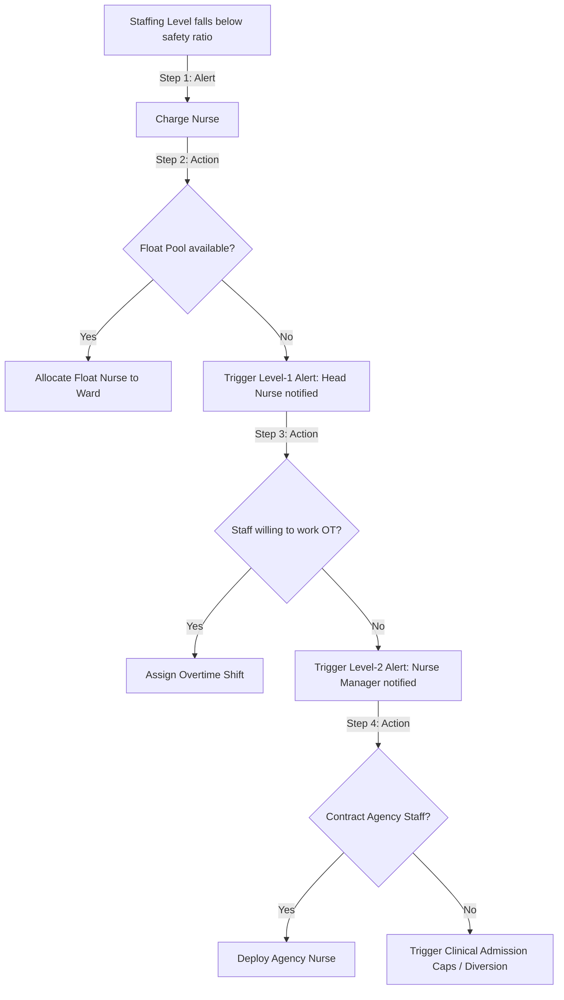

# CyMed Nursing Model

> **Status:** Approved — Phase 1.2
> **Owner:** Chief Nursing Informatics Architect
> **Related Documents:** [healthcare_workforce_architecture.md](healthcare_workforce_architecture.md), [acuity_staffing_model.md](acuity_staffing_model.md)

This document specifies the responsibilities, clinical authority bounds, competency requirements, and escalation behaviors for CyMed's nursing structure.

---

## 1. Nursing Roles & Tiers

The nursing structure consists of 15 distinct tiers, split into administrative, specialized clinical, and flexible staffing categories.

```
       [Nurse Manager] ➔ Administrative Oversight
              │
         [Head Nurse] ➔ Ward-Level Operations
              │
       [Charge Nurse] ➔ Active Shift Supervisor
              │
  ┌───────────┴───────────┐
  ▼                       ▼
[Staff / Senior]     [Specialized Tiers]
 - General Wards      - ICU / ER / OR / Dialysis / L&D / Peds / NICU
  ▲
  └────────────────── [Flexible Pool] (Float, Travel, Agency)
```

### 1.1 Administrative & Leadership Roles
*   **Nurse Manager:**
    *   *Responsibilities:* Strategic resource allocation, department budget compliance, policy alignment, and clinical quality oversight across multiple wards.
    *   *Authority:* Final sign-off on department rosters, monthly schedule templates, and permanent roster changes.
*   **Head Nurse:**
    *   *Responsibilities:* Daily ward operations, quality indicator tracking, employee performance management, and shift roster reviews.
    *   *Authority:* Approval of shift swap requests, leave approvals, and roster validation for their specific ward.
*   **Charge Nurse:**
    *   *Responsibilities:* Managing the active shift, assigning patients to nurses, supervising clinical care quality, and resolving staffing shortfalls.
    *   *Authority:* JIT patient assignments, invoking "Float Nurse" requests, and initiating "Break-the-Glass" access overrides for staff.

### 1.2 Clinical & Specialized Wards
*   **Staff Nurse:** Baseline clinical care in general medical-surgical wards.
*   **Senior Nurse:** Advanced care, mentoring junior staff, acting as preceptor.
*   **ICU Nurse:** High-frequency charting, hemodynamic monitoring, complex medication titration.
*   **ER Nurse:** Triage, trauma care, rapid stabilization, and dynamic flow control.
*   **OR Nurse:** Circulating and scrub roles, maintaining sterile fields, surgical counts, and safety checklists.
*   **Dialysis Nurse:** Hemodialysis/peritoneal dialysis management, fluid balance monitoring, AV fistula care.
*   **Labor & Delivery Nurse:** Fetal monitoring, labor staging, delivery assistance, and neonatal stabilization.
*   **Pediatric Nurse:** Pediatric pharmacology, age-specific assessment, family-centered care.
*   **NICU Nurse:** Neonatal intensive care, thermal regulation, micro-dosing pharmacology, ventilator care.

### 1.3 Flexible & Contractual Staffing
*   **Float Nurse:** Hospital-employed nurses trained to deploy dynamically across multiple departments to cover shortfalls.
*   **Travel Nurse:** Mid-term contract nurses hired to address seasonal census surges.
*   **Agency Nurse:** Short-term external nurses deployed JIT for emergency staffing shortfalls.

---

## 2. Authority, Shift Eligibility & Competency Matrix

| Nursing Tier | Primary Department | Shift Eligibility | Mandatory Competencies | Clinical Authority |
|---|---|---|---|---|
| **Nurse Manager** | Department Office | Core Day (08:00-17:00) | Leadership, Finance, Quality | Department-wide overrides |
| **Head Nurse** | Designated Ward | Core Day (07:00-15:00) | Roster mgmt, Conflict resolution | Ward-level overrides |
| **Charge Nurse** | Designated Ward | All (8h / 12h) | ACLS, Triage, Load balancing | Active shift assignments |
| **Staff Nurse** | Med-Surg Ward | All (8h / 12h) | BLS, Medication administration | Direct patient care |
| **ICU Nurse** | Intensive Care | 12-Hour Shifts Only | ACLS, PALS, Vent management | Critical care charting |
| **ER Nurse** | Emergency | All (8h / 12h) | ACLS, TNCC, Trauma Triage | Emergency triage scoring |
| **OR Nurse** | Operating Room | Shift / On-Call | Scrub/Circulating certification | Sterile field verification |
| **Float Nurse** | Floating Pool | All (Dynamic) | Multi-ward certifications | Variable per assignment |
| **Agency Nurse** | External | Fixed Shifts Only | Certified background check | No administrative authority |

---

## 3. Escalation Paths & Shortage Workflows

When a ward's active staffing level falls below the safety parameters defined in the Acuity Staffing Model, the following escalation sequence is triggered automatically:



### Safety & Diversion Rules:
1.  **Admission Gating:** If Level-2 Escalation fails to resolve a staffing deficit in the Emergency Department within 60 minutes, the status shifts to **ED Diversion** (notifying local emergency transport via CyIntegration Hub).
2.  **Roster Lock:** No scheduler can publish a roster that bypasses the competency verification (e.g., assigning a Staff Nurse without an ICU competency to a 1:1 ventilator bed). The validation engine blocks the transaction.
