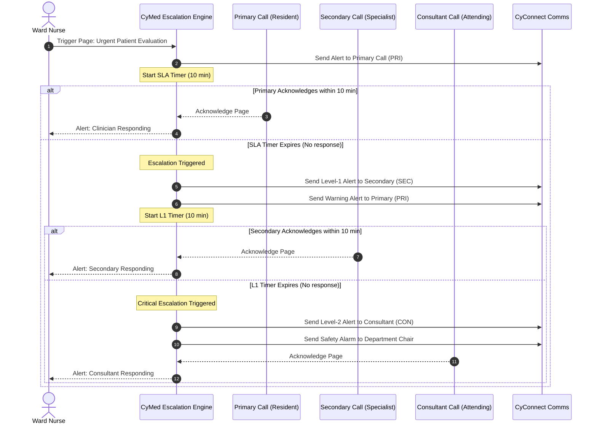

# CyMed On-Call Architecture

> **Status:** Approved — Phase 1.2
> **Owner:** Hospital Operations Architect + Workforce Planning Architect
> **Related Documents:** [healthcare_workforce_architecture.md](healthcare_workforce_architecture.md), [physician_model.md](physician_model.md)

This document specifies the on-call organization, coverage requirements, and SLA-driven escalation workflows for all clinical specialties.

---

## 1. On-Call Modes & Definitions

To maintain continuous patient care, CyMed supports 8 distinct on-call modes based on response SLA and clinician level:

```
                          [On-Call Scheduler]
                                   │
         ┌─────────────────────────┼─────────────────────────┐
         ▼                         ▼                         ▼
    [Location]                 [Seniority]                [Tier]
  - In-House (Immediate)     - Resident Call            - Primary (First Res)
  - Home Call (Pager/Phone)  - Consultant Call          - Secondary (Backup)
                             - Emergency Call           - Backup
```

### 1.1 Location-Based Call Modes
*   **In-House Call:** The physician is physically present inside the facility during the call period (e.g., Trauma Surgeon, OB-GYN, ICU Resident). Target response time: **< 5 minutes**.
*   **Home Call:** The physician is off-site but reachable via phone/pager and must arrive at the hospital within a set SLA (typically 20–30 minutes) if summoned. Target response time: **< 30 minutes**.

### 1.2 Seniority-Based Call Modes
*   **Resident Call:** Training-grade coverage managed under Attending supervision.
*   **Consultant Call:** Senior specialist coverage providing tertiary backup or direct emergency intervention.
*   **Emergency Call:** Activated during mass casualty incidents or internal disasters (e.g., calling in disaster-response teams).

### 1.3 Tier-Based Call Modes
*   **Primary Call:** The first responder clinician assigned to be paged for clinical events.
*   **Secondary Call:** The backup clinician called if the Primary is in the Operating Room, executing a procedure, or unreachable.
*   **Backup Call:** Tertiary administrative or specialist backup.

---

## 2. On-Call Escalation Hierarchy (SLA-Driven Alerts)

To ensure clinical safety, CyMed tracks page acknowledgments and automatically escalates calls when response targets are missed.



---

## 3. Coverage Validation & Approval Workflows

### 3.1 Roster Validation Rules
Before a weekly call roster is published, the validation engine enforces three mandatory constraints:
1.  **Specialty Integrity:** Every clinical specialty (e.g., Cardiology, Neurosurgery) must have exactly one designated **Primary Call** and at least one **Secondary Call** allocated per shift.
2.  **Fatigue check:** A physician assigned to a 24-hour In-House Call cannot be scheduled for a Primary Call on the following day.
3.  **Credential Check:** The assigned clinician's active license must cover the specialty (e.g., an Orthopedic Resident cannot be scheduled for General Surgery Call).

### 3.2 Call Swap Approval Workflow
*   **Self-Service Swaps:** Clinicians can propose call swaps via their mobile app.
*   **Sign-Off Gates:**
    *   *Resident-to-Resident Swap:* Requires Chief Resident sign-off.
    *   *Consultant-to-Consultant Swap:* Requires Department Chair sign-off.
    *   All approved swaps update the active policy cache (Redis) dynamically to ensure that incoming phone calls and pages route to the correct on-duty physician.
