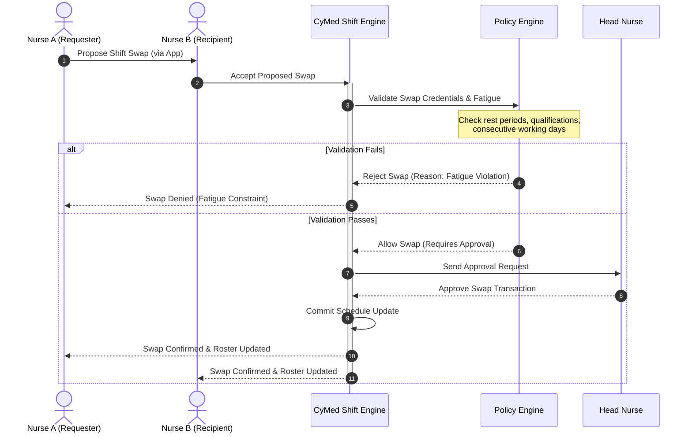

# CyMed Shift Management Architecture

> **Status:** Approved — Phase 1.2
> **Owner:** Hospital Operations Architect + Workforce Planning Architect
> **Related Documents:** [healthcare_workforce_architecture.md](healthcare_workforce_architecture.md), [clinical_staffing_model.md](clinical_staffing_model.md)

This document establishes the architecture for scheduling shifts, processing swaps, managing flexible pools, and forecasting clinical demand.

---

## 1. Shift Templates & Rotations

CyMed supports flexible shift definitions configurable at the facility or unit level:

*   **8-Hour Shifts:** Traditional Med-Surg/Administrative scheduling (Morning: 07:00-15:00, Afternoon: 15:00-23:00, Night: 23:00-07:00).
*   **12-Hour Shifts:** Critical Care/Emergency standard shifts (Day: 07:00-19:00, Night: 19:00-07:00). Includes a mandatory 30-minute unpaid meal break and 30-minute overlapping clinical handover period.
*   **Fixed Shifts:** Permanent assignments to a specific shift schedule (e.g., permanent night shift staff).
*   **Rotating Shifts:** Cyclic schedules moving staff between day, evening, and night duties.
*   **Weekend & Holiday Rotations:** Equal-distribution algorithms ensuring fair holiday and weekend duty allocations across staff cohorts.

---

## 2. Self-Scheduling & Shift Swaps

### 2.1 Self-Scheduling Gating Rules
To improve nurse retention, CyMed permits self-scheduling under strict constraints:
1.  **Window Limits:** Self-scheduling opens for a 7-day window starting 30 days before the target month.
2.  **Quota Protection:** Once a shift's target count is met (e.g., 5 nurses needed for Pediatric ICU Day Shift), the slot locks, preventing further self-scheduling.
3.  **Balance Rules:** Schedulers must book a minimum ratio of weekend and night duties during their self-selection window (e.g., 2 weekend shifts per month).

### 2.2 Shift Swap Sequence Flow
Shift swaps are initiated by clinicians on their mobile apps and evaluated dynamically:



---

## 3. Float Pools & Agency Staff Integration

When scheduled shifts remain vacant, CyMed manages the deployment of flexible resources:

*   **Float Pool Allocation:** Float nurses are assigned to a virtual department (the "Float Pool"). The system uses a priority matrix to deploy them to departments with the highest vacancy or highest patient acuity first.
*   **Agency Staff Onboarding:** External agency staff are registered as temporary profiles with active credentials and a locked start/end date. They undergo a mandatory digital check-in (validating identity and active credentials via CyIdentity) before they can receive EHR access tokens.

---

## 4. Predictive Staffing Forecasting (CyAI Integration)

CyMed interfaces with **CyAI** to predict patient volume and determine optimal staffing levels 14 days in advance:

```
[Historical ER Visits, Outpatient Calendars, Weather Models]
                             │
                             ▼
                    [CyAI Model Gateway]
                             │
                             ▼
         [Predicted Patient Census per Department]
                             │
                             ▼
        [CyMed: Automated Roster Template Adjustments]
```

*   **Data Contracts:** CyMed sends active patient admission histories, outpatient appointment slots, and weather forecasts (via CyIntegration Hub) to `CyData`.
*   **Model Execution:** `CyAI` runs weekly forecasts, calculating expected admission peaks (e.g., predicting an influenza surge or heatwave influx).
*   **Roster Generation:** The forecasting engine outputs a **Recommended Staffing Level** curve, allowing ward schedulers to scale up float pool allocations or adjust shift templates before releasing schedules.
