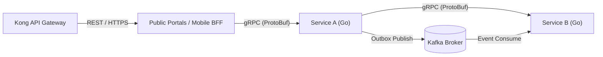

# Backend Architecture

This document defines backend coding templates, microservice design patterns, communication protocols, database transaction controls, and service mesh details.

---

## 1. Backend Technology Stack

CyberCom backend services use three standard languages based on performance requirements:
*   **Go (Golang):** Mandated for high-concurrency microservices (`CyMed` EHR, `CyCom` core APIs, `CyIntegrationHub`). Go provides fast compile times, low memory footprints, and native concurrency controls.
*   **Node.js / TypeScript:** Used for frontend BFF (Backend-For-Frontend) aggregators and public portals (`CyCitizen`, `CyShop` checkout APIs).
*   **Python:** Reserved strictly for AI model training and ML pipelines (`CyAI`, data prep inside `CyData`).

---

## 2. Service Communication Protocols



### 2.1 External API Ingress
*   **REST/JSON:** Used for client-to-gateway traffic.
*   **GraphQL:** Utilized by BFF layers to aggregate multiple microservice calls for web pages.

### 2.2 Internal Service-to-Service Calls
*   **gRPC over HTTP/2:** Mandated for all synchronous internal microservice communications. Protocol Buffers (Proto3) define service contracts in `/packages/proto/`.
*   **mTLS Encryption:** All internal TCP traffic runs inside the **Envoy Service Mesh**, which validates service identities (SPIFFE IDs) and encrypts payloads in-transit.

---

## 3. Transactional Outbox Pattern Implementation

To guarantee eventual consistency across decoupled databases without using unstable two-phase commits:
1.  **Atomic Transaction:** Services write business records and event payloads inside the same PostgreSQL database transaction:
    ```sql
    BEGIN;
    INSERT INTO patient_record (id, name, status) VALUES ('...', 'John', 'admitted');
    INSERT INTO outbox_event (id, topic, payload, created_at) VALUES ('...', 'patient.registered', '{...}', NOW());
    COMMIT;
    ```
2.  **CDC Stream (Debezium):** The Debezium connector monitors the database WAL, extracts rows from the `outbox_event` table, and publishes them to the respective Kafka topic.
3.  **Clean Sweep:** A background job deletes successfully processed events from the `outbox_event` table after confirmation.

---

## 4. Configuration and Secrets Management

*   **Environment Variables:** Config values are injected as environment variables following Twelve-Factor App principles.
*   **Secrets Injector:** Vault Agent Sidecars run alongside application containers, fetching database credentials dynamically and rendering them as a local file mount (`/vault/secrets/db-creds.json`) accessible to the backend app.

---

## 5. Revision History

| Date | Version | Description | Author |
|---|---|---|---|
| 2026-06-21 | 1.0 | Initial Backend Architecture | Enterprise Architect |
