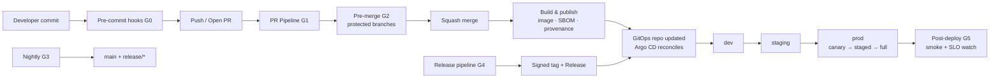

# CI/CD Baseline

> **Status:** Approved — Program 0, Phase 0.4
> **Owner:** DevOps Architect + DevSecOps Architect
> **Implements:** [`quality_gates`](../standards/quality_gates.md), [ADR-0008](../adr/ADR-0008-saas-deployment-strategy.md)

This document specifies the **target CI/CD pipeline** for every CyberCom repository and service. The pipeline is GitHub Actions–based, OIDC-authenticated to cloud, and GitOps-driven into Kubernetes.

---

## 1. Principles

1. **Trunk-stable.** `main` is always releasable; protected branches gated by checks.
2. **One pipeline pattern.** All services share the same workflow skeleton; service-specific logic is in scripts, not in workflows.
3. **Security-first.** Every relevant security scan runs by default; reductions require an ADR.
4. **No long-lived cloud credentials.** Auth via **GitHub OIDC → cloud role**.
5. **Provenance everywhere.** SBOM + signed images + signed provenance attached to every artifact.
6. **Fast feedback.** PR pipeline target ≤ 15 minutes p95; nightly does the heavy lifting.

---

## 2. Pipeline Map

---

## 3. CI Pipeline (per PR)

Implemented as a **reusable workflow** in `infrastructure/github/workflows/ci.yml` consumed by each repo.

### 3.1 Jobs

| # | Job | Tools | Blocking |
|---|---|---|---|
| 1 | `setup` | Checkout (full history), restore caches | ✅ |
| 2 | `commitlint` | `@commitlint/cli` with Conventional Commits config | ✅ |
| 3 | `lint` | Ruff / ESLint / Prettier check | ✅ |
| 4 | `format-check` | Ruff format / Prettier `--check` | ✅ |
| 5 | `typecheck` | `mypy --strict` / `tsc --noEmit` | ✅ |
| 6 | `unit-tests` | pytest / vitest, with coverage | ✅ |
| 7 | `coverage-gate` | Diff-aware threshold per [`quality_gates`](../standards/quality_gates.md) §8 | ✅ |
| 8 | `secret-scan` | `gitleaks` + GitHub native | ✅ |
| 9 | `sast` | **CodeQL** (multi-language) | ✅ |
| 10 | `sca` | `trivy fs`, `pip-audit`, `npm audit --omit=dev` | ✅ — High/Critical block |
| 11 | `license-scan` | `pip-licenses`, `license-checker`, `Trivy` | ✅ |
| 12 | `openapi-lint` | `spectral` + `oasdiff` breaking-change | ✅ when spec changed |
| 13 | `iac-scan` | `checkov`, `tflint`, `kubeconform`, `kube-linter` | ✅ when IaC changed |
| 14 | `docker-build` | `docker buildx` (multi-stage, non-root) | ✅ if Dockerfile |
| 15 | `image-scan` | `trivy image` + `dockle` | ✅ — High/Critical block |
| 16 | `integration-tests` | Testcontainers (Postgres, Redis, broker) | ✅ on protected targets |
| 17 | `api-contract-tests` | Schemathesis vs OpenAPI | ✅ when API changed |
| 18 | `accessibility-checks` | axe-core via Playwright | ✅ when UI changed |
| 19 | `e2e-smoke` | Playwright critical journeys | ✅ for `develop`/`release/*`/`main` |
| 20 | `smoke-perf` | k6 baseline (≤ 2 min) | ✅ for critical-tier endpoints |
| 21 | `sbom` | `syft` → CycloneDX JSON | ✅ on protected targets |
| 22 | `sign` | `cosign sign` (keyless via OIDC) | ✅ on build |
| 23 | `provenance` | SLSA Level 3 generator | ✅ on build |
| 24 | `docs-check` | `markdownlint`, `lychee` link check, `cspell` | ✅ when docs changed |
| 25 | `adr-check` | Verifies ADR present for architecture-tagged PRs | ✅ |
| 26 | `pr-size-check` | Warn at >600 LOC, require justification >1000 | ⚠️ |

### 3.2 Concurrency
`concurrency: group=${{ github.workflow }}-${{ github.ref }}, cancel-in-progress: true` to avoid wasted runs on rapid pushes.

### 3.3 Caching
- pnpm store, Poetry virtualenv, pip wheel, Trivy DB, CodeQL DB — keyed by lockfile hash.

### 3.4 Matrix
- Backend: Python 3.12 (3.13 advisory).
- Frontend: Node 20 LTS.
- OS: `ubuntu-latest` for app code; macOS/Windows for Electron desktop builds only.

---

## 4. Security Scanning Detail

### 4.1 SAST
- **CodeQL** (mandatory): Python + TypeScript packs at minimum.
- Findings: Critical/High block; Medium opens issue; Low informational.
- Suppressions require Security Architect approval, code comment, and `# nosec` justification.

### 4.2 SCA (dependency scanning)
- **Trivy** (filesystem + image), **`pip-audit`** (Python), **`npm audit --omit=dev`** (Node).
- **Dependabot** for PR-based updates; security PRs auto-mergeable after CI green + CODEOWNER approval.
- License policy: deny GPL/AGPL in proprietary code; allow MIT/Apache-2.0/BSD/MPL with review.

### 4.3 Secret scanning
- **Gitleaks** in CI + pre-commit; GitHub native secret scanning + **push protection** at org.
- Any disclosed secret → rotate immediately, don't just fix the PR (see [`secrets_management_strategy`](../security/secrets_management_strategy.md) §5).

### 4.4 IaC scanning
- **Checkov** for Terraform & Helm; **tflint**; **kubeconform** (schema) + **kube-linter** (best practices).
- Blocks on Critical/High; opens issues for Medium.

### 4.5 Container scanning
- **Trivy image** for OS + lang dependencies + misconfig + secrets.
- **Dockle** for image hygiene (non-root, no curl/wget, no embedded creds).
- Critical/High block; vulnerable base images upgraded via Renovate/Dependabot.

### 4.6 DAST
- **OWASP ZAP** baseline scan: nightly on `dev` and `staging`; full active scan pre-release.
- Authenticated scans use disposable test accounts.
- Findings tracked in security backlog with SLA per severity.

### 4.7 Mutation testing
- `mutmut` / `Stryker` on Tier-1 critical paths (auth, billing, clinical, audit).
- Mutation score ≥ 70% gate; runs nightly, not per-PR.

### 4.8 Supply-chain & provenance
- Images and SBOMs signed with **cosign (keyless / OIDC)**.
- **SLSA Level 3** provenance generated and attached.
- Admission control via Kyverno / Connaisseur verifies signatures and SBOM presence before deploy.

---

## 5. Build & Publish

- Multi-stage `Dockerfile`: builder → distroless/slim runtime; non-root `cybercom` user (UID 10001); read-only root filesystem.
- Image tags: `vMAJOR.MINOR.PATCH` and `git-<sha>`; `latest` **forbidden** in deployment manifests.
- Image labels: `org.opencontainers.image.{source,revision,version,licenses}`.
- Artifacts published:
  - Container image to private registry.
  - SBOM (CycloneDX JSON).
  - SLSA provenance attestation.
  - Helm chart (versioned).
  - OpenAPI spec + generated SDKs (where applicable).

---

## 6. Deployment (GitOps)

- **Argo CD** watches the GitOps repo (`infrastructure/gitops/`).
- PRs to GitOps repo bump image digests + chart versions per environment.
- Promotion path: `dev` → `staging` → `prod`, each its own Argo Application.
- Progressive delivery in `staging`/`prod`: **canary → staged → full** via Argo Rollouts (or Flagger).
- Automatic rollback on SLO breach (error rate, latency, custom metrics).
- Migrations run as pre-sync hooks with safe-migration patterns.

---

## 7. Release Controls

Per [`release_management`](../governance/release_management.md) and [`quality_gates`](../standards/quality_gates.md) §6 (G4):

- Release PR cuts `release/<version>` from `develop`; stabilization commits only (`fix`/`docs`/`chore`/`test`/`security`).
- RC tags `vX.Y.0-rc.N` build full artifacts.
- Release exit criteria (all must pass):
  - [ ] All required CI checks green on the release commit
  - [ ] Zero open Sev-1/Sev-2 in scope
  - [ ] Security scans clean (no Critical/High unresolved)
  - [ ] SBOM generated, signed, attached
  - [ ] DAST baseline clean
  - [ ] Performance regression < 10% on critical paths
  - [ ] Release notes published and reviewed
  - [ ] Rollback plan documented and rehearsed
  - [ ] Compliance review complete (healthcare/government scope)
  - [ ] Approval matrix satisfied (Release Manager, Chief Architect, Security, QA, Domain Leads)
- Final tag `vX.Y.Z` on `main` is **signed** and immutable.
- Back-merge `main` → `develop` and `main` → affected domain branches within 24 h.

---

## 8. Required GitHub Settings (org + repo)

- **OIDC** to cloud roles; no long-lived cloud keys in repo secrets.
- **Required status checks** match §3 (per branch tier — see [`branch_protection_strategy`](../governance/branch_protection_strategy.md)).
- **Required reviews** per [`repository_operating_model`](../governance/repository_operating_model.md) §4.2.
- **Signed commits** required (where supported).
- **Linear history** required on protected branches.
- **Secret scanning** + **push protection** enabled.
- **Dependabot** alerts + version + security updates enabled.
- **CodeQL** default setup enabled.
- **Private vulnerability reporting** enabled.
- **Branch creation** restricted to allowed prefixes.

---

## 9. Observability of the Pipeline

- Build duration, success rate, gate-failure rate per check exported to Prometheus.
- Failed builds open auto-issues; flaky tests tracked and quarantined per [`testing_standards`](../standards/testing_standards.md) §8.
- DORA metrics: deployment frequency, lead time, change failure rate, MTTR — dashboarded.

---

## 10. Forbidden

- Long-lived cloud or registry credentials in repo / Actions secrets.
- `pull_request_target` with untrusted code execution.
- `self-hosted` runners for untrusted code; if used at all, ephemeral + isolated.
- Disabling security scans without an ADR.
- Deploying unsigned images to `staging`/`prod`.
- Skipping migrations or running them manually in prod outside the pipeline.
