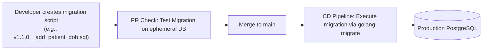

# Database Schema & Migration Strategy

This document details database architecture, schema isolation models, automated migration flows, table partitioning designs, archiving routines, and performance tuning rules for the CyberCom platform.

---

## 1. Database Ownership & Schema Separation

To prevent tight coupling between microservices, database schemas are isolated:
*   **No Cross-Service Queries:** Services must not execute SQL joins across database boundaries or query tables owned by other microservices. All cross-domain data needs must use APIs or consume replicated Kafka event caches.
*   **Dedicated Database Pools:** In SaaS standard deployments, services run inside separated PostgreSQL schemas with Row-Level Security (RLS) enabled. In Enterprise Premium tier, services connect to physically separate PostgreSQL database instances.

---

## 2. Automated Migration Pipeline

All schema modifications are tracked in version-controlled migration scripts:

*   **Migration Engine:** `golang-migrate` for Go microservices; Liquibase for complex multi-schema deployments.
*   **Immutability:** Migration files are named sequentially using version numbers (e.g., `0001_initialize_schema.up.sql`, `0002_add_index.up.sql`). Modified scripts are rejected by checksum validation in the CI pipeline.
*   **Execution:** Migrations execute during application startup or via a Kubernetes init-container before the main service pod goes live.

---

## 3. Partitioning and Archiving Strategy

High-volume tables (e.g., `audit_event`, `patient_encounter`, `telemetry_metric`) use declarative time-based partitioning:
*   **Partition Period:** Monthly partitions managed automatically by the `pg_partman` extension.
*   **Archiving Routine:** At the end of every month, partitions older than 12 months are:
    1.  Dumped to compressed CSV/Parquet files.
    2.  Uploaded to secure, cold object storage (`docs/Phase1_4_Enterprise_Reference_Architecture_Report.md` compliance).
    3.  Dropped from the transactional PostgreSQL database.

---

## 4. Database Performance Strategy

*   **Connection Pooling:** Every PostgreSQL instance is deployed with **PgBouncer** running in Transaction Pooling mode, keeping active connection counts optimal.
*   **Index Tuning:** All table primary keys use Sequential UUIDv7 to prevent index fragmentation. Regular execution plans (`EXPLAIN ANALYZE`) run in CI to catch missing indexes on query paths.

---

## 5. Revision History

| Date | Version | Description | Author |
|---|---|---|---|
| 2026-06-21 | 1.0 | Initial Database Schema Strategy | Enterprise Architect |
