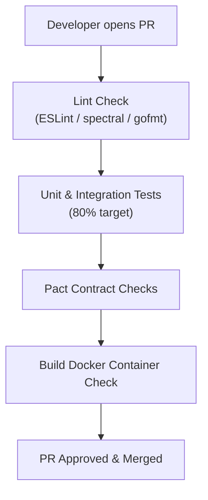

# DevOps Architecture

This document details the CI/CD pipeline automation, GitOps infrastructure layouts, Terraform configuration guidelines, and environment promotion workflows for the CyberCom platform.

---

## 1. Continuous Integration (GitHub Actions)

Every pull request triggers a unified GitHub Actions pipeline:



*   **Caching:** Build caching is configured for Go compiler artifacts, pnpm workspace packages, and pip modules.
*   **Security Gates:** PRs are blocked if unit test coverage drops below 80% or if Trivy detects high/critical vulnerabilities in dependencies.

---

## 2. Continuous Delivery & GitOps (ArgoCD)

Deployment states are declared in Git. The platform utilizes **ArgoCD** for GitOps synchronization:
*   **Git Repositories:**
    *   *Application Repo:* Contains source code and Dockerfiles.
    *   *GitOps Config Repo:* Contains Kubernetes manifests and Helm values.
*   **GitOps Directory Structure:**
    ```
    gitops-config/
    ├── apps/                    # ArgoCD Application declarations
    └── environments/            # Helm values per environment
        ├── dev/
        ├── uat/
        └── prod/
    ```

---

## 3. Environment Promotion Flow

Promoting a service release across environments is driven entirely by Git pulls:
1.  **To Dev/UAT:** The CI pipeline builds the Docker image on a merge to `develop`, tags it with the short git SHA, and updates the `image.tag` value in the `/environments/dev` directory. ArgoCD syncs the changes.
2.  **To Staging:** A release branch is created. The CI updates `/environments/staging` with the release version.
3.  **To Production:** After verification, the release PR is merged into `main`. The image tag inside `/environments/prod` is updated to the SemVer release tag, and ArgoCD executes a controlled Canary rollout.

---

## 4. Infrastructure as Code (Terraform)

All physical VM clusters, PostgreSQL nodes, Kafka networks, and HSM vaults are provisioned using **Terraform**:
*   **State Locking:** State files are stored in regional cloud buckets with locking managed via DynamoDB / GCP storage locks.
*   **Environment Parity:** The same Terraform modules are deployed across all environments, parameterized with environment-specific variables.

---

## 5. Revision History

| Date | Version | Description | Author |
|---|---|---|---|
| 2026-06-21 | 1.0 | Initial DevOps Architecture | Enterprise Architect |
