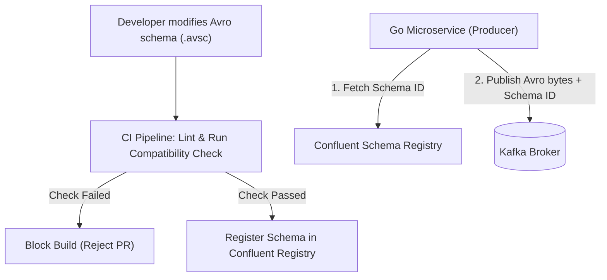

# Event Contract Strategy

This document details the configuration of Kafka and RabbitMQ messaging brokers, specifying Avro schemas, Schema Registry validations, retry protocols, and dead-letter queue (DLQ) pathways.

---

## 1. Apache Kafka Standards

Kafka serves as the core event log for data replication and cross-domain synchronization:
*   **Message Format:** **Apache Avro** is the mandatory serialization format. All message schemas are written in `.avsc` files under `/packages/schemas/`.
*   **Topic Naming Strategy:** Topics comply with the template:
    `cybercom.<environment>.<service-owner>.<entity-name>.<action>`
*   **Partitioning Key:** All events related to an entity (e.g., a specific patient) must pass the exact same ID (e.g., patient UUIDv7) as the partition key to guarantee ordered processing.

---

## 2. Schema Registry Compatibility & Validation

All microservices publish and consume events through a central **Schema Registry** (Confluent/Apicurio):

*   **Compatibility Level:** **BACKWARD** compatibility is enforced.
*   **CI Pipeline check:** During the build stage, the Spectral linter validates formatting, and the schema registry runner tests compatibility against the active deployment registry before permitting a merge.

---

## 3. Retry Policies & Dead Letter Queues (DLQ)

To handle consumer execution failures without causing queue blockage:

1.  **Transient Error Retry:** If a consumer encounters a database lock or network timeout, the client retries up to 3 times with exponential backoff (initial interval: 2 seconds, multiplier: 2.0).
2.  **Dead Letter Queue (DLQ) Routing:** If retries fail or if a payload fails basic schema validation:
    *   The message is published to the DLQ topic, named by appending `.dlq` to the original topic name (e.g., `cybercom.prod.cymed.patient.registered.dlq`).
    *   An observability alert is immediately dispatched to the Slack/PagerDuty channel.
    *   The consumer commits the Kafka offset of the original failed message to resume processing the partition queue.

---

## 4. RabbitMQ Task Queues

For transient, localized worker tasks:
*   **Exchange Type:** `direct` or `fanout` depending on routing requirements.
*   **Payload:** Plain-text JSON envelopes. No Schema Registry checks are performed.
*   **Use Cases:** Distributing email jobs (`cyconnect`), triggering PDF document rendering, and scheduling localized file purging.

---

## 5. Revision History

| Date | Version | Description | Author |
|---|---|---|---|
| 2026-06-21 | 1.0 | Initial Event Contract Strategy | Enterprise Architect |
