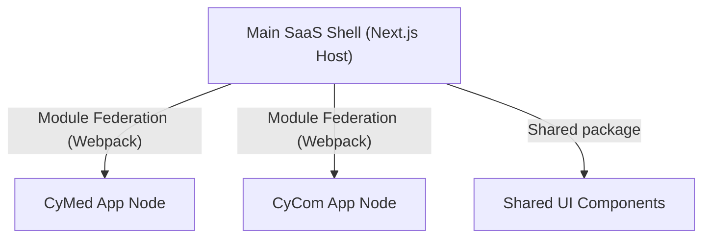

# Frontend Architecture

This document defines the web frontend architecture, micro-frontend strategy, React/Next.js structure, localization setup, and accessibility standards for the CyberCom platform.

---

## 1. Micro-Frontend (MFE) Strategy

To allow separate product teams to build and deploy web features independently without full-system rebuilds, CyberCom implements a **Micro-Frontend** architecture:

*   **Technology:** **Webpack Module Federation** (using Next.js Zone or standard module federation configurations).
*   **Host Shell:** A central Next.js shell handles login redirects (`CyIdentity`), tenant domain validation, global navigation bars, and footer components.
*   **Remote Apps:** Indepedently-deployed applications (e.g., `cymed-mfe` at `/app/clinical`, `cycom-mfe` at `/app/erp`) load dynamically into the host container shell.

---

## 2. React and Next.js Architecture

*   **Framework Version:** **Next.js 14+ (App Router)** utilizing React Server Components (RSC) for fast initial paint times.
*   **State Management:**
    *   *Server State:* **React Query (TanStack Query)** handles caching, caching expiration, and background data synchronization.
    *   *Local UI State:* **Zustand** for lightweight, localized client-only state variables (e.g., sidebar collapse, active tab).
*   **Routing Structure:**
    *   `/app/[tenant-id]/clinical/...` - Gated clinical views.
    *   `/app/[tenant-id]/erp/...` - Administrative business views.

---

## 3. Design System Integration & Styling

*   **Styling Engine:** Vanilla CSS and CSS Modules. TailwindCSS is permitted if standard styling variables match design tokens.
*   **Design Tokens:** CSS variables containing theme colors (clinical deep blues, corporate slate), font weights, shadows, and spacings are imported into the root `globals.css` of all micro-frontends.

---

## 4. Localization and RTL Support (Arabic / English)

*   **Translation Engine:** `next-i18next` or React standard i18n modules.
*   **RTL Switch:** The layout checks the user's selected language:
    *   If Arabic (`ar`): Sets the html element attribute `<html dir="rtl" lang="ar">`.
    *   If English (`en`): Sets `<html dir="ltr" lang="en">`.
*   **CSS Rules:** Direction-agnostic CSS rules (Logical Properties) are enforced (e.g., `padding-inline-start` instead of `padding-left`).

---

## 5. Accessibility (WCAG 2.1 AA)

To satisfy civic (`CyGov`) and clinical compliance:
*   **Semantic HTML:** Strict use of `<main>`, `<nav>`, `<article>`, and `<header>` tags.
*   **ARIA attributes:** All interactive components (e.g., dropdowns, modals) must include standard `aria-expanded`, `aria-hidden`, and role designations.
*   **Keyboard Navigation:** All elements must support focus management (`tabindex`, visible outline states).

---

## 6. Revision History

| Date | Version | Description | Author |
|---|---|---|---|
| 2026-06-21 | 1.0 | Initial Frontend Architecture | Enterprise Architect |
