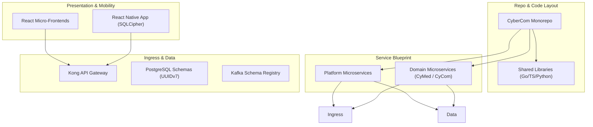
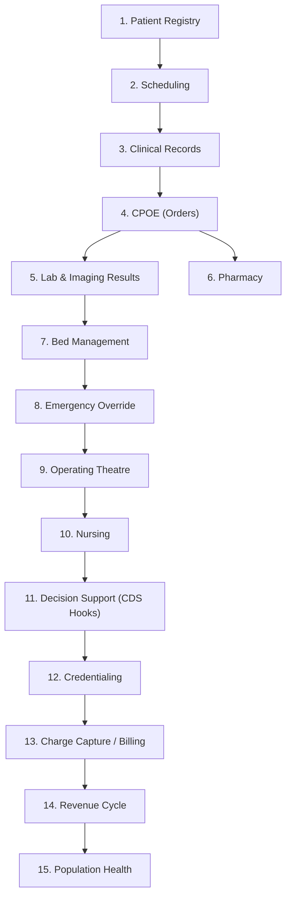
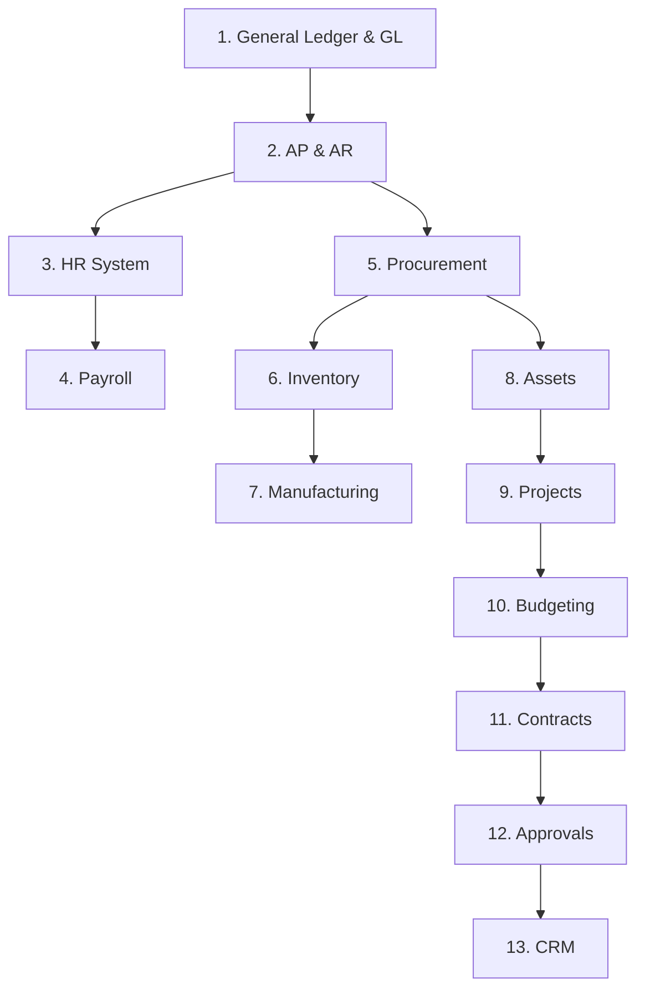

# Implementation Architecture & Roadmap

## 1. Introduction

The Implementation Architecture translates the high-level reference structures of the CyberCom Platform into concrete, developer-actionable blueprints. It establishes coding standards, repository layouts, schema designs, API contracts, deployment pipelines, testing matrices, and implementation roadmaps.

---

## 2. CyMed Implementation Strategy

To build the clinical platform safely and efficiently, `CyMed` modules are deployed in a sequential dependency order:

### 2.1 Implementation Order and Dependencies
1.  **Patient Registry (MPI):** Core foundation. Every other clinical entity references `patient_id`.
2.  **Scheduling:** Allocates physical assets and times slots. Requires the patient directory.
3.  **Clinical Records (EHR):** Problems, allergies, history. Required before writing prescriptions.
4.  **CPOE (Orders):** Directs medication, lab, and imaging orders.
5.  **Results Integration:** Ingests lab reports and DICOM metadata via `CyIntegrationHub`.
6.  **Pharmacy (Clinical Dispensing):** Interfaces with order entries.
7.  **Bed & Ward Management:** ADT system tracking ward states.
8.  **Emergency Override (Break-Glass):** Allows ER access to clinical charts.
9.  **Operating Theatre (OR):** Schedules surgical rooms. Depends on bed states.
10. **Nursing Care Plans:** Shift handovers and daily nursing logs.
11. **Clinical Decision Support (CDS):** AI-driven warning cards (`CyAI`).
12. **Credentialing & Privileging:** Validates provider credentials (`ADR-0026`).
13. **Billing (Charge Capture):** Generates cost items from clinical events.
14. **Revenue Cycle Management:** Claims processing and insurance eligibility.
15. **Population Health (CyData analytics):** Aggregate reporting on clinical outcomes.

---

## 3. CyCom Implementation Strategy

The back-office ERP platform is implemented systematically, building financial ledgers before activating supply chains or assets:

### 3.1 Implementation Order
1.  **Finance & General Ledger (GL):** The core chart of accounts database.
2.  **Accounts Payable (AP) & Accounts Receivable (AR):** Basic transaction management.
3.  **HR System:** Registers departments and employee records (SoR for Employee Master).
4.  **Payroll:** Computes staff compensation. Depends on HR employee listings.
5.  **Procurement:** Creates purchase orders.
6.  **Inventory Management:** Tracks warehouse item levels.
7.  **Manufacturing:** Tracks medical production lines.
8.  **Fixed Assets:** Manages hardware and hospital equipment depreciation.
9.  **Project Management:** Coordinates clinical setups and hospital extensions.
10. **Budgeting & Forecasting:** Establishes cost centers and allocations.
11. **Contracts Management:** Supplier SLAs and partner records.
12. **Approvals Routing Engine:** Dual MFA approval limits for procurement.
13. **CRM:** Tracks donor management and client outreach.

---

## 4. Multi-Year Implementation Roadmap

The execution schedule is divided into 5 distinct Programs:

*   **Program 2: Foundation & Core IAM (Months 1–6):** Deploy `CyIdentity`, Kong Gateway, database pools, and initial monorepo workspace.
*   **Program 3: Core Clinical & Financial Ledgers (Months 7–15):** Develop `CyMed` Patient Registry, EHR Core, and `CyCom` General Ledger accounting.
*   **Program 4: Integrations & Supply Chain (Months 16–24):** Deploy `CyIntegrationHub` (HL7/DICOM), `CyCom` Procurement, and `CyShop` checkout APIs.
*   **Program 5: Mobility & Citizen Portal (Months 25–30):** Launch `CyCitizen` mobile wallet and secure offline clinician synchronization.
*   **Program 6: AI & Advanced Analytics (Months 31–36):** Deploy Triton model serving (`CyAI`), CDS hooks, and Apache Iceberg tables (`CyData`).

---

## 5. Sub-Architectures Directory

For detailed specifications, consult the following dedicated implementation guides:

*   **[Service Architecture](service_architecture.md):** Service responsibilities, inputs, and events.
*   **[Repository Architecture](repository_architecture.md):** Monorepo workspace layouts and Git branching models.
*   **[Module Architecture](module_architecture.md):** Plugin patterns and dynamic tenant overrides.
*   **[Frontend Architecture](frontend_architecture.md):** Micro-frontends, React layouts, and RTL Arabic configs.
*   **[Mobile Architecture](mobile_architecture.md):** React Native, SQLCipher DB caching, and sync conflict vectors.
*   **[Backend Architecture](backend_architecture.md):** Go/gRPC services, outbox persistence, and secrets.
*   **[Database Schema Strategy](database_schema_strategy.md):** Migrations, partitioning, and PgBouncer.
*   **[API Contract Strategy](api_contract_strategy.md):** RFC 7807 problem json and cursor pagination.
*   **[Event Contract Strategy](event_contract_strategy.md):** Avro schemas and Dead Letter Queues (DLQ).
*   **[Testing Architecture](testing_architecture.md):** Unit, integration, contract, and workflow test suites.
*   **[Release Architecture](release_architecture.md):** Blue-green deployments, canaries, and feature flags.
*   **[DevOps Architecture](devops_architecture.md):** Github Actions CI/CD pipelines and Terraform state configs.
*   **[Security Implementation Architecture](security_implementation_architecture.md):** Cryptographic keys, Vault token access, WebAuthn integration, and Break-Glass code paths.

---

## 6. Revision History

| Date | Version | Description | Author |
|---|---|---|---|
| 2026-06-21 | 1.0 | Initial Implementation Architecture & Roadmap | Enterprise Architect |
