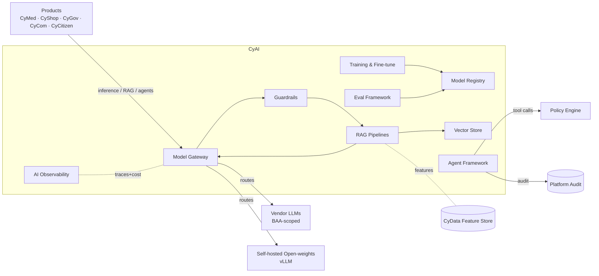

# CyAI — Product Architecture

> **Status:** Approved — Program 1, Phase 1.1
> **Owner:** Chief Software Architect
> **Related:** [ADR-0016](../adr/ADR-0016-ai-platform-strategy.md), [ADR-0015](../adr/ADR-0015-reporting-analytics-strategy.md), [`ai_assistants_in_platform`](../governance/ai_assistants_in_platform.md)

---

## 1. Mission

**Be CyberCom's AI/ML platform** — one auditable, multi-provider, safety-gated surface for embeddings, models, RAG, agents, evaluation, and guardrails — runnable in SaaS, private cloud, and sovereign on-prem (open-weights for PHI).

## 2. Scope

**In scope**
- Model gateway (LLM, embedding, vision, ASR, classical).
- Model registry (versions, licenses, evals, owners).
- Vector store(s) for RAG.
- RAG pipelines (chunking → embedding → retrieval → reranking → prompt assembly).
- Agent framework with typed tools, traces, policy hooks.
- Training & fine-tuning infrastructure (Ray + PyTorch on K8s).
- Eval framework (offline + online + human-in-the-loop).
- Guardrails library (PHI/PII detection, prompt-injection defense, toxicity, jailbreak, refusal patterns).
- AI observability (prompts, retrievals, tool calls, latency, cost, quality).

**Out of scope**
- Clinical interpretation / decision (that lives in **CyMed** with SaMD governance).
- Domain business logic of any product.
- Source-of-record data (always lives in product OLTP or CyData).
- The engineer-facing assistants (Claude Code, Antigravity, ChatGPT) — governed by [`ai_assistants_in_platform`](../governance/ai_assistants_in_platform.md), separate operating manual.

## 3. Users

| User class | Examples |
|---|---|
| Products (programmatic) | CyMed (CDS, summarization, coding hints), CyCom (assist), CyShop (search/recs), CyGov/CyCitizen (assist) |
| Data scientists | Feature engineering, training, eval |
| ML engineers | Model lifecycle, deployment, monitoring |
| Compliance / safety reviewers | Evals, risk classifications, audits |

## 4. Core Modules

1. **Model Gateway** — single front door (LiteLLM/vLLM behind internal gateway); request routing, retries, quotas, tenant-aware billing.
2. **Model Registry** — capabilities, versions, licenses, owners, eval scores.
3. **Vector Store(s)** — pgvector (small/medium); OpenSearch/Qdrant/Milvus per ADR for large scale.
4. **RAG Framework** — pipelines per feature; provenance carried into responses.
5. **Agent Framework** — typed tools, policy hooks, HITL gates, step + token budgets.
6. **Training & Fine-tuning** — Ray + PyTorch on K8s; vendor fine-tune APIs where appropriate.
7. **Eval Framework** — Promptfoo/DeepEval + custom; clinical-feature sample review pathway.
8. **Guardrails** — input validation, PHI/PII detection, prompt-injection defense, output policy filters.
9. **Feature Bridge** — reads Feature Store from **CyData** for online + offline features.
10. **AI Observability** — OTel-native traces of model id, tokens, retrievals, tool calls, guardrail outcomes; quality + cost dashboards.

## 5. Shared Services Consumed

| Service | Use |
|---|---|
| CyIdentity | AuthN of human and service callers; tenant-scoped tokens |
| CyData | Feature Store + Gold layer reads (governed) |
| CyIntegration Hub | Outbound calls to vendor LLM endpoints (BAA-scoped) |
| Platform secrets/KMS | Vendor API keys, model artifact signing |
| Platform audit log | Every inference, retrieval, and tool call audit-tagged |
| Platform policy engine | Tool-call authorization, dataset access |

## 6. Owned Data

- Model registry metadata (capabilities, versions, licenses, eval results).
- Vector indexes per feature (tenant-scoped).
- Prompts, system prompts, retrieval templates (versioned in git).
- Eval datasets + results history.
- Guardrail policies + outcomes.
- Inference logs (redacted; retention default 30 d hot / 1 y cold; per regulation otherwise).
- Training run metadata, model artifacts, fine-tune lineage.

## 7. Consumed Data

- Feature Store features from CyData (online + offline).
- Gold-layer datasets for training (de-identified).
- Curated knowledge sources for RAG (per feature, tenant-scoped indexes).
- Terminology service (ICD-11, SNOMED, LOINC) for medical RAG.

## 8. APIs

- **Inference API** (`/v1/chat`, `/v1/embeddings`, `/v1/classify`, etc.) — provider-agnostic.
- **RAG API** (feature-scoped: ingest doc, query, manage index).
- **Agent API** (feature-scoped: invoke, status, cancel).
- **Registry API** (models, evals, owners).
- **Feedback API** (thumbs / corrections / clinician review).
- **Admin API** (policies, budgets, routing rules).

## 9. Events

Produced (prefix `cybercom.cyai.*`):

- `inference.completed`, `inference.guardrail.blocked`
- `index.embedding.refreshed`
- `model.registered`, `model.deprecated`
- `eval.completed`, `eval.regression.detected`
- `cost.budget.exceeded`

Consumed:

- Source-of-record events from products that trigger re-embedding (e.g. document updated).
- Erasure signals (propagated into vector indexes and inference logs).

## 10. Integrations

- **Vendor LLM endpoints** (BAA-scoped where PHI may transit): Claude, GPT, Gemini families.
- **Open-weights self-hosted** via vLLM (Llama, Mistral, Qwen, Falcon families) — default for PHI / sovereign.
- **Vector store backends** per scale (pgvector, OpenSearch, Qdrant, Milvus).
- **Labeling tools** (Argilla / Label Studio) for eval and fine-tuning.
- **CyIntegration Hub** for outbound calls and event subscriptions.

## 11. Deployment Model

- Tier-1 for healthcare-critical and high-volume features; Tier-2 default.
- Multi-region per ADR-0008; sovereign on-prem uses open-weights via vLLM.
- Per-tenant + per-feature budgets enforced at the gateway.
- GPU pools (or cloud GPU) per region; spillover policies defined.
- Eval suites run in CI on each model promotion; nightly online evals.

## 12. Security Requirements

- **No PHI/PII** leaves the regulated boundary unless under a signed BAA/DPA and an approved data-flow ADR.
- Guardrails detect and block PHI in prompts where policy demands.
- Prompt + completion logs redacted; minimum-necessary fields persisted.
- Tool calls authorized via policy engine; agents run as the requesting user (no privilege escalation).
- Training datasets de-identified; lineage in OpenLineage.
- Vector indexes encrypted at rest; per-tenant isolation enforced.
- EU AI Act risk classification recorded per feature in registry; high-risk features carry additional controls.
- For clinical features: SaMD governance, clinician-reviewed eval samples, intended-use documentation.

## 13. Component Diagram

