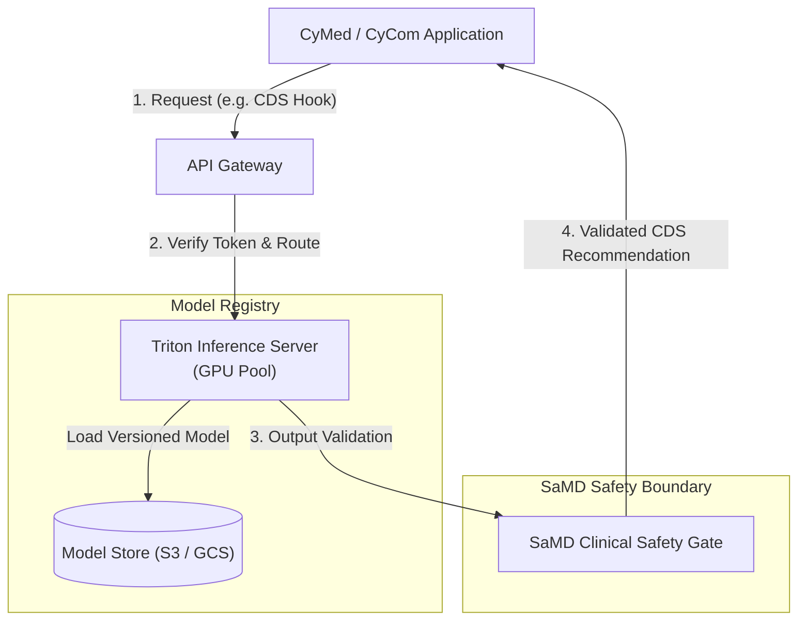

# CyAI Reference Architecture

## 1. System Overview

`CyAI` is CyberCom's Machine Learning and Artificial Intelligence platform. It provides clinical decision support (CDS), predictive ERP supply chain analysis, and automated coding recommendations.

---

## 2. Model Inference & Serving Layer

To achieve low-latency predictions across clinical and commercial services:
*   **Serving Platform:** **Triton Inference Server** (or TorchServe). Triton supports concurrent model execution, dynamic batching, and multiple backend frameworks (TensorFlow, PyTorch, ONNX, and LLM engines).
*   **Hardware Pool:** NVIDIA GPU-enabled node pools inside the Kubernetes cluster, configured with node affinity rules so only AI workloads run on expensive GPU hardware.
*   **Protocols:** gRPC for internal low-latency inference (<20ms); REST for external web integrations.

---

## 3. Software as a Medical Device (SaMD) Governance

Any AI model that impacts patient care (e.g., predicting sepsis, recommending drug dosages, interpreting radiology scans) is classified as **SaMD** and is subject to strict clinical safety rules:
1.  **Immutability & Versioning:** Every deployed model is tagged with a unique, cryptographically-hashed ID and stored in a read-only registry.
2.  **Safety Gate:** Outputs are validated by hardcoded clinical boundary checks (e.g., flagging impossible dosage suggestions).
3.  **Explainability:** Models must output confidence scores and, where applicable, the underlying clinical features used to make the prediction.

---

## 4. Business Integrations

*   **Clinical (CDS Hooks):** Integrates with `CyMed` CPOE. Placing an order triggers a CDS Hook request to `CyAI`. `CyAI` returns warning cards (e.g., drug-drug interaction warnings) displayed inside the physician's workflow.
*   **ERP (Predictive Procurement):** Ingests warehouse levels from `CyCom` to predict stock depletion and draft automated purchase orders.

---

## 5. Revision History

| Date | Version | Description | Author |
|---|---|---|---|
| 2026-06-21 | 1.0 | Initial CyAI Reference Architecture | Enterprise Architect |
