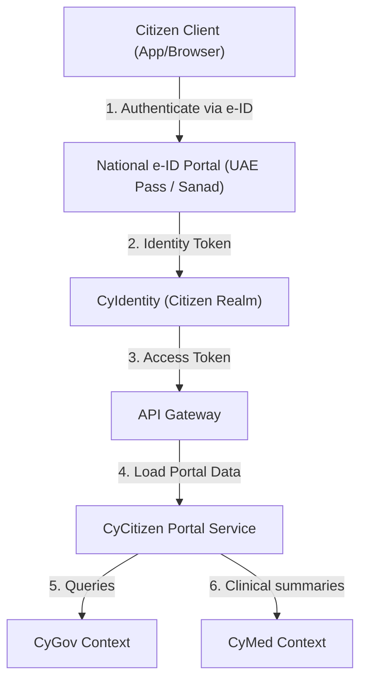

# CyCitizen Reference Architecture

## 1. System Overview

`CyCitizen` is the citizen-facing portal and mobile application for the CyberCom platform. It allows citizens to view their health cards, download municipal permits, pay local utility invoices, and manage their identity profiles.

---

## 2. Core Modules

1.  **Citizen Portal Service:** Aggregates and renders user views of health status, pending invoices, and municipal permits.
2.  **Mobile Identity Wallet:** An iOS/Android application that securely stores cryptographic digital identity credentials and digital health cards.
3.  **Privacy Consent Panel:** Allows citizens to revoke data sharing consents, check data access audit trails, and request account deletions.

---

## 3. Integrations

*   **National Digital ID:** Directly federated with official country-level identity services (e.g., UAE PASS, Jordan Sanad, Saudi IAM).
*   **Payment Services:** Connects to central state payment gateways (e.g., Sadad in KSA, eFAWATEERcom in Jordan) via `CyIntegrationHub`.

---

## 4. Revision History

| Date | Version | Description | Author |
|---|---|---|---|
| 2026-06-21 | 1.0 | Initial CyCitizen Reference Architecture | Enterprise Architect |
