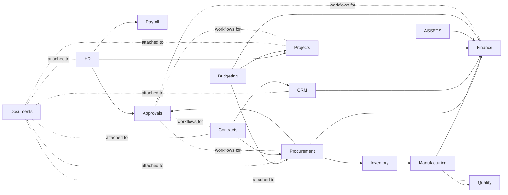
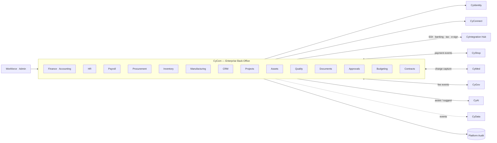

# CyCom — Product Architecture (Enterprise Back-Office / ERP)

> **Status:** Approved — repositioned by [ADR-0018](../adr/ADR-0018-cycom-product-repositioning.md) (2026-06-21)
> **Supersedes:** the Phase 1.1 communications definition of CyCom (now [CyConnect](cyconnect_architecture.md), per [ADR-0019](../adr/ADR-0019-cyconnect-communications-platform.md))
> **Owner:** ERP Domain Architect

---

## 1. Mission

**Be CyberCom's integrated enterprise back-office** — the one ERP that handles Finance, HR, Procurement, Inventory, Manufacturing, CRM, Projects, Assets, Quality, Documents, Approvals, Budgeting, and Contracts for hospital, government, and enterprise tenants — with one identity, one audit, one event backbone, and one analytics plane.

## 2. Scope

**In scope** (15 modules)

| Module | What it does |
|---|---|
| **Finance** | General Ledger, sub-ledgers (AR, AP, Cash), multi-entity / multi-currency, period close, FX revaluation |
| **Accounting** | Chart of accounts, journals, allocations, intercompany, tax accounting |
| **HR** | Employee master, organization, positions, leave, performance, benefits |
| **Payroll** | Pay calc, deductions, garnishments, statutory filings, payslips |
| **Procurement** | Enterprise procurement: suppliers, RFx, POs, GRNs, three-way match, supplier payments |
| **Inventory** | Items, lots, serials, warehouses, stock moves, valuation, cycle counts |
| **Manufacturing** | BoMs, routings, work orders, MRP, shop-floor execution, costing |
| **CRM** | Accounts, contacts, opportunities, pipeline, activities, sales orders (B2B) |
| **Projects** | Projects, tasks, timesheets, expenses, project accounting, billing |
| **Assets** | Fixed assets, depreciation, maintenance schedules, disposals |
| **Quality** | Quality plans, inspections, non-conformance, CAPA, supplier quality |
| **Documents** | Enterprise document management (versioned, signed, retention-aware) |
| **Approvals** | Workflow engine for ERP approvals (PO / expense / journal / contract) |
| **Budgeting** | Budgets, forecasts, variance, encumbrance, period locking |
| **Contracts** | Customer + supplier contracts, terms, renewals, obligations, e-signature |

**Out of scope (delegated)**

- Identity / SSO / MFA → **CyIdentity**.
- Messaging / email / SMS / WhatsApp / voice / video / contact center / notifications → **CyConnect**.
- Consumer commerce (catalog / cart / checkout / storefronts / marketplace / payment **capture**) → **CyShop**.
- Government-scale e-procurement (national tenders, public registers) → **CyGov**.
- Clinical workflows (EHR / CPOE / eMAR / lab / imaging) → **CyMed**.
- Cross-product analytics / executive BI → **CyData**.
- Model serving / AI inference → **CyAI**.
- External partner APIs / B2B ingress (EDI / X12 / ISO 20022 transport, partner onboarding) → **CyIntegration Hub**.

## 3. Users

| User class | Examples |
|---|---|
| Finance | Controllers, GL accountants, AP/AR clerks, tax, treasury |
| HR & Payroll | HRBPs, recruiters, payroll administrators |
| Procurement | Buyers, category managers, supplier-relations |
| Operations | Warehouse, plant, supply chain planners |
| Sales | Account managers, sales ops, customer success |
| Project teams | Project managers, project accountants, consultants logging time |
| Maintenance / facilities | Asset managers, technicians |
| Quality / compliance | Quality engineers, auditors |
| Executives | CFO, COO, CHRO, CIO dashboards (via CyData) |

## 4. Core Modules → Bounded Contexts

Each module is a bounded context with its own aggregates and team ownership. Detailed per-module domain models land in Phase 1.2; the cross-context relationships are:

## 5. Shared Services Consumed

| Service | Use |
|---|---|
| CyIdentity | Workforce + tenant-admin sign-in; SCIM provisioning from HRIS upstream (where present); role/group claims |
| CyConnect | All notifications (approval requests, payslip published, PO acknowledged, invoice sent) |
| CyIntegration Hub | EDI / X12 / ISO 20022 for AR/AP/bank exchanges; banking APIs; tax-authority APIs; partner ERPs |
| CyShop | B2C payment **capture** (CyShop) feeding back as AR postings into CyCom Finance |
| CyData | Financial analytics, HR analytics, supply-chain analytics, executive dashboards |
| CyAI | Suggested coding (Finance), document extraction (Procurement invoices), anomaly detection (Audit), CRM lead scoring |
| Platform audit / observability / secrets / policy / mesh | Standard |
| Platform terminology service | Tax codes, country/currency reference data |

## 6. Owned Data

- **Chart of accounts, journals, sub-ledgers, period status, FX rates** (Finance/Accounting).
- **Employee master, organization, positions, leave/benefits/performance** (HR).
- **Payroll calc results, deductions, statutory filings, payslips** (Payroll).
- **Supplier master, RFx, POs, GRNs, supplier invoices, three-way-match status** (Procurement).
- **Items, lots, serials, warehouses, stock balances, valuations** (Inventory).
- **BoMs, routings, work orders, operation results, costing** (Manufacturing).
- **Accounts, contacts, opportunities, activities, sales orders** (CRM).
- **Projects, tasks, timesheets, expenses, project ledgers** (Projects).
- **Fixed assets, depreciation schedules, maintenance records** (Assets).
- **Quality plans, inspection results, non-conformance, CAPA** (Quality).
- **Enterprise documents (versioned, signed, classified)** (Documents).
- **Approval workflow definitions + in-flight + history** (Approvals).
- **Budgets, forecasts, encumbrances, variance** (Budgeting).
- **Customer + supplier contracts, terms, obligations, e-sign envelopes** (Contracts).

## 7. Consumed Data

- **Identity claims** (employee/admin roles, MFA strength) from CyIdentity.
- **Payment events** from CyShop (`payment.captured`, `payment.refunded`) for AR posting and reconciliation.
- **Clinical charge capture** from CyMed (`chargecapture.posted`) for hospital-tenant AR.
- **Government fee events** from CyGov (`fee.assessed`, `fee.captured-via-CyShop`) for public-sector tenants.
- **Bank statements, tax responses, EDI documents** ingressed via CyIntegration Hub.
- **Reference data**: countries, currencies, tax codes, ISIC/NACE codes.

## 8. APIs

OpenAPI 3.1 across all modules; consistent error envelope and cursor pagination per [`api_standards`](../standards/api_standards.md).

- **Finance API** — accounts, journals, periods, postings, balances.
- **Procurement API** — suppliers, RFx, POs, GRNs, invoices.
- **HR / Payroll APIs** — employees, positions, leaves, runs, payslips.
- **Inventory / Manufacturing APIs** — items, stock, work orders.
- **CRM API** — accounts, contacts, opportunities, sales orders.
- **Projects / Assets APIs** — projects, timesheets, depreciation.
- **Approvals API** — workflow definitions, submit, decide, query.
- **Documents API** — upload, version, sign, retrieve (with classification).
- **Contracts API** — author, sign, renew, obligations.
- **Admin APIs** — chart of accounts, fiscal calendars, tax setup, approval rules.

## 9. Events

Produced (prefix `cybercom.cycom.*` — **reassigned to ERP** per [ADR-0018](../adr/ADR-0018-cycom-product-repositioning.md)):

- `gl.period.opened`, `gl.period.closed`, `gl.journal.posted`
- `ar.invoice.issued`, `ar.payment.received`, `ar.credit.note.issued`
- `ap.invoice.received`, `ap.payment.released`
- `po.created`, `po.approved`, `po.received`, `po.invoiced`, `po.closed`
- `supplier.onboarded`, `supplier.qualified`
- `employee.hired`, `employee.terminated`, `position.changed`
- `payroll.run.completed`, `payslip.published`
- `inventory.move.posted`, `inventory.adjustment.posted`
- `workorder.released`, `workorder.completed`
- `opportunity.created`, `opportunity.won`, `salesorder.created`
- `project.created`, `timesheet.approved`, `project.invoice.issued`
- `asset.acquired`, `asset.depreciated`, `asset.disposed`
- `quality.nc.opened`, `quality.capa.closed`
- `document.published`, `document.signed`, `document.retired`
- `approval.requested`, `approval.granted`, `approval.rejected`
- `budget.published`, `budget.variance.alert`
- `contract.signed`, `contract.renewed`, `contract.expired`

Consumed:

- `cybercom.cyidentity.account.*` (employee / admin lifecycle).
- `cybercom.cyshop.payment.captured` / `refunded` (B2C and patient billing).
- `cybercom.cymed.chargecapture.posted` (hospital AR).
- `cybercom.cygov.fee.assessed` (public-sector AR).
- `cybercom.hub.bank.statement.received` (treasury reconciliation).

## 10. Integrations

- **Banks** (ISO 20022, regional schemes) via CyIntegration Hub.
- **Tax authorities** (e-invoicing, e-filing, country-specific) via CyIntegration Hub.
- **Payroll statutory bodies** per jurisdiction.
- **e-Signature** providers (DocuSign / Adobe Sign / regional) for Contracts and Documents.
- **EDI / X12** for supplier and customer exchanges.
- **Other ERPs** (SAP, Oracle, Workday) where tenants run alongside.
- **HRIS** upstream where the tenant uses a separate HRIS (SCIM into CyIdentity + HR feed into CyCom HR).

## 11. Deployment Model

- Tier-1 for Finance + Payroll (period-close / payroll-run windows); Tier-2 default for the rest.
- Multi-AZ default; multi-region for SaaS production; **sovereign on-prem common** for healthcare and government tenants per [ADR-0008](../adr/ADR-0008-saas-deployment-strategy.md).
- Per-tenant CMK (BYOK) for regulated tenants.
- Build approach (OSS ERP base vs build) is the subject of **ADR-0018a** (pending).
- DR: cross-region replication for SaaS; immutable on-prem backups per [`backup_recovery_strategy`](../security/backup_recovery_strategy.md).

## 12. Security Requirements

- **Separation of duties (SoD)** is a first-class control: PO creator ≠ approver ≠ GRN ≠ payment-releaser ≠ journal-poster; enforced via the platform policy engine; CI tests verify SoD policies per tenant configuration.
- **Period locking** and **immutable journals** (corrections via offsetting entries, never edits).
- **Document signatures** (digital, with timestamp) on every contract, invoice, payslip; retention per jurisdiction.
- **PHI does not enter CyCom** except as minimum-necessary fields in charge-capture pass-through (e.g. encounter id, charge code, amount, payer reference).
- **PCI does not enter CyCom** — payment capture stays in CyShop's PCI enclave; CyCom receives masked transaction references for AR posting.
- All financial postings, approval decisions, and master-data changes audited with actor / resource / purpose / period-context.
- Cross-tenant isolation at app + DB (RLS) + infra layers; per-tenant residency.

## 13. Component Diagram

