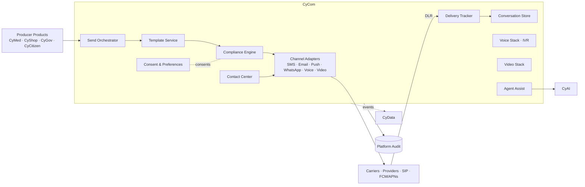

# CyCom — Product Architecture

> **Status:** Approved — Program 1, Phase 1.1
> **Owner:** Platform Architect (Communications)

---

## 1. Mission

**Be CyberCom's secure communications layer** — the one product every other product uses to *talk* to humans (SMS, email, push, in-app messages, voice/SIP, video) and to operate contact centers — with consistent identity, audit, consent, and compliance.

## 2. Scope

**In scope**
- **Messaging:** SMS, MMS, RCS, email, push, in-app chat, WhatsApp/iMessage (per partner).
- **Voice & telephony:** SIP trunking, IVR, click-to-call, recording (per consent), TTS/STT.
- **Video:** real-time video calls / webinars / telehealth (lib + media server abstraction).
- **Contact center:** queues, skills routing, agent desktop, omnichannel handoff, supervisor tools.
- **Templates & locales:** message templates with i18n, RTL, regulatory headers (opt-out, etc.).
- **Consent & preferences:** channel preferences, opt-in/opt-out, quiet hours, jurisdiction-aware suppression.
- **Delivery tracking:** receipts, bounces, DLR, attempts, failures.
- **Conversation history & threading** (durable, searchable, audited).

**Out of scope**
- Identity & sign-in → **CyIdentity** (clinicians, agents, citizens all sign in there).
- Clinical content / decisions → **CyMed** (CyCom carries the message; CyMed authored it).
- Payment for premium SMS / international voice → **CyShop** (billing capture).
- Cross-product analytics on message effectiveness → **CyData** (events flow there).
- LLM-powered assist for agents → **CyAI** (CyCom embeds the call; CyAI returns suggestions).

## 3. Users

| User class | Examples |
|---|---|
| Producer products | CyMed (appointment reminders), CyShop (order updates), CyGov/CyCitizen (notices) |
| End-recipients | Patients, customers, citizens |
| Agents | Contact-center agents, supervisors |
| Workforce | Internal collab / secure clinician chat |

## 4. Core Modules

1. **Channel Adapters** — SMS/MMS/RCS, email (SMTP + transactional providers), push (FCM/APNs), WhatsApp/iMessage, voice (SIP), video.
2. **Template Service** — versioned, locale-aware templates with placeholders + regulatory headers.
3. **Send Orchestrator** — channel fallback, retries, rate limits, cost-aware routing.
4. **Consent & Preferences** — central opt-in/out, channel preferences, quiet hours, do-not-contact list (jurisdiction-aware).
5. **Delivery Tracker** — receipts, DLR, bounces, link-click events (consent permitting).
6. **Conversation Store** — durable threads per recipient + per product.
7. **Voice Stack** — IVR designer, SIP trunking abstraction, call recording (per consent), TTS/STT.
8. **Video Stack** — media server abstraction (Janus/LiveKit/vendor); recording (per consent).
9. **Contact Center** — queues, skills routing, agent desktop, omnichannel state, supervisor.
10. **Agent Assist** — embeds **CyAI** suggestions (summaries, replies, next-best-action) without owning the model.
11. **Compliance Engine** — TCPA/CASL/GDPR/ePrivacy/HIPAA-aware suppression and gating.

## 5. Shared Services Consumed

| Service | Use |
|---|---|
| CyIdentity | All human authN; consent capture context |
| CyIntegration Hub | Connections to carriers, providers, SIP trunks |
| CyData | Analytics on delivery, engagement, cost |
| CyAI | Agent assist, summarization, sentiment |
| CyShop | Billing for premium / international traffic |
| Platform audit / observability / secrets | Standard |

## 6. Owned Data

- Channel adapters configs, provider credentials (in Vault).
- Templates and template versions.
- Recipient preferences and consent state (per jurisdiction).
- Conversation threads, message bodies (encrypted at rest; field-level for highest classes).
- Delivery attempts, receipts, DLRs.
- Voice call metadata; recordings (encrypted, retention-bounded).
- Video session metadata; recordings (encrypted, retention-bounded).
- Contact-center queues, routing rules, agent presence, supervisor metrics.

## 7. Consumed Data

- Recipient identity claims from **CyIdentity** (canonical contact info preferred from there).
- Source-of-record content from producing products (CyMed care messages, CyShop orders, CyGov notices).
- AI suggestions from **CyAI** for agent assist.

## 8. APIs

- **Send API** (`/v1/messages`, `/v1/calls`, `/v1/videos`) — channel-agnostic with hints.
- **Template API** — CRUD templates, render previews, version management.
- **Preferences API** — read/update recipient preferences and consents.
- **Conversation API** — list / read / search threads (scoped to product + recipient).
- **Contact-center APIs** — queues, agent state, omnichannel handoff.
- **Webhook ingress** — provider DLR/receipt webhooks (signed).

## 9. Events

Produced (prefix `cybercom.cycom.*`):

- `message.queued`, `message.sent`, `message.delivered`, `message.failed`, `message.bounced`
- `call.started`, `call.ended`, `call.recorded`
- `video.session.started`, `video.session.ended`
- `consent.granted`, `consent.withdrawn`
- `conversation.created`, `conversation.archived`
- `cc.agent.available`, `cc.agent.unavailable`, `cc.handoff`

Consumed:

- `cybercom.cymed.appointment.scheduled` → trigger reminder.
- `cybercom.cyshop.order.shipped` → trigger update.
- `cybercom.cygov.case.updated` → trigger notice.
- `cybercom.cyidentity.session.created` → optional security notification.

## 10. Integrations

- **Carriers / providers:** Twilio / Vonage / MessageBird / regional carriers; email providers (SES, SendGrid, native); push (FCM/APNs).
- **SIP trunks** per jurisdiction.
- **Media servers** for video (Janus / LiveKit / vendor).
- **Compliance lists** (national DNC registries) per jurisdiction.

## 11. Deployment Model

- Tier-1 service; multi-AZ default; multi-region for SaaS production.
- Voice/video media plane separated from control plane; auto-scaled per session load.
- Per-tenant rate limits and cost guardrails.
- Sovereign on-prem profiles use locally-licensed SIP/SMS partners (per addendum).

## 12. Security Requirements

- All content encrypted in transit (TLS 1.3) and at rest (AES-256).
- Conversation bodies treated as Confidential by default; Restricted (PHI/PII) when the recipient relationship is clinical/governmental.
- Recording requires **explicit consent**; jurisdiction-aware notice messages.
- Webhook signatures HMAC-SHA-256 with rotating secrets + replay protection.
- Compliance Engine blocks sends that would violate TCPA/CASL/GDPR/ePrivacy/HIPAA suppression rules.
- Phishing-resistant suppression: outbound links use HMAC tokenization; click-tracking disabled by default for clinical/government messages.
- Audit every send, delivery, and recording start/stop.

## 13. Component Diagram

